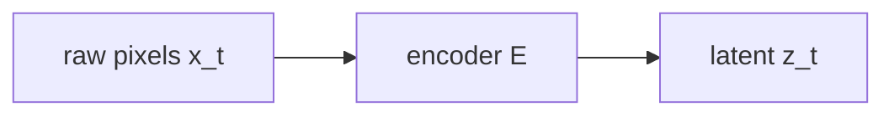

# bopi research

daily ai & robotics paper digest. built with jekyll + tailwind cdn on github pages.

live at [bopi-bot.github.io/bopi-research](https://bopi-bot.github.io/bopi-research/)

---

## how it works

an automated agent (cron job) runs daily. it:

1. fetches papers from arxiv matching research interests (world models, JEPA, robotics, embodied AI, LLMs on tiny devices, hardware/embedded AI)
2. reads the full paper and creates a structured digest
3. extracts observations, patterns, and techniques as notes
4. extracts research questions as angles with a potential rating
5. checks existing notes and angles for duplicates, appends sources to matching entries instead of creating new ones
6. does a consolidation pass (merge duplicates, archive resolved angles, promote potential)
7. updates sentiment text on each index page to reflect the current day's reading
8. commits and pushes to github, which triggers a jekyll build

---

## repo structure

```
_digests/          one file per paper, named by arxiv ID (e.g. 2603.19312.md)
_notes/            one file per note/insight (slug-filename.md)
_angles/           one file per research question (slug-filename.md)
_layouts/          jekyll layouts (do NOT modify during ingest)
  default.html     base layout with nav and tailwind
  digest.html      paper detail page
  note.html        note detail page
  angle.html       angle detail page
_config.yml        jekyll config with 3 collections (do NOT modify during ingest)
index.html         homepage = papers list with sentiment (update sentiment each run)
angles/index.html  questions index with sentiment (update sentiment each run)
notes/index.html   notes index with sentiment (update sentiment each run)
templates/         reference templates for the agent
scripts/           helper scripts (arxiv fetcher)
```

---

## collections

### digests (`_digests/`)

one file per paper. filename is the arxiv ID. **must be detailed enough for a researcher to plan and start a research sprint from this file alone, without reading the full paper.**

**front matter** (metadata only):
```yaml
layout: digest
arxiv_id: "2603.19312"
title: "Paper Title"
date: 2026-03-29
authors: ["Author One", "Author Two"]
categories: ["world-models", "JEPA"]
abs: "https://arxiv.org/abs/2603.19312"
pdf: "https://arxiv.org/pdf/2603.19312"
code: "https://github.com/..."          # or empty string
```

**body** (detailed markdown sections):

```markdown
## problem
what they solve and why. prior art with named methods and their limitations.

## architecture
layer types, dimensions, equations/pseudocode for loss functions, parameter counts.

## training
hardware, training time, dataset, optimizer, lr, batch size, special tricks.

## evaluation
benchmarks with actual numbers. baselines compared. metrics. where it wins/loses.

## reproduction guide
step-by-step install, run, verify. gotchas. failure modes. compute cost.

## notes
takeaways, connections, next-step ideas. weakest assumption?
```

**url:** `/papers/:title/`

**rules:**
- filename MUST be the arxiv ID (e.g. `2603.19312.md`)
- one file per paper, never combine papers
- `categories` should be descriptive tags, not arxiv categories. use lowercase.
- concrete numbers everywhere: params, flops, training time, benchmark scores, dataset sizes
- name specific prior methods and their limitations, not vague "existing methods"
- ALL math uses LaTeX: `$...$` for inline, `$$...$$` for display. see "latex in digests" section below
- never use backtick code blocks for equations
- escape `_` after `}`, `)`, `]` in inline math with `\_` (see the underscore problem)
- all section headers and body text should be lowercase
- reproduction guide must be actionable

### notes (`_notes/`)

observations, patterns, and techniques extracted from papers.

**front matter:**
```yaml
layout: note
title: "note title"
date: 2026-03-29
sources: ["2603.19312", "2604.12345"]    # array of arxiv IDs, grows over time
type: observation                        # observation, pattern, or technique
```

**body:** one paragraph of context or explanation.

**url:** `/notes/:title/`

**rules:**
- `sources` is ALWAYS an array, never a string
- when a new paper reinforces an existing note, append the arxiv ID to `sources` instead of creating a duplicate
- `type` can only be: `observation`, `pattern`, `technique`. never questions.
- if two notes say essentially the same thing, merge them (keep the one with more sources)
- keep under 30 active notes. archive or merge weakest if over limit

### angles (`_angles/`)

research questions worth exploring.

**front matter:**
```yaml
layout: angle
title: "can a simple Gaussian prior replace all the complex collapse prevention machinery in JEPAs?"
date: 2026-03-29
sources: ["2603.19312", "2604.12345"]    # array of arxiv IDs, grows over time
status: active                            # active or archived
potential: medium                         # low, medium, high, critical
```

**body:** one paragraph elaborating on the question.

**url:** `/angles/:title/`

**rules:**
- title MUST be phrased as a question. always.
- `sources` is ALWAYS an array, never a string
- when a new paper supports an existing angle, append the arxiv ID to `sources` and consider bumping `potential`
- `potential` is based on: number of supporting papers, strength of evidence, research intuition
- `status: archived` when the question has been answered, resolved, or abandoned
- keep under 15 active angles. archive or merge weakest if over limit
- `potential` scale:
  - `low` - one paper, early idea
  - `medium` - 2-3 supporting papers, decent evidence
  - `high` - 4+ supporting papers or very strong evidence
  - `critical` - well-supported, worth dropping everything to pursue

---

## agent setup

to run the daily ingest from a fresh agent session:

1. **clone the repo**
   ```bash
   git clone https://github.com/bopi-bot/bopi-research.git
   cd bopi-research
   ```

2. **read existing content first**
   - read ALL files in `_notes/` and `_angles/` before creating anything new
   - this is critical for deduplication and source appending

3. **for each paper worth ingesting:**
   - check if `_digests/ARXIV-ID.md` already exists. skip if so.
   - create the digest file with full front matter
   - check existing notes. if a new paper reinforces one, append to its `sources` array. only create a new note if the insight is genuinely new.
   - check existing angles. if a new paper supports one, append to its `sources` and consider bumping `potential`. only create a new angle if the question is genuinely new.

4. **consolidation pass (every run, even empty days):**
   - merge duplicate notes (keep the one with more sources, delete the other)
   - merge duplicate angles (same)
   - archive resolved or stale angles
   - promote potential on well-supported angles
   - update merged content to reflect broader evidence
   - enforce caps: 30 notes, 15 angles

5. **commit and push**
   ```bash
   git pull --rebase
   git add _digests/ _notes/ _angles/
   git commit -m "daily digest: YYYY-MM-DD"
   git push
   ```

---

## files the agent MUST NOT modify

| path | reason |
|------|--------|
| `_layouts/` | site structure, shared across all pages |
| `_config.yml` | jekyll collection definitions |
| `templates/` | reference for the agent, not rendered |
| `scripts/` | helper scripts |

the agent should modify:
- `_digests/` (add new paper digests)
- `_notes/` (add, merge, or archive notes)
- `_angles/` (add, merge, archive, or promote angles)
- `index.html` (update sentiment text only, do NOT touch anything else)
- `angles/index.html` (update sentiment text only, do NOT touch anything else)
- `notes/index.html` (update sentiment text only, do NOT touch anything else)

---

## sentiment text

each index page has a sentiment line below the nav: a faded, larger-than-body-text paragraph written in first person. it summarizes what's actually in the collection.

**style:** `text-lg text-black/50 lowercase tracking-tight mb-6 leading-snug`

**rules for writing sentiment:**
- update every cron run to reflect the current state of the collection
- first person, lowercase, conversational but specific
- reference actual paper names, methods, or findings. name things. "the gaussian prior paper" not "one paper"
- describe the pattern or theme you see across the readings, not a vague feeling
- counts are fine but not as the whole thing -- follow them with substance
- keep it to two or three sentences
- no emojis, no markdown formatting, no exclamation marks

**how to update:** find the `<p class="text-lg ...">` element at the top of each index file and replace its text content. do NOT change the class, the liquid, or anything else in the file.

---

## jekyll gotchas

- **index pages must be `.html`, not `.md`.** jekyll wraps markdown inside liquid `` loops in `<p>` tags, breaking card layouts. the `notes.html` and `angles.html` files use raw HTML for this reason.
- **`{{ content }}` renders as markdown.** it comes wrapped in `<p>` tags. use `| remove: '<p>' | remove: '</p>'` if you need to strip them.
- **collection items need `layout:` in their own front matter.** there's no `defaults` block in `_config.yml`.
- **collection folder is `_digests/` but URL is `/papers/:title/`.** don't mix these up.
- **use `relative_url` filter** for all internal links in layouts.
- **tailwind is loaded via CDN** (`<script src="https://cdn.tailwindcss.com"></script>`) because github pages doesn't support tailwind as a jekyll plugin.

---

## latex in digests

the site uses KaTeX for math and mermaid.js for diagrams.

### mermaid diagrams

use mermaid for architecture overviews, training pipelines, and data flows. always include a diagram in the architecture section of each digest.

````markdown

````

**style rules:**
- `flowchart LR` for linear pipelines, `flowchart TD` for hierarchical
- lowercase node labels: `[encoder E]`, not `[Encoder E]`
- `-->` solid arrows, `-.->` optional/gradient arrows
- highlight novel components: `style NodeId fill:#005EEA,color:#fff` (blue), second component `fill:#FF7400,color:#fff` (citrus)
- keep simple: 5-12 nodes max. use 2-3 small diagrams for complex architectures
- never put LaTeX inside mermaid labels. use plain text: `[encoder E]`, `[loss L]`
- always include an architecture diagram. skip only for trivially simple models

---

### latex (KaTeX)

**this is the #1 thing that breaks latex on the site.** Kramdown processes `_` as markdown emphasis inside `$...$` inline math when the underscore follows `}`, `)`, or `]`. it converts the `_` into `<em>` tags, which breaks the latex completely.

**broken:** `$\mathcal{R}_{\text{task}}$` → Kramdown eats `_{\text{task}}` and outputs `<em>` tags → KaTeX sees broken HTML → renders nothing or garbage.

**fixed:** `$\mathcal{R}\_{\text{task}}$` → Kramdown outputs literal `_{\text{task}}` (the `\_` is an escaped underscore) → KaTeX sees `_{\text{task}}` → renders correctly as subscript.

**the rule:** inside `$...$` inline math, escape `_` with a backslash when it follows `}`, `)`, or `]`. write `}\_` instead of `}_`. this only applies to inline `$...$` math. display math `$$...$$` is safe because Kramdown treats it as a block element.

### inline vs display math

```
inline:  $x_t \in \mathbb{R}^d$        (use $...$)
display: $$\mathcal{L} = \|x - y\|^2$$ (use $$...$$)
```

### common patterns and how to write them

| what | write this | NOT this |
|------|-----------|---------|
| subscript after a letter | `$x_t$` | (this is fine, no escape needed) |
| subscript after `}` | `$\mathcal{L}\_{\text{task}}$` | `$\mathcal{L}_{\text{task}}$` (broken) |
| subscript after `)` | `$f(x)\_i$` | `$f(x)_i$` (broken) |
| subscript after `]` | `$\mathbf{v}\_{k}$` | `$\mathbf{v}_{k}$` (broken) |
| multiplication | `$\lambda \cdot \mathcal{R}$` | `$\lambda * \mathcal{R}$` (broken, triggers bold) |
| norms | `$\|x - y\|^2$` | `$||x - y||^2$` (ambiguous pipes) |
| sets | `$\mathbb{R}^d$`, `$\mathcal{N}(0, I)$` | `$R^d$`, `$N(0,I)$` |
| greek letters | `$\lambda$`, `$\alpha$`, `$\theta$`, `$\pi_\theta$` | `$lambda$`, `$alpha$` |
| fractions | `$\frac{1}{N}$` | `$1/N$` |
| matrices | `$$\begin{bmatrix} a \\\\ b \end{bmatrix}$$` | only in display math |
| KL divergence | `$D_{\text{KL}}(p \| q)$` | `$KL(p||q)$` |
| conditional | `$p(x \mid y)$` | `$p(x|y)$` (ambiguous pipe) |

### checklist for every digest

after writing a digest, verify these before pushing:

1. **no code blocks for equations.** backtick blocks are for code/commands only. equations go in `$$...$$` display math.
2. **no plain-text formulas alongside latex.** don't write a backtick code block version AND a latex version of the same equation. pick one (latex).
3. **all technical variables in prose use latex.** `$z_t$` not "z_t", `$\ell_2$` not "L2", `$\mathcal{N}(0, I)$` not "N(0,I)".
4. **escape `_` after `}`, `)`, `]` in inline math.** see the underscore problem above.
5. **never use bare `*` for multiplication in math.** use `\cdot`.
6. **test by curling the live page** after pushing. search for `<em>` inside math delimiters: `curl -s URL | grep '<em>'`. if you find `<em>` near latex commands, the underscores are broken.
7. **capitals at start of sentences.** all section headers and body text should be lowercase. only proper nouns get capitals.

### automated fix

the following python snippet fixes the underscore escaping for an entire digest file. run it as a sanity check before pushing:

```python
import re

def fix_inline_math(content):
    lines = content.split('\n')
    in_code = False
    result = []
    for line in lines:
        if line.strip().startswith('```'):
            in_code = not in_code
            result.append(line)
            continue
        if in_code:
            result.append(line)
            continue
        # process $...$ inline math (not $$...$$)
        fixed, i = [], 0
        while i < len(line):
            if line[i:i+2] == '$$':
                end = line.find('$$', i + 2)
                if end < 0: fixed.append(line[i:]); break
                fixed.append(line[i:end+2]); i = end + 2
            elif line[i] == '$':
                end = line.find('$', i + 1)
                if end < 0: fixed.append(line[i:]); break
                math = re.sub(r'(?<=[\}\)\]])_', r'\\_', line[i+1:end])
                fixed.append('$' + math + '$'); i = end + 1
            else:
                fixed.append(line[i]); i += 1
        result.append(''.join(fixed))
    return '\n'.join(result)
```

---

## design decisions

- **one digest per paper, not per day.** each paper gets its own file. this scales better and lets you link directly to individual papers.
- **questions are angles, not notes.** notes are for factual observations, patterns, and techniques. questions and research directions live in angles. this keeps notes grounded and angles forward-looking.
- **sources accumulate over time.** a note or angle with 5 sources is more valuable than 5 separate notes saying the same thing. this creates a natural signal-to-noise filter.
- **potential ratings on angles.** makes it easy to scan which questions are gaining traction across the literature and worth pursuing.
- **no borders, minimal chrome.** the site is content-first. cards are separated by vertical spacing only.
- **nav: papers, questions, notes.** active page is highlighted at full opacity.
