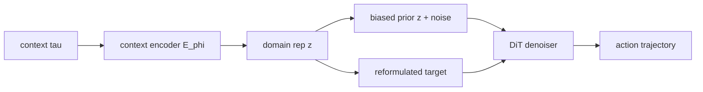

## problem

learning-based policies are coupled to specific environments. performance degrades sharply in unseen transition dynamics (different friction, mass, joint damping). prior domain adaptation methods (CORRO, CaDM, Meta-DT, MetaDiffuser) either entangle static domain info with time-varying dynamical properties, or fail to fully leverage learned domain representations in the policy.

specific limitation of diffusion policies: starting from pure gaussian noise, the denoiser must reconstruct different domain-specific action modalities from every sampled point equally. standard conditioning (input concatenation) doesn't bias the sampling toward domain-appropriate modes.

## architecture

### two-stage pipeline

**stage 1: domain representation learning (lagged context dynamical prediction)**

standard dynamical prediction uses adjacent context $\tau\_t = (s\_{t-H}, a\_{t-H}, \ldots, s\_{t-1}, a\_{t-1})$, which entangles:
- static info $\xi$: domain-specific dynamics (gravity, friction) -- desired
- varying info $\omega\_t$: instantaneous dynamical properties (higher-order temporal derivatives) -- undesired

solution: introduce temporal offset $\Delta t$. context from episode $i$, prediction target from episode $j$ in same domain (cross-episode prediction):

$$\hat{s}\_{t+1} = f\_\theta(s\_t, a\_t, z\_{t-\Delta t}), \quad z\_{t-\Delta t} = E\_\phi(\tau\_{t-\Delta t})$$

as $\Delta t \to \infty$, $I(\omega\_t; z\_{t-\Delta t} \mid s\_t, a\_t, \xi) \to 0$ by information theory. static $\xi$ remains informative since it's time-invariant. practically: context selected from another episode in the same domain.

loss: $\mathcal{L} = \beta\_{\text{forward}} \cdot \|\hat{s} - s\|^2 + \beta\_{\text{inverse}} \cdot \|\hat{a} - a\|^2$ with $\beta = 1.0$.

context encoder: transformer with adaptive pooling. dim=256, 4 layers, 8 heads, history length $H=16$.

**stage 2: domain-aware diffusion injection**

two-part injection into the diffusion prior:

1. **bias the prior** -- start from domain-shifted initial distribution:
$$x\_K = \sqrt{\bar{\alpha}\_K} \cdot (a\_0 - z) + z + \sqrt{1 - \bar{\alpha}\_K} \cdot \varepsilon$$

at step $K$: $x\_K = z + \varepsilon$, so the prior is a mixed gaussian with peaks at domain-specific modalities instead of isotropic noise.

2. **reformulate the prediction target** -- predict composite term instead of pure noise:
$$\hat{\varepsilon} = \sqrt{1-\bar{\alpha}\_k} \cdot \varepsilon + (1 - \bar{\alpha}\_k) \cdot \lambda z$$

diffusion policy: DiT backbone, dim=256, 6 planner layers, 8 heads, cosine noise schedule, 5 inference steps. guidance scale $\lambda = 0.1$.

## training

**context encoder:** batch 128, LR $3 \times 10^{-4}$, 10 epochs, training ratio 0.8.

**policy:** batch 256, LR $3 \times 10^{-4}$, cosine noise schedule.

| environment | iterations |
|---|---|
| Walker2d | 1,000,000 |
| Ant | 400,000 |
| Hopper | 400,000 |
| HalfCheetah | 100,000 |
| Adroit Relocate | 500,000 |
| Adroit Door | 100,000 |

25 domains per MuJoCo environment. SAC expert policies per parameter setting. Adroit data from ODRL (3 domains total).

## evaluation

### main results (5 seeds, mean $\pm$ std)

| environment | setting | Meta-DT | **DADP** |
|---|---|---|---|
| Walker2d | IID | 1304 $\pm$ 586 | **3999 $\pm$ 174** |
| Walker2d | OOD | 889 $\pm$ 579 | **2834 $\pm$ 285** |
| Ant | IID | 3045 $\pm$ 128 | **3052 $\pm$ 30** |
| Ant | OOD | 3187 $\pm$ 899 | **3485 $\pm$ 83** |
| Hopper | IID | 1140 $\pm$ 156 | **1631 $\pm$ 47** |
| Hopper | OOD | 1208 $\pm$ 99 | **1686 $\pm$ 47** |
| HalfCheetah | IID | **3978 $\pm$ 66** | 3978 $\pm$ 66 |
| HalfCheetah | OOD | **3174 $\pm$ 501** | 3001 $\pm$ 225 |
| Door | IID | 1283 $\pm$ 323 | **1428 $\pm$ 44** |
| Door | OOD | 1294 $\pm$ 228 | **1494 $\pm$ 81** |

DADP wins on 8/10 settings. consistently lowest variance across seeds. the only method to outperform expert on Hopper OOD (1686 > 1555). loses to Meta-DT on HalfCheetah by small margins (tied IID, -173 OOD).

### representation quality (linear probe accuracy)

| $\Delta t$ | Walker2d | HalfCheetah |
|---|---|---|
| 1 (standard) | 27.9% | 68.6% |
| 32 | 64.9% | 98.3% |
| $\infty$ (cross-episode) | **99.3%** | **99.9%** |
| supervised oracle | 99.8% | 99.9% |

cross-episode lagged context reaches near-supervised domain representation quality without any labels.

## reproduction guide

1. generate MuJoCo domains: sample 25 parameter sets per env from Table 5 ranges. train SAC expert per setting. collect 100-300 episodes per domain.
2. train context encoder: transformer (dim 256, 4 layers, 8 heads, $H=16$). cross-episode prediction with $\Delta t \to \infty$ (different episodes same domain). batch 128, LR 3e-4, 10 epochs.
3. train DADP: DiT (dim 256, 6 layers). mixed gaussian prior + reformulated prediction target. batch 256, LR 3e-4, 5 DDIM steps.
4. evaluate: compute $z = E\_\phi(h\_{\text{ctx}})$ from online context, initialize $x\_K = \lambda z + \varepsilon$, denoise 5 steps with guidance $\lambda=0.1$.

no code released yet. compute: moderate. 10 epochs of context encoder training + 100K-1M policy iterations per environment. feasible on single GPU.

## notes

the lagged context idea is information-theoretically clean and simple to implement. the key insight is that separating context temporally (cross-episode) automatically filters out time-varying properties while retaining static domain info. reaching 99.3% linear probe accuracy without labels is remarkable.

the biased prior for diffusion is a practical trick that could transfer to other conditional generation settings where you want to bias sampling toward known modes. the $\lambda=0.1$ guidance scale is small but effective.

limitation: only addresses stationary (time-invariant) dynamics. non-stationary environments (e.g., changing payload, wear) aren't handled. the MuJoCo domains are relatively simple compared to real-world robot dynamics with contact, deformation, and unmodeled effects.

connection to existing notes: this reinforces `inference-time-guidance-pattern-robotics` -- domain-aware diffusion injection is another form of inference-time intervention. connects to `can-discrete-flow-matching-replace-ar-and-diffusion-in-vlas` -- DADP shows diffusion policies still have room for architectural improvement over naive conditioning.
