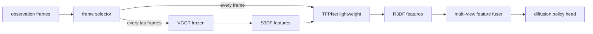

## problem

large-scale 3D foundation models (VGGT) provide strong spatial priors for manipulation but are too slow for real-time control (~73ms per frame). naive multi-view fusion via feature concatenation ignores camera geometry. depth sensors introduce noise on transparent/reflective surfaces (Depth Anything v2 + DP3 drops from 57.6% to 28.2%). DP3 requires depth sensors AND object bounding boxes, adding deployment complexity.

the core tension: you need 3D understanding for contact-rich tasks (stacking, inserting, handover) but can't afford to run a 3D foundation model at every timestep.

## architecture

R3DP is a plug-and-play 3D-aware perception module that replaces the visual encoder in diffusion policy. three components:

### asynchronous fast-slow collaboration (AFSC)

- **slow system ($\Phi\_{\text{slow}}$)**: frozen VGGT processes multi-view RGB every $\tau$ frames. produces Slow 3D-aware Features (S3DF).
- **fast system ($\Phi\_{\text{fast}}$)**: lightweight TFPNet propagates S3DF to every intermediate frame. produces Real-time 3D-aware Features (R3DF).
- only 1 in $\tau$ frames goes through VGGT. $\tau$ is configurable at deployment without retraining.

### temporal feature prediction network (TFPNet)

per-view images encoded by DINOv2-S, then 4 alternating-attention transformer blocks for cross-view aggregation, then cross-attention with historical R3DF features. distilled from frozen VGGT using cosine similarity loss:

$$\mathcal{L}\_{\text{TFP}} = \sum\_{i=0}^{3} \left(1 - \cos(F^{\text{S3D}}\_t, F^{\text{R3D}}\_t)\right)$$

training: 4 frames per sample with random interval 1-8 timesteps. only TFPNet parameters updated (VGGT frozen). outputs unified tokens from VGGT's 24 layers of dense output.

### multi-view feature fuser (MVFF)

each view's image processed by ResNet encoder to 2D features. cross-attention fuses 2D features (Q) with R3DF features (K, V) per view. PRoPE (projective positional encoding) explicitly encodes camera intrinsics $K\_i$ and extrinsics $T^{cw}\_i$ using relative projective transformations between camera pairs. uses GTA-style block-diagonal attention with $d/8$-dim projective component + $d/4$-dim RoPE for x,y coordinates.

## training

**two-stage pipeline:**

**stage 1 -- TFPNet pre-training:**

| parameter | value |
|---|---|
| GPU | 8x NVIDIA A800 |
| sequences per task | ~200,000 (from 100 trajectories) |
| sequence length | 4 frames |
| random interval | 1-8 timesteps |
| views | 2 (head, front) |
| image size | 308 x 168 |
| batch size | 12 |
| optimizer | Adam ($\beta=(0.9, 0.999)$, $\epsilon=10^{-8}$) |
| learning rate | $10^{-4}$ |
| weight decay | $10^{-4}$ |
| epochs | 100 |
| mixed precision | bfloat16 |

**stage 2 -- policy training:**

| parameter | value |
|---|---|
| GPU | 4x NVIDIA RTX 4090 |
| optimizer | AdamW ($\beta=(0.95, 0.999)$, $\epsilon=10^{-8}$) |
| learning rate | $2 \times 10^{-5}$ |
| weight decay | $10^{-6}$ |
| LR schedule | cosine with 500 warmup steps |
| epochs | 600 |
| batch size | 8 |
| horizon | 8 |
| $n\_{\text{obs\_steps}}$ | 1 |
| $n\_{\text{action\_steps}}$ | 8 |
| DDIM inference steps | 10 |
| vision backbones | frozen |

## evaluation

### simulation -- RoboTwin benchmark (100 trials/task)

| task | DP | DP3 | $\pi\_0$ | **R3DP ($\tau=4$)** |
|---|---|---|---|---|
| block hammer beat | 0% | 49% | 47% | **77%** |
| block handover | 1% | 48% | 71% | **95%** |
| blocks stack easy | 6% | 26% | **79%** | 69% |
| container place | 48% | **89%** | 77% | 63% |
| put apple cabinet | 92% | 98% | 64% | **100%** |
| tube insert | 92% | **97%** | 68% | 97% |
| diverse bottles pick | 16% | 34% | **47%** | 31% |
| **average** | **36.1%** | **57.6%** | **59.9%** | **69.0%** |

R3DP wins on 7/10 tasks, $\pi\_0$ wins on 3 (blocks stack, container place, diverse bottles). R3DP average: +11.4pp over DP3, +9.1pp over $\pi\_0$.

### latency

| config | obs encoder (ms) | action expert (ms) |
|---|---|---|
| DP+VGGT (naive) | 73.1 | -- |
| DP+VGGT+MVFF | 78.3 | -- |
| **R3DP ($\tau=4$)** | **50.5** | ~55 |
| **R3DP ($\tau=8$)** | **40.3** | ~57 |

$\tau=8$: 44.8% latency reduction vs naive DP+VGGT. $\tau=8$ averages 65.7% (vs 69.0% at $\tau=4$) -- only 3.3pp accuracy loss for 20% faster inference.

### real-world (30 trials/task, single RTX 4090)

| task | DP | DP3 | **R3DP** |
|---|---|---|---|
| place shoe | 46.7% | 50.0% | **86.7%** |
| place glass cup | 23.3% | 56.7% | **83.3%** |
| pick peach | 20.0% | 30.0% | **50.0%** |
| stack bowls | 33.3% | 56.7% | **66.7%** |
| **average** | **30.8%** | **48.4%** | **71.7%** |

obs encoder: 62.2ms (vs 105.1ms for DP+VGGT+MVFF = 40.8% reduction).

## reproduction guide

code at https://github.com/dazazh/R3DP.

1. clone repo, install dependencies
2. stage 1: pre-train TFPNet on frozen VGGT features. need ~200K 4-frame sequences from 100 demos per task. 8x A800, ~100 epochs, ~4 hours.
3. stage 2: train diffusion policy head with AFSC+MVFF. 4x RTX 4090, 600 epochs, ~12 hours.
4. deploy: choose $\tau$ at inference time (4 or 8 recommended). single RTX 4090 sufficient.

**compute cost:** ~$400 for TFPNet pretraining + ~$100 for policy training = ~$500 total per task.

**gotchas:** VGGT and TFPNet must be frozen during policy training (gradients only update diffusion head). TFPNet needs DINOv2-S weights. bfloat16 required for VGGT inference.

## notes

the fast-slow pattern is elegant: decouple expensive 3D reasoning from every-frame policy execution. TFPNet as a temporal propagator is essentially a lightweight "3D feature cache invalidator" -- it predicts how 3D features change between keyframes. the 44.8% latency reduction at $\tau=8$ with only 3.3pp accuracy loss is a strong tradeoff.

PRoPE encoding camera geometry is important -- without it, multi-view fusion degrades. this connects to the broader pattern of encoding physical priors into neural architectures.

the gap to $\pi\_0$ on some tasks (blocks stack, diverse bottles) suggests 3D-aware perception alone doesn't fully close the gap with large-scale VLM priors. VLA models bring language understanding and broad pretraining that pure perception modules lack. this relates to the `can-vla-models-eliminate-separate-world-models` angle -- R3DP is evidence that 3D perception modules are complementary to, not replacements for, VLAs.
