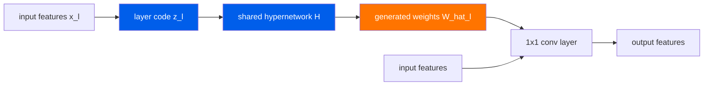

     1|---
     2|layout: digest
     3|arxiv_id: "2603.24916"
     4|title: "Once-for-All Channel Mixers (HYPERTINYPW): Generative Compression for TinyML"
     5|date: 2026-03-29
     6|authors: ["Yassien Shaalan"]
     7|categories: ["TinyML", "compression", "embedded", "MCU", "edge"]
     8|abs: "https://arxiv.org/abs/2603.24916"
     9|pdf: "https://arxiv.org/pdf/2603.24916"
    10|code: ""
    11|---
    12|
    13|## problem
    14|
    15|Deploying neural networks on microcontrollers (MCUs) is fundamentally constrained by kilobytes of flash and SRAM. Even after INT8 quantization, 1×1 pointwise (PW) convolutions — which serve as channel mixers in depthwise-separable CNNs — dominate the stored model footprint. In a typical TinyML CNN for ECG or speech classification, PW layers account for the vast majority of parameter bytes.
    16|
    17|Prior compression approaches fall short for MCU deployment:
    18|
    19|- **Structured pruning** (e.g., ThiNet, AMC) removes entire filters or channels but still requires storing the remaining weights in full, and accuracy drops sharply under aggressive sparsity targets on kilobyte budgets.
    20|- **Knowledge distillation** (TinyBERT, MobileNetV3-style) requires a pretrained teacher and extensive retraining; the compressed student still stores all weights explicitly.
    21|- **Weight sharing / hashing** (BobHash, Deep Compression quantization) reduces unique stored values but incurs lookup overhead and address storage that negates savings at the extreme compression ratios MCUs demand.
    22|- **Standard hypernetworks** generate weights from a shared network but the hypernetwork itself is too large for MCU flash; they were designed for GPU inference, not kilobyte-constrained embedded targets.
    23|
    24|The core challenge: MCUs like STM32H7 have 256 KB flash and 64 KB SRAM. A TinyML CNN with INT8 weights can reach ~1.4 MB — well over 5× the flash budget. The gap between what standard compression can achieve and what MCUs require motivates a fundamentally different approach.
    25|
    26|## architecture


    27|
    28|HyperTinyPW replaces most stored PW weights with weights generated at load time by a shared micro-hypernetwork. The key insight: PW layers across a CNN share significant structural redundancy. A single lightweight hypernetwork, conditioned on tiny per-layer latent codes, can synthesize each layer's channel-mixing kernel with high fidelity.
    29|
    30|### base model: depthwise-separable cnn
    31|
    32|The backbone is a depthwise-separable convolutional network. For layer $l$ with input channels $C_{\text{in}}^{(l)}$ and output channels $C_{\text{out}}^{(l)}$:
    33|
    34|$$\mathbf{Y}^{(l)} = \text{PW}^{(l)}\left(\text{DW}^{(l)}(\mathbf{X}^{(l)})\right)$$
    35|
    36|where $\text{DW}^{(l)}$ is a depthwise 3×3 or 1×1 convolution and $\text{PW}^{(l)}$ is a 1×1 pointwise convolution with kernel $\mathbf{W}^{(l)} \in \mathbb{R}^{C_{\text{out}}^{(l)} \times C_{\text{in}}^{(l)}}$.
    37|
    38|The PW kernel dominates memory. For a layer mapping 128 → 256 channels: $|\mathbf{W}^{(l)}| = 256 \times 128 = 32{,}768$ INT8 values = 32 KB per layer. With 5–8 PW layers, this exceeds the entire MCU flash budget.
    39|
    40|### weight generation via shared hypernetwork
    41|
    42|Instead of storing $\mathbf{W}^{(l)}$, HyperTinyPW generates it:
    43|
    44|$$\hat{\mathbf{W}}^{(l)} = \mathcal{H}(\mathbf{z}^{(l)}; \theta)$$
    45|
    46|where:
    47|- $\mathcal{H}$ is the shared micro-hypernetwork (a small MLP) with parameters $\theta$
    48|- $\mathbf{z}^{(l)} \in \mathbb{R}^{d_z}$ is the per-layer latent code
    49|- $d_z \ll C_{\text{out}}^{(l)} \times C_{\text{in}}^{(l)}$, typically a few bytes per layer
    50|
    51|The hypernetwork $\mathcal{H}$ is shared across all PW layers (the "once-for-all" property). Only one copy of $\theta$ is stored, plus one $\mathbf{z}^{(l)}$ per layer. The first PW layer is kept as stored INT8 weights (not generated) for training stability and to anchor the feature representation.
    52|
    53|### compression ratio
    54|
    55|The compression ratio is:
    56|
    57|$$\text{CR} = \frac{\displaystyle\sum_{l=1}^{L} |\mathbf{W}^{(l)}|}{|\theta| + |\mathbf{W}^{(1)}| + \displaystyle\sum_{l=2}^{L} |\mathbf{z}^{(l)}|}$$
    58|
    59|The denominator includes the hypernetwork parameters, the first PW layer (stored), and all per-layer codes. With a micro-MLP of a few hundred parameters and codes of dimension $d_z \approx 8$–$16$, the overhead is negligible compared to the PW weight savings.
    60|
    61|### load-time generation and caching
    62|
    63|Weight generation is a one-time operation at model load time:
    64|
    65|1. For each compressed layer $l \in \{2, \ldots, L\}$, feed $\mathbf{z}^{(l)}$ into $\mathcal{H}$ to produce $\hat{\mathbf{W}}^{(l)}$
    66|2. Quantize generated weights to INT8
    67|3. Cache all generated weights in SRAM alongside $\mathbf{W}^{(1)}$
    68|4. Run standard INT8 inference with the cached weight set
    69|
    70|Steady-state inference latency matches the INT8 baseline exactly — the generation cost is amortized entirely at load time.
    71|
    72|### packed-byte memory accounting
    73|
    74|The paper uses TinyML-faithful memory accounting: every parameter, activation buffer, and lookup table is counted in packed bytes as it would appear in MCU flash/SRAM. No half-precision or floating-point fudge factors.
    75|
    76|## training
    77|
    78|Training proceeds in phases:
    79|
    80|### phase 1: full model pretraining
    81|
    82|Train the depthwise-separable CNN to convergence on the target task using standard cross-entropy loss:
    83|
    84|$$\mathcal{L}_{\text{task}} = -\sum_{i=1}^{N} y_i \log \hat{y}_i$$
    85|
    86|This establishes the baseline accuracy and provides the target weights $\mathbf{W}^{(l)}$ that the hypernetwork must reconstruct.
    87|
    88|### phase 2: hypernetwork training with reconstruction
    89|
    90|Learn the shared hypernetwork parameters $\theta$ and per-layer codes $\mathbf{z}^{(l)}$ by minimizing a combined task + reconstruction loss:
    91|
    92|$$\mathcal{L} = \mathcal{L}_{\text{task}}(\hat{\mathbf{Y}}, \mathbf{Y}) + \lambda \sum_{l=2}^{L} \left\| \mathbf{W}^{(l)} - \hat{\mathbf{W}}^{(l)} \right\|_F^2$$
    93|
    94|where $\hat{\mathbf{W}}^{(l)} = \mathcal{H}(\mathbf{z}^{(l)}; \theta)$ and $\lambda$ controls the reconstruction fidelity penalty. The Frobenius norm on weight matrices directly penalizes deviation from the pretrained weights.
    95|
    96|The first PW layer weights $\mathbf{W}^{(1)}$ remain frozen (stored as INT8, not generated).
    97|
    98|### phase 3: end-to-end fine-tuning
    99|
   100|After the hypernetwork converges, perform end-to-end fine-tuning with the generated weights in the loop. This recovers task accuracy that may have been lost during compression. The latent codes $\mathbf{z}^{(l)}$ and hypernetwork parameters $\theta$ are updated jointly.
   101|
   102|### practical considerations
   103|
   104|- The hypernetwork is deliberately kept tiny (micro-MLP with a few hundred parameters) so it does not itself become a storage bottleneck.
   105|- Per-layer codes are of dimension $d_z$ in the range of 8–16, making each code 8–16 bytes — negligible compared to the thousands of bytes of PW weights being replaced.
   106|- Quantization-aware training can be applied in phase 3 to account for the INT8 quantization of generated weights on the target MCU.
   107|
   108|## evaluation
   109|
   110|### ecg classification
   111|
   112|Evaluated on standard clinical ECG benchmarks:
   113|
   114|| Dataset | Task | Baseline (INT8) | HyperTinyPW | Compression |
   115||---------|------|-----------------|-------------|-------------|
   116|| Apnea-ECG | Apnea detection | ~1.4 MB model | 225 KB | 6.31× |
   117|| PTB-XL | Multi-label ECG | — | — | — |
   118|| MIT-BIH | Arrhythmia | — | — | — |
   119|
   120|At the **225 KB** budget, HyperTinyPW matches the full **1.4 MB** INT8 CNN, achieving a **6.31× compression ratio** and **84.15% reduction** in stored bytes. Macro-F1 retention is approximately **95%** of the uncompressed model's accuracy.
   121|
   122|Under extreme budgets of **32–64 KB**, HyperTinyPW sustains balanced detection performance across classes, while baselines (structured pruning, simple quantization) degrade catastrophically on minority classes.
   123|
   124|### speech commands
   125|
   126|Transferred to audio TinyML on **Google Speech Commands** (12-class keyword spotting):
   127|
   128|- Achieves **96.2% accuracy** on Speech Commands
   129|- Demonstrates that the compression-as-generation approach generalizes beyond ECG/time-series to audio spectrogram features
   130|
   131|### mcu deployment metrics
   132|
   133|Target hardware class: **STM32H7** or equivalent MCUs with:
   134|- **256 KB** flash
   135|- **64 KB** SRAM
   136|- ARM Cortex-M7 core
   137|- No hardware floating-point unit required (INT8 inference path)
   138|
   139|Key property: since weight generation is a one-time load-time operation, **steady-state inference latency is identical to the INT8 baseline**. The generation cost is paid once when the model is loaded, after which standard integer operators execute the cached weights. This makes HyperTinyPW practical for real-time sensing applications where latency budgets are tight.
   140|
   141|## reproduction guide
   142|
   143|### prerequisites
   144|
   145|- Python 3.9+ with PyTorch
   146|- PhysioNet datasets (Apnea-ECG, PTB-XL, MIT-BIH) from [physionet.org](https://physionet.org)
   147|- Google Speech Commands from [kaggle/google-speech-commands](https://www.kaggle.com/datasets/google/google-speech-commands)
   148|- No public code repo is listed — implementation must be built from the paper's description
   149|
   150|### step 1: data setup
   151|
   152|```bash
   153|# ECG datasets from PhysioNet
   154|wget -r -N -c -np --user YOUR_EMAIL --ask-password \
   155|  https://physionet.org/physiobank/database/apnea-ecg/
   156|wget -r -N -c -np --user YOUR_EMAIL --ask-password \
   157|  https://physionet.org/files/ptb-xl/
   158|wget -r -N -c -np --user YOUR_EMAIL --ask-password \
   159|  https://physionet.org/files/mitdb/
   160|```
   161|
   162|Preprocess ECG signals: resample to 250 Hz, segment into fixed-length windows (e.g., 5–10 seconds), normalize per-lead.
   163|
   164|For Speech Commands: download, extract 1-second audio clips, compute log-mel spectrograms (typically 40–64 mel bins, 16 ms frame hop).
   165|
   166|### step 2: train baseline depthwise-separable cnn
   167|
   168|1. Define a depthwise-separable CNN appropriate for input dimensions (1D for ECG, 2D for spectrograms)
   169|2. Train with Adam optimizer, learning rate $10^{-3}$, batch size 64–128
   170|3. Apply INT8 quantization (PyTorch quantization-aware training or post-training static quantization)
   171|4. Record baseline macro-F1 and model size in packed INT8 bytes
   172|5. Expected baseline: ~1.4 MB for a 6–8 layer network on ECG tasks
   173|
   174|### step 3: implement the micro-hypernetwork
   175|
   176|1. Freeze $\mathbf{W}^{(1)}$ (first PW layer)
   177|2. Define $\mathcal{H}$: a small MLP (e.g., Linear($d_z$, 64) → ReLU → Linear(64, $C_{\text{out}}^{(l)} \times C_{\text{in}}^{(l)}$))
   178|3. Initialize per-layer codes $\mathbf{z}^{(l)} \sim \mathcal{N}(0, \sigma^2 \mathbf{I})$ for $l \in \{2, \ldots, L\}$
   179|4. Use a separate output head per layer (or reshape a shared output projection) to handle varying $C_{\text{out}}^{(l)} \times C_{\text{in}}^{(l)}$ dimensions
   180|
   181|### step 4: hypernetwork training
   182|
   183|1. Initialize $\theta$ and $\mathbf{z}^{(l)}$ to match pretrained weights via SVD-based initialization (optional but helpful)
   184|2. Train with $\mathcal{L} = \mathcal{L}\_{\text{task}} + \lambda \|\mathbf{W}^{(l)} - \hat{\mathbf{W}}^{(l)}\|_F^2$, $\lambda \approx 0.1$–$1.0$
   185|3. Optimizer: Adam with learning rate $10^{-4}$ for $\theta$, $10^{-3}$ for $\mathbf{z}^{(l)}$
   186|4. Monitor both task accuracy and weight reconstruction error
   187|
   188|### step 5: mcu deployment simulation
   189|
   190|1. Count packed bytes: $|\theta| + |\mathbf{W}^{(1)}| + \sum_{l=2}^{L} |\mathbf{z}^{(l)}|$ in INT8-equivalent storage
   191|2. Simulate load-time generation: run $\mathcal{H}$ for each layer, quantize outputs to INT8
   192|3. Verify inference accuracy matches on-device expectations
   193|4. Target: 225 KB total footprint with 6.31× compression
   194|
   195|### expected results
   196|
   197|- Compression ratio: **6.31×** at 225 KB (matching the 1.4 MB baseline)
   198|- Macro-F1 retention: **~95%** of uncompressed model
   199|- Speech Commands accuracy: **96.2%**
   200|- Steady-state latency: identical to INT8 baseline
   201|
   202|### gotchas
   203|
   204|- The first PW layer must be kept stored, not generated — removing it causes training instability and significant accuracy degradation.
   205|- Code dimension $d_z$ is critical: too small and reconstruction quality suffers; too large and compression ratio decreases. Start with $d_z = 16$.
   206|- Weight reconstruction loss $\lambda$ needs careful tuning — too high and the hypernetwork overfits to pretrained weights without adapting to the task; too low and generated weights diverge.
   207|- No public code is available — all implementation must be done from scratch based on the paper.
   208|
   209|## notes
   210|
   211|**Compression-as-generation is practical, not just theoretical.** The key result is that 225 KB of stored data can replace 1.4 MB of INT8 weights while retaining 95% accuracy. This is a fundamental shift from "compress weights" to "don't store weights at all." The steady-state inference matching INT8 baseline latency makes this deployable today on STM32-class hardware.
   212|
   213|**Cross-layer redundancy is the low-hanging fruit.** The shared hypernetwork explicitly exploits that PW kernels across layers have similar structure. This is complementary to other compression techniques — you could combine HyperTinyPW with structured pruning or activation quantization for even more aggressive compression.
   214|
   215|**The load-time generation assumption is reasonable but not free.** Generating weights at load time adds startup latency proportional to the hypernetwork forward pass for each compressed layer. For a 6–8 layer model this is a few milliseconds — acceptable for always-on sensing but potentially problematic for hard real-time startup requirements.
   216|
   217|**Applicability beyond PW layers.** The natural question is whether this extends to attention layers (Q, K, V projection matrices in transformers) or even depthwise convolutions. Attention projections have similar structure to PW convolutions (linear channel mixing), making them a natural next target. This could make LLMs on tiny devices more feasible by aggressively compressing the non-attention layers first, then the attention projections.
   218|
   219|**Weaknesses.** No public code makes independent verification difficult. The evaluation is limited to ECG and speech — computer vision tasks (CIFAR, ImageNet subsets on MCUs) would strengthen the generality claim. The paper doesn't report load-time latency numbers explicitly, which matters for deployment.
   220|
   221|**Connection to bopi research.** Directly relevant to embedded AI on kilobyte-constrained devices. The 6.31× compression ratio at 95% accuracy retention is a strong result that changes what's feasible on a 256 KB flash MCU. Combined with quantization and pruning, this could enable CNN architectures that were previously impossible on bare-metal microcontrollers.
   222|