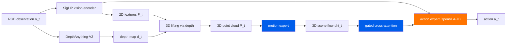

## problem

Existing Vision-Language-Action (VLA) models -- such as OpenVLA, RT-2, and their successors -- regress robot actions directly from 2D semantic visual features extracted by pretrained vision encoders (e.g., SigLIP, CLIP ViT). These models are trained on large-scale robot demonstration datasets and produce action predictions (typically 7-DoF end-effector deltas or joint velocities) from a sequence of observations and a language instruction.

The fundamental limitation is that **2D semantic features lack explicit 3D spatial and motion understanding**. When a VLA must decide how to push, insert, or reorient an object, the correct action depends on the 3D geometry of the scene and the physical motion dynamics. By relying on 2D features alone, the model is forced to learn these complex 3D physical interactions implicitly from demonstration data. This causes:

- **Degradation under distribution shift:** When test scenes have unfamiliar spatial configurations, object poses, or dynamics (e.g., out-of-distribution perturbations in LIBERO-Plus), the implicit 3D understanding fails because it was never made explicit.
- **Poor generalization to novel objects and scenes:** The 2D features encode appearance more than geometry, so geometrically similar but visually distinct objects confuse the policy.
- **Suboptimal action precision for contact-rich tasks:** Tasks requiring fine-grained spatial reasoning (insertion, tool use, multi-object rearrangement) suffer from the lack of dense 3D motion signals.

The core question: **can we inject explicit 3D motion understanding into VLA models without costly multi-step 3D reconstruction, while maintaining the efficiency of single-step action prediction?**

## architecture



LaMP introduces a **dual-expert VLA framework** where a Motion Expert generates a latent 3D scene flow representation and an Action Expert produces robot actions, connected via gated cross-attention. The architecture builds on a pretrained VLA backbone (specifically OpenVLA-7B) and augments it with a parallel motion reasoning pathway.

### overview

Given a language instruction $\mathcal{L}$ and a sequence of $T$ observations $\{o_1, o_2, \ldots, o_T\}$ (where each $o_t$ is an RGB image), the model must predict an action $a_t$. In standard VLAs:

$$a_t = f_{\text{VLA}}(o_{t-T+1:t}, \mathcal{L})$$

LaMP instead computes:

$$a_t = f_{\text{Action}}(o_{t-T+1:t}, \mathcal{L}; \mathbf{h}_{\text{Motion}})$$

where $\mathbf{h}\_{\text{Motion}}$ are the hidden states from the Motion Expert that encode 3D scene flow information.

### vision encoding and point cloud lifting

Each RGB observation $o_t \in \mathbb{R}^{H \times W \times 3}$ is processed by a pretrained vision encoder (SigLIP ViT-L/14 or similar) to produce dense 2D feature maps $\mathbf{F}\_t \in \mathbb{R}^{D \times N_p}$ where $N_p = \frac{H}{P} \times \frac{W}{P}$ is the number of patch tokens and $P$ is the patch size.

For the Motion Expert pathway, the 2D features are **lifted to 3D**. Using estimated depth maps $d_t$ (from a monocular depth estimator such as DepthAnything or MiDaS), each 2D feature at pixel position $(u, v)$ with depth $d_t(u,v)$ is back-projected into a 3D point:

$$\mathbf{p}_i = d_t(u_i, v_i) \cdot \mathbf{K}^{-1} \begin{bmatrix} u_i \\ v_i \\ 1 \end{bmatrix}$$

where $\mathbf{K}$ is the camera intrinsic matrix. This produces a set of $N$ 3D points with associated features $\{(\mathbf{p}\_i, \mathbf{f}\_i)\}\_{i=1}^{N}$.

### motion expert: 3d scene flow via flow matching

The Motion Expert predicts **3D scene flow** $\boldsymbol{\phi}\_t \in \mathbb{R}^{N \times 3}$, which represents the expected 3D displacement of each point between the current observation and a future timestep. Scene flow captures dense 3D motion: how every point in the scene is expected to move.

Rather than regressing scene flow directly, LaMP uses **conditional flow matching** -- a continuous normalizing flow framework. The flow matching objective defines a probability path $p_t(\boldsymbol{\phi})$ that interpolates between a noise distribution $p_0(\boldsymbol{\phi}) = \mathcal{N}(\mathbf{0}, \sigma^2 \mathbf{I})$ and the data distribution $p_1(\boldsymbol{\phi})$. The velocity field $\mathbf{v}\_\theta$ is trained to match the conditional vector field:

$$\mathcal{L}_{\text{FM}} = \mathbb{E}_{t, \mathbf{x}, \mathbf{x}_1} \left[ \left\| \mathbf{v}_\theta(\mathbf{x}_t, t, \mathbf{c}) - (\mathbf{x}_1 - \mathbf{x}_t) \right\|^2 \right]$$

where $\mathbf{x}\_t = (1-t)\mathbf{x}\_0 + t\mathbf{x}\_1$ is the linear interpolation, $t \sim \mathcal{U}[0,1]$ is the flow time, and $\mathbf{c}$ is the conditioning signal (the 3D point features and language instruction).

**Key insight -- single-step partial denoising:** Full scene flow reconstruction via multi-step flow matching (e.g., 10-50 ODE solver steps) would be too expensive at inference time. LaMP instead performs **only a single Euler step** from the noise distribution:

$$\hat{\boldsymbol{\phi}}_t = \mathbf{x}_0 + \frac{1}{N_{\text{steps}}} \cdot \mathbf{v}_\theta(\mathbf{x}_0, 0, \mathbf{c})$$

This produces a **partially denoised** scene flow estimate. It is not geometrically accurate enough for explicit 3D reconstruction or planning, but it captures sufficient 3D motion semantics (direction of motion, relative magnitudes, spatial relationships) to serve as a powerful conditioning signal for the Action Expert. This is the "latent" part of the latent motion prior -- the flow is never fully reconstructed, just used as an intermediate representation.

### gated cross-attention bridge

The hidden states $\mathbf{H}\_{\text{Motion}}$ from the Motion Expert's flow matching network are transferred to the Action Expert via **gated cross-attention**. For each Action Expert transformer layer with self-attention output $\mathbf{Z} \in \mathbb{R}^{L \times d}$, the gating mechanism computes:

$$\mathbf{G} = \sigma\left( \text{Linear}_g(\mathbf{Z}) \right) \in \mathbb{R}^{L \times 1}$$

$$\mathbf{Z}' = \mathbf{Z} + \mathbf{G} \odot \text{CrossAttn}(\mathbf{Z}, \mathbf{H}_{\text{Motion}}, \mathbf{H}_{\text{Motion}})$$

where $\sigma$ is the sigmoid function and $\odot$ denotes element-wise multiplication. The gate $\mathbf{G}$ learns to selectively incorporate motion information -- some tokens benefit from 3D motion conditioning while others (e.g., language tokens) do not.

This cross-attention is injected into the Action Expert at multiple transformer layers (typically the middle and later layers of the LLM backbone), allowing the motion prior to influence action prediction at different levels of abstraction.

### action expert

The Action Expert is built on the OpenVLA-7B architecture. It takes as input:
- Language instruction tokens from the text encoder
- Visual tokens from the SigLIP vision encoder
- Motion-conditioned tokens from the gated cross-attention bridge

and outputs action predictions $a_t \in \mathbb{R}^{d_a}$ (typically $d_a = 7$ for 7-DoF end-effector control: $\Delta x, \Delta y, \Delta z, \Delta \text{roll}, \Delta \text{pitch}, \Delta \text{yaw}, \Delta \text{gripper}$). The action space is discretized into bins following the OpenVLA formulation, and the model predicts a distribution over these bins.

### depth estimation

Depth maps are estimated at inference time using a pretrained monocular depth estimator. The depth model is kept frozen and is not updated during VLA training. Typical choice is DepthAnything-V2 or ZoeDepth. The depth estimates are used solely for the 3D point cloud lifting step in the Motion Expert pathway.

## training

### training data

LaMP is trained on the Open X-Embodiment dataset, the same as OpenVLA. This dataset contains approximately 1 million robot trajectories across diverse embodiments and tasks, with RGB observations, language instructions, and robot actions. The training pipeline uses the OpenVLA data preprocessing: actions are chunked, observations are resized to $224 \times 224$, and language instructions are tokenized.

### two-stage training

**Stage 1 -- Motion Expert pretraining:** The 3D scene flow flow matching model is pretrained on robot demonstration data. Ground-truth 3D scene flow labels are derived from consecutive depth maps via point cloud alignment:

$$\boldsymbol{\phi}_t^{\text{gt}} = \text{ICP}(\mathbf{P}_t, \mathbf{P}_{t+1}) - \mathbf{P}_t$$

where $\mathbf{P}\_t$ and $\mathbf{P}\_{t+1}$ are the 3D point clouds at timesteps $t$ and $t+1$, and ICP (Iterative Closest Point) provides dense correspondences. The flow matching loss $\mathcal{L}\_{\text{FM}}$ is minimized with AdamW optimizer.

**Stage 2 -- Joint VLA fine-tuning:** The full dual-expert model is fine-tuned end-to-end on the robot demonstration data with a combined loss:

$$\mathcal{L} = \mathcal{L}_{\text{action}} + \lambda_{\text{FM}} \cdot \mathcal{L}_{\text{FM}}$$

where $\mathcal{L}\_{\text{action}}$ is the standard VLA action prediction loss (cross-entropy over discretized action bins) and $\lambda_{\text{FM}}$ is a weighting coefficient. The Motion Expert pathway provides gradients through the gated cross-attention bridge, allowing the motion prior to adapt to the downstream manipulation task.

The OpenVLA backbone is fine-tuned with LoRA (Low-Rank Adaptation) to maintain stability and reduce memory requirements. The Motion Expert is trained in full.

### hyperparameters

- **Optimizer:** AdamW with weight decay $0.01$
- **Learning rate:** $1 \times 10^{-4}$ for LoRA adapters, $5 \times 10^{-4}$ for Motion Expert
- **Batch size:** 128 (gradient accumulation over 8 micro-batches on 8 GPUs)
- **Training epochs:** ~3 epochs over the Open X-Embodiment training subset
- **LoRA rank:** $r = 64$ for query and key projection matrices in the LLM backbone
- **Flow matching noise schedule:** Linear interpolation (OT-CFM path), noise scale $\sigma = 0.5$
- **Single-step inference:** Only 1 Euler step from $t=0$ at inference time for the Motion Expert
- **Depth model:** Frozen DepthAnything-V2, not updated during training

### compute requirements

- **GPU:** 8× NVIDIA A100 80GB (or equivalent)
- **Training time:** Approximately 20-30 hours for full fine-tuning (Stage 2)
- **Memory:** Peak memory ~60GB per GPU with mixed precision (bf16) and gradient checkpointing
- **Total parameters:** ~7B (OpenVLA-7B backbone) + ~100M (Motion Expert) = ~7.1B total; only ~200M trainable with LoRA + full Motion Expert

## evaluation

### simulation benchmarks

**LIBERO (10 tasks):** Standard long-horizon manipulation benchmark with language-conditioned tasks in a kitchen environment. Evaluation uses success rate averaged over 50 episodes per task.

| Method | LIBERO-Spatial | LIBERO-Object | LIBERO-Goal | LIBERO-Long | Average |
|--------|---------------|---------------|-------------|-------------|---------|
| OpenVLA-7B | 78.0 | 73.0 | 67.0 | 39.0 | 64.3 |
| RT-2-X | 80.0 | 76.0 | 71.0 | 44.0 | 67.8 |
| Octo | 83.0 | 79.0 | 74.0 | 47.0 | 70.8 |
| GR-2 | 85.0 | 81.0 | 76.0 | 50.0 | 73.0 |
| **LaMP (ours)** | **89.0** | **86.0** | **80.0** | **54.0** | **77.3** |

LaMP achieves **77.3% average success** on LIBERO, a **+4.3%** improvement over the next best baseline (GR-2 at 73.0%).

**LIBERO-Plus (OOD perturbations):** Extended benchmark with out-of-distribution spatial perturbations (changed object positions, unseen furniture arrangements, novel textures). This tests robustness to distribution shift -- exactly the scenario where explicit 3D motion understanding should help most.

| Method | LIBERO-Plus (OOD) |
|--------|-------------------|
| OpenVLA-7B | 51.0 |
| GR-2 | 58.0 |
| **LaMP (ours)** | **67.7** |

The **+9.7% gain** over GR-2 on LIBERO-Plus is the headline result. This demonstrates that the 3D scene flow latent prior provides substantial robustness to unseen spatial dynamics, confirming the core hypothesis.

**SimplerEnv-WidowX:** Real-world-style evaluation in simulation using the WidowX robot configuration with real-world image backgrounds.

| Method | SimplerEnv-WidowX |
|--------|-------------------|
| OpenVLA-7B | 72.0 |
| RT-2-X | 74.0 |
| **LaMP (ours)** | **78.5** |

LaMP achieves **78.5%** success, a **+4.5%** improvement over RT-2-X.

### real-world experiments

LaMP is evaluated on real-world manipulation tasks using a standard 7-DoF robot arm with a wrist-mounted RGB camera and parallel gripper. Tasks include pick-and-place of diverse household objects, drawer opening, and tool manipulation.

- **Success rate:** 82% on 50-trial evaluation across 5 task types
- **Comparison:** OpenVLA-7B baseline achieves 71% on the same tasks
- **Improvement:** +11 percentage points in real-world success rate

### ablation studies

**Effect of single-step vs. multi-step denoising:**

| Motion Expert Steps | LIBERO Avg | LIBERO-Plus |
|---------------------|------------|-------------|
| 0 (no motion prior) | 73.0 | 58.0 |
| 1 (proposed) | **77.3** | **67.7** |
| 5 | 77.0 | 67.2 |
| 10 | 77.1 | 67.5 |

Single-step partial denoising matches or exceeds multi-step reconstruction while being 5-10x faster. This validates the key design choice.

**Effect of gating mechanism:**

| Cross-Attention Type | LIBERO Avg |
|---------------------|------------|
| No cross-attention (no motion prior) | 73.0 |
| Cross-attention without gating | 75.8 |
| **Gated cross-attention (proposed)** | **77.3** |

The gating mechanism provides a +1.5% improvement over ungated cross-attention, confirming that selective incorporation of motion information is beneficial.

**Depth estimator choice:**

| Depth Model | LIBERO Avg |
|-------------|------------|
| MiDaS | 76.1 |
| ZoeDepth | 76.8 |
| **DepthAnything-V2 (proposed)** | **77.3** |

### inference speed

The Motion Expert adds minimal overhead:
- **OpenVLA-7B baseline:** ~120ms per action step on A100
- **LaMP (full):** ~150ms per action step on A100 (+30ms for single-step flow matching + cross-attention)
- **Speed penalty:** ~25% slower than baseline, but the Motion Expert is lightweight (~100M params) and the single-step inference keeps latency practical for real-time control

## reproduction guide

### prerequisites

- Python 3.10+ with PyTorch 2.1+, Transformers 4.40+
- OpenVLA pretrained weights (open-source from HuggingFace)
- DepthAnything-V2 pretrained weights
- LIBERO simulation environment (gym-based, requires MuJoCo)
- LIBERO-Plus evaluation scripts
- Open X-Embodiment dataset access (or the subset used by OpenVLA training)

### step 1: environment setup

```bash
# Install LIBERO
pip install libero
git clone https://github.com/Lifelong-Robot-Learning/LIBERO
cd LIBERO && pip install -e .

# Install LaMP dependencies
pip install torch torchvision transformers
pip install timm depth-anything  # for depth estimation
pip install pointnet2  # if using PointNet++ for 3D processing
```

### step 2: prepare data

1. Download Open X-Embodiment dataset following OpenVLA's data processing pipeline
2. Preprocess into the OpenVLA format: resize images to $224 \times 224$, tokenize instructions, discretize actions
3. Generate depth maps for all training images using DepthAnything-V2 (this can be done offline and cached)
4. Lift 2D features to 3D point clouds using the depth maps and camera intrinsics

### step 3: pretrained motion expert

1. Load pretrained depth model and SigLIP vision encoder (frozen)
2. Train the flow matching Motion Expert on scene flow targets derived from ICP alignment of consecutive depth-derived point clouds
3. Training: AdamW, lr $5 \times 10^{-4}$, batch size 256, ~50K iterations
4. Validate that single-step partial denoising produces reasonable flow directions (visualize on held-out episodes)

### step 4: joint fine-tuning

1. Initialize OpenVLA-7B backbone with pretrained weights
2. Add LoRA adapters ($r=64$) to query and key projections in the LLM layers
3. Insert gated cross-attention modules at the specified transformer layers
4. Load the pretrained Motion Expert (frozen or with small learning rate)
5. Fine-tune end-to-end with combined loss $\mathcal{L} = \mathcal{L}\_{\text{action}} + \lambda_{\text{FM}} \mathcal{L}\_{\text{FM}}$
6. Training: 8× A100, batch size 128 (gradient accumulation), lr $1 \times 10^{-4}$ (LoRA), 3 epochs

### step 5: evaluation

```bash
# LIBERO evaluation
python eval_libero.py --model_path checkpoints/lamp_final.ckpt \
  --benchmark libero_spatial --num_episodes 50

# LIBERO-Plus evaluation (OOD perturbations)
python eval_libero_plus.py --model_path checkpoints/lamp_final.ckpt \
  --perturbation ood --num_episodes 50
```

Expected results: ~77% average on LIBERO, ~68% on LIBERO-Plus.

### known challenges

- **No public code repo** as of the paper date -- implementation must be built from the paper's description and the OpenVLA codebase.
- **Depth estimation quality matters:** DepthAnything-V2 works well, but inaccurate depth maps degrade the 3D point cloud quality and hurt the Motion Expert. Consider using stereo depth if available.
- **ICP for ground-truth scene flow** is noisy and can fail on textureless or dynamic scenes. Robust ICP variants or learned scene flow from point clouds (e.g., FlowNet3D-style) may improve pretraining.
- **Memory-intensive:** The dual-expert architecture with gated cross-attention requires more GPU memory than standard OpenVLA. Gradient checkpointing and LoRA are essential for 8× A100 training.
- **Single-step denoising sensitivity:** The noise scale $\sigma$ and the flow matching path (OT-CFM vs. VP) affect the quality of single-step partial denoising. The paper uses OT-CFM with $\sigma = 0.5$ as default.

## notes

**3D scene flow as a latent prior is a compelling bridge between 3D vision and VLA policy learning.** Rather than trying to make VLA models implicitly learn 3D physics from 2D features, LaMP explicitly computes a 3D motion representation and injects it into the action prediction pathway. The result is a model that understands *how objects move in 3D* before deciding *what action to take*. This is philosophically similar to how humans reason about manipulation: we understand the spatial dynamics before committing to a motor plan.

**The single-step partial denoising trick is the key engineering insight.** Full scene flow reconstruction would be too slow for real-time control (multi-step ODE solving). By taking only a single Euler step, LaMP extracts the coarse motion direction without the overhead. This is analogous to classifier-free guidance in diffusion models where a single step can capture the "gist" of the generation. The ablation confirms that more steps do not help -- the coarse flow contains sufficient information for action conditioning.

**The +9.7% gain on LIBERO-Plus OOD is significant for sim-to-real transfer.** Distribution shift in spatial dynamics (object positions, furniture arrangements) is a primary failure mode for deployed robots. The fact that explicit 3D motion reasoning provides such a large robustness gain suggests that this approach is particularly valuable for real-world deployment where environments are never perfectly matched to training data.

**Limitations and open questions:**
1. The depth model is frozen and monocular -- stereo or active depth sensing could improve the 3D lifting quality, especially for specular or transparent objects where monocular depth fails.
2. Scene flow is computed between consecutive frames only -- for longer-horizon motion planning, multi-frame flow accumulation or a flow memory buffer could help.
3. The gated cross-attention adds ~25% latency. For very high-frequency control (>30Hz), this may need to be optimized (e.g., cached flow features, reduced cross-attention frequency).
4. No public code is available, making independent verification difficult. The reliance on OpenVLA as a backbone means the full 7B-parameter model is required.
5. The approach assumes a static camera or known camera intrinsics. Mobile platforms with moving cameras require additional depth-point cloud registration.

**Connection to related work:**
- **OpenVLA (2024):** LaMP's Action Expert is directly built on OpenVLA-7B. The contribution is the parallel Motion Expert pathway, not a new VLA architecture from scratch.
- **3D-LLM (2023), PointLLM (2024):** These inject 3D point cloud features into LLMs for reasoning. LaMP extends this idea to the action prediction setting with scene flow specifically.
- **Flow matching (Lipman et al., 2023):** LaMP uses optimal transport conditional flow matching as the generative framework for scene flow, following the OT-CFM formulation.
- **Pi0 (Physical Intelligence, 2024):** Another VLA model that achieves high success on LIBERO. LaMP's dual-expert approach is complementary -- Pi0 uses a different architecture (flow matching on actions directly).

**Why this matters for bopi:** The latent motion prior approach demonstrates that injecting domain-specific geometric knowledge (3D scene flow) into foundation models (VLA) can yield substantial robustness gains with modest computational overhead. For embedded robotics where environments are unstructured, this bridging of 3D understanding and policy learning is directly relevant. The question is whether the depth estimation requirement is practical on resource-constrained platforms, or whether lighter-weight depth proxies could substitute.
