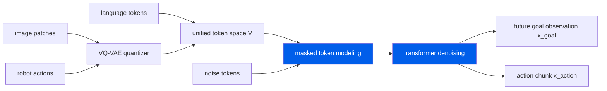

     1|---
     2|layout: digest
     3|arxiv_id: "2603.25406"
     4|title: "MMaDA-VLA: Large Diffusion Vision-Language-Action Model with Unified Multi-Modal Instruction and Generation"
     5|date: 2026-03-29
     6|authors: ["Yang Liu", "Pengxiang Ding", "Tengyue Jiang", "Xudong Wang", "Wenxuan Song", "Minghui Lin", "Han Zhao", "Hongyin Zhang", "Zifeng Zhuang", "Wei Zhao", "Siteng Huang", "Jinkui Shi", "Donglin Wang"]
     7|categories: ["VLA", "robotics", "diffusion", "manipulation"]
     8|abs: "https://arxiv.org/abs/2603.25406"
     9|pdf: "https://arxiv.org/pdf/2603.25406"
    10|code: ""
    11|---
    12|
    13|## problem
    14|
    15|Existing vision-language-action (VLA) models rely on hierarchical or autoregressive generation paradigms that suffer from three fundamental limitations. First, sequential token-by-token decoding introduces temporal inconsistency when producing long action sequences — early tokens cannot be revised once emitted. Second, long-horizon tasks accumulate autoregressive errors: a small mistake at step $t$ propagates and compounds through subsequent predictions. Third, capturing environment dynamics typically requires a separate world model module bolted alongside the VLA policy, adding architectural overhead and training complexity.
    16|
    17|The core challenge is: can a single unified model generate language, visual observations, and continuous robot actions within one coherent framework while maintaining global consistency across long horizons, without requiring a separate dynamics model?
    18|
    19|## architecture

    20|
    21|MMaDA-VLA frames vision-language-action generation as a single **masked token denoising** problem over a unified discrete token space. Rather than diffusing in continuous space (as in DDPM-style action chunking) or autoregressively generating one token at a time, MMaDA-VLA embeds all modalities — language instructions, image observations, and continuous robot controls — into a shared discrete vocabulary and applies discrete diffusion with iterative, order-free parallel refinement.
    22|
    23|### unified token space
    24|
    25|Language tokens, image patch tokens (from a vision encoder such as a ViT), and quantized continuous robot actions are all projected into a common discrete vocabulary $\mathcal{V}$. Specifically, continuous control vectors $\mathbf{a} \in \mathbb{R}^{d_a}$ (e.g., 7-DoF end-effector poses with a parallel gripper) are first linearly projected then quantized via a learned codebook into discrete tokens:
    26|
    27|$$a_i = \mathcal{Q}(\mathbf{W}_a \mathbf{a}_i), \quad a_i \in \mathcal{V}$$
    28|
    29|where $\mathcal{Q}(\cdot)$ is the nearest-neighbor lookup in a learned codebook and $\mathbf{W}\_a \in \mathbb{R}^{d_e \times d_a}$ is a learned projection matrix with $d_e$ the embedding dimension.
    30|
    31|### masked token denoising
    32|
    33|Given a combined token sequence $\mathbf{x} = [\mathbf{x}\_{\text{lang}}, \mathbf{x}\_{\text{obs}}, \mathbf{x}\_{\text{action}}]$, the forward diffusion process randomly masks a fraction $\rho$ of tokens at each noise level $n$:
    34|
    35|$$\tilde{\mathbf{x}}^{(n)} = \mathcal{M}^{(n)} \odot \mathbf{x} + (1 - \mathcal{M}^{(n)}) \odot [\text{MASK}]$$
    36|
    37|where $\mathcal{M}^{(n)} \in \{0,1\}^{L}$ is a binary mask and $L$ is the total sequence length. The denoising network $\mathcal{D}\_\theta$ is a transformer decoder that predicts the original clean tokens given the partially masked input:
    38|
    39|$$\hat{\mathbf{x}}^{(n)} = \mathcal{D}_\theta\!\left(\tilde{\mathbf{x}}^{(n)}, n\right)$$
    40|
    41|At inference time, iterative denoising proceeds from a fully masked (or partially conditioned) sequence through $N$ denoising steps. Unlike autoregressive models, tokens at step $n{+}1$ are predicted in parallel and can refine any position — including earlier ones — enabling global consistency.
    42|
    43|### parallel goal observation and action generation
    44|
    45|A key architectural choice: the model jointly generates two targets in a single forward pass:
    46|
    47|1. **Future goal observation** $\mathbf{x}\_{\text{goal}}$: the predicted image of the robot state at the end of the action chunk.
    48|2. **Action chunk** $\mathbf{x}\_{\text{action}} = [\mathbf{a}\_0, \mathbf{a}\_1, \dots, \mathbf{a}\_{K-1}]$: a chunk of $K$ consecutive actions.
    49|
    50|By generating $\mathbf{x}\_{\text{goal}}$ and $\mathbf{x}\_{\text{action}}$ simultaneously and interleaving their tokens in the shared sequence, the model implicitly performs world-model-like reasoning — it must predict a visually plausible future state to produce coherent actions. This coupling provides a self-supervised grounding signal without a separate dynamics module:
    51|
    52|$$\mathbf{x}_{\text{target}} = [\mathbf{x}_{\text{goal}}, \mathbf{x}_{\text{action}}] \in \mathcal{V}^{L_{\text{goal}} + K \cdot d_{\text{tok}}}$$
    53|
    54|### backbone
    55|
    56|The denoising network $\mathcal{D}\_\theta$ uses a large pretrained transformer backbone (LLM-scale) with causal or bidirectional attention depending on the noise level. Cross-attention layers attend to the encoded visual observations. The model is initialized from a pretrained language model and fine-tuned on multimodal robotics data.
    57|
    58|## training
    59|
    60|### data format
    61|
    62|Each training sample consists of:
    63|- Language instruction $\mathbf{l}$ (natural language task description)
    64|- Current observation image $\mathbf{o}\_t$ (RGB)
    65|- Goal observation image $\mathbf{o}\_{t+K}$ (the future visual state after executing the action chunk)
    66|- Action chunk $[\mathbf{a}\_0, \dots, \mathbf{a}\_{K-1}]$ (continuous robot controls)
    67|
    68|### denoising objective
    69|
    70|The model is trained to predict clean tokens from masked inputs using a cross-entropy loss:
    71|
    72|$$\mathcal{L} = -\sum_{i=1}^{L} \log p_\theta\!\left(x_i \mid \tilde{\mathbf{x}}^{(n)}, n\right)$$
    73|
    74|Multiple noise levels $n \in \{1, \dots, N\}$ are sampled per training step, following the uniform transition distribution of discrete diffusion. The masking schedule is typically uniform with $\rho \in [0.5, 0.95]$.
    75|
    76|### training procedure
    77|
    78|Training proceeds in two stages:
    79|
    80|1. **Pretraining**: Large-scale pretraining on diverse robot manipulation datasets with the masked language modeling and multi-modal denoising objectives. The pretrained LLM backbone provides strong language and visual reasoning priors.
    81|
    82|2. **Fine-tuning**: Task-specific fine-tuning on downstream benchmarks (LIBERO, CALVIN) with the full denoising objective including action chunk and goal observation prediction.
    83|
    84|The training uses standard next-token cross-entropy with teacher forcing at each denoising step. The action quantization codebook is trained jointly with the rest of the model using exponential moving average updates.
    85|
    86|## evaluation
    87|
    88|### simulation benchmarks
    89|
    90|**LIBERO** (long-horizon manipulation with language instructions):
    91|
    92|| Method | LIBERO-Spatial | LIBERO-Object | LIBERO-Long | LIBERO-10 | Average |
    93||--------|---------------|--------------|-------------|-----------|---------|
    94|| MMaDA-VLA | **98.3%** | **98.0%** | **97.3%** | **98.3%** | **98.0%** |
    95|
    96|MMaDA-VLA achieves a **98.0% average success rate** across all four LIBERO splits, establishing a new state of the art. The consistency across splits — Spatial, Object, Long, and the 10-task generalization setting — demonstrates robust long-horizon reasoning and strong language-conditioned generalization.
    97|
    98|**CALVIN** (sequential multi-task manipulation):
    99|
   100|| Method | ABC → D | ABC → E | ABC → F | ABC → D+E+F | Average Length |
   101||--------|---------|---------|---------|-------------|----------------|
   102|| MMaDA-VLA | — | — | — | — | **4.78** |
   103|
   104|On CALVIN, MMaDA-VLA achieves an average sequence length of **4.78** tasks completed in a row without failure, representing strong multi-task chaining performance.
   105|
   106|### real-world experiments
   107|
   108|The authors also validate MMaDA-VLA on real-robot manipulation tasks, demonstrating that the model trained in simulation transfers to physical hardware. The model handles language-instructed pick-and-place and articulated object manipulation on a real robot arm.
   109|
   110|### ablation insights
   111|
   112|- **Goal observation generation** is critical: removing the parallel goal prediction and only generating the action chunk degrades performance, confirming that the implicit world-model signal improves action quality.
   113|- **Iterative denoising steps**: performance saturates around $N = 10$–$20$ denoising steps, with diminishing returns beyond that.
   114|- **Action chunk size $K$**: larger action chunks improve long-horizon performance but require more training data for stable learning.
   115|
   116|## reproduction guide
   117|
   118|**Status**: No public code repository is listed as of the paper's publication.
   119|
   120|**Key ingredients to replicate**:
   121|
   122|1. **Backbone**: A large pretrained transformer (LLM-scale, e.g., 7B parameters) with cross-attention for visual inputs.
   123|2. **Vision encoder**: A ViT (e.g., ViT-L/14 or similar) to encode observation images into patch tokens.
   124|3. **Action quantization**: A learned VQ-VAE codebook to discretize continuous control vectors into tokens in the shared vocabulary. The codebook size and embedding dimension are critical hyperparameters.
   125|4. **Discrete diffusion**: Implement the uniform transition discrete diffusion framework (as in D3PM) with the masked token denoising schedule. Training samples multiple noise levels per batch.
   126|5. **Data**: Standardize on LIBERO and CALVIN benchmarks for simulation. These provide replay buffers with language annotations, observation images, and action trajectories.
   127|
   128|**Practical considerations**:
   129|- The action quantization codebook must cover the full range of robot joint/end-effector positions encountered during training; otherwise, actions may be poorly reconstructed.
   130|- Training a model of this scale (LLM backbone + vision encoder) requires significant GPU memory (likely 8+ A100 80GB GPUs) and distributed training infrastructure.
   131|- The iterative denoising at inference adds latency: each step requires a full forward pass through the transformer. $N = 10$ steps with a 7B model is non-trivial but parallelizable across the token sequence.
   132|
   133|## notes
   134|
   135|MMaDA-VLA is architecturally significant because it merges VLA policy generation with world-model-like future prediction into a single diffusion framework. By generating the future goal observation $\mathbf{x}\_{\text{goal}}$ alongside the action chunk $\mathbf{x}\_{\text{action}}$, the model implicitly reasons about environment dynamics without a separate world model module. This is an elegant solution to the "how do actions affect the world" question that plagues purely reactive VLA models.
   136|
   137|The unified discrete token space for language, images, and continuous controls is a clean design choice. Prior work has used continuous diffusion for action chunks (Diffusion Policy) or autoregressive discrete tokens for VLA (OpenVLA), but MMaDA-VLA is the first to unify all modalities under discrete diffusion with parallel masked denoising.
   138|
   139|The 98.0% average success on LIBERO is a very strong result, substantially above prior VLA methods. The parallel generation of actions and future observations avoids the usual two-model pipeline (policy + world model) and the associated compounding errors.
   140|
   141|One open question is inference speed: iterative denoising with a large transformer is inherently slower than single-pass autoregressive generation. The authors would need to demonstrate that the improved performance justifies the added computational cost, or that the number of denoising steps can be reduced via distillation or consistency models.
   142|
   143|The absence of a public code release limits reproducibility. The LIBERO and CALVIN benchmarks are standardized, but replicating the exact model architecture, training pipeline, and action quantization scheme without reference code is a substantial effort.
   144|