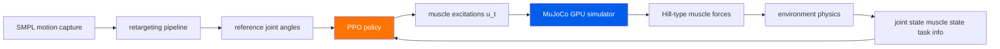

     1|---
     2|layout: digest
     3|arxiv_id: "2603.25544"
     4|title: "Towards Embodied AI with MuscleMimic: Unlocking full-body musculoskeletal motor learning at scale"
     5|date: 2026-03-29
     6|authors: ["Chengkun Li", "Cheryl Wang", "Bianca Ziliotto", "Merkourios Simos", "Jozsef Kovecses", "Guillaume Durandau", "Alexander Mathis"]
     7|categories: ["embodied-AI", "robotics", "simulation", "motor-learning", "musculoskeletal"]
     8|abs: "https://arxiv.org/abs/2603.25544"
     9|pdf: "https://arxiv.org/pdf/2603.25544"
    10|code: "https://github.com/amathislab/musclemimic"
    11|---
    12|
    13|## problem
    14|
    15|learning motor control for muscle-driven musculoskeletal models is hindered by two bottlenecks: the computational cost of biomechanically accurate simulation (seconds per timestep on CPU), and the scarcity of validated open full-body models. most prior work on humanoid control uses simplified rigid-body dynamics with joint torque actuators, ignoring the complexity of real muscles (activation dynamics, force-length-velocity relationships, tendon compliance). this limits transfer to real biomechanics research and prosthetics.
    16|
    17|prior approaches:
    18|- **DeepMimic** (peng et al.): joint-torque-driven characters, no muscle dynamics. can't study biomechanics.
    19|- **AMP** (peng et al.): adversarial motion priors for torque-driven humanoids. same limitation.
    20|- **MyoSuite** (macklin et al.): musculoskeletal but limited to isolated body parts (hand, arm). no full-body locomotion.
    21|- **learning muscle control for biomechanics** (various): small-scale, single-task, often hand-crafted reward functions.
    22|
    23|## architecture

    24|
    25|**simulator**: uses MuJoCo with custom muscle actuators. each muscle modeled as a Hill-type actuator with:
    26|- activation dynamics: $\dot{a} = (u - a) / \tau_a$, where $u \in [0, 1]$ is the neural excitation and $\tau_a$ is the activation time constant
    27|- muscle force: $f = a \cdot f_l(l) \cdot f_v(v) \cdot f_{\max}$, where $f_l$ and $f_v$ are the force-length and force-velocity curves
    28|
    29|**two validated embodiments**:
    30|1. **fixed-root upper-body** ($N = 126$ muscles, $30$ DOF): for manipulation tasks (reaching, grasping, tool use)
    31|2. **full-body** ($N = 416$ muscles, $76$ DOF): for locomotion (walking, running, jumping)
    32|
    33|**retargeting pipeline**: maps SMPL motion capture data to musculoskeletal joint space via inverse kinematics, then extracts joint angle trajectories as reference for imitation.
    34|
    35|**policy**: RL policy (PPO) that outputs muscle excitations $u_t$ per muscle per timestep. the observation space includes joint positions, velocities, muscle states (length, velocity, activation), and task-specific information (target positions, object states).
    36|
    37|$$\pi_\theta(a_t | o_t) \rightarrow u_t \in [0, 1]^{N_{\text{muscles}}}$$
    38|
    39|**massively parallel GPU simulation**: custom MuJoCo-based simulator runs $4096+$ environments in parallel on a single GPU, giving order-of-magnitude speedup over CPU simulation.
    40|
    41|## training
    42|
    43|- **hardware**: single NVIDIA GPU (type not specified, likely A100 or similar)
    44|- **training time**: "days" for a generalist policy across hundreds of motions (vs months on CPU)
    45|- **algorithm**: PPO with shared generalist policy across diverse motion clips
    46|- **dataset**: hundreds of diverse motions from CMU Mocap and AMASS, retargeted to both embodiments via SMPL pipeline
    47|- **reward**: combination of imitation reward (joint position tracking) and biomechanical regularization (muscle effort penalties, joint limit avoidance)
    48|- **curriculum**: starts with easy motions, progressively adds harder ones
    49|
    50|## evaluation
    51|
    52|**single generalist policy performance**:
    53|- trained on hundreds of diverse motions, achieves robust performance across unseen motion categories
    54|- strong biomechanical validation against experimental walking/running data
    55|- mean correlation $r = 0.90$ for joint kinematics against ground-truth motion capture
    56|
    57|**muscle activation analysis**:
    58|- key finding: kinematic imitation alone does NOT achieve physiological muscle fidelity
    59|- the policy can match joint trajectories while using physiologically implausible muscle coordination patterns
    60|- this suggests future work needs explicit biomechanical objectives (e.g., EMG matching, metabolic cost minimization), not just motion matching
    61|
    62|**embodiment-specific results**:
    63|- upper-body (126 muscles): successful manipulation across diverse reaching and grasping tasks
    64|- full-body (416 muscles): locomotion (walking, running, turning) with physically plausible ground reaction forces
    65|
    66|## reproduction guide
    67|
    68|1. clone the repo: `git clone https://github.com/amathislab/musclemimic`
    69|2. install dependencies: MuJoCo, PyTorch, CUDA. the README should have exact version pins
    70|3. download preprocessed motion datasets (links in repo)
    71|4. for a quick test: train on a single locomotion motion first (e.g., walking). expect convergence in hours on a single GPU
    72|5. for the full generalist: train across the full motion library. this takes days on a single GPU
    73|6. the repo includes pre-trained checkpoints, musculoskeletal model files, and retargeted datasets - excellent reproducibility
    74|7. known gotcha: muscle simulation is sensitive to timestep size. use the default timestep from the paper - smaller timesteps improve stability but slow training
    75|
    76|## notes
    77|
    78|this is highly relevant for bopi's embodied AI interests. the key contribution is making musculoskeletal simulation practical at scale through GPU parallelization. $416$ muscles is a real full-body model, not a toy.
    79|
    80|the finding that kinematic imitation alone doesn't produce physiological muscle fidelity is important and underappreciated. it means if you want to study real biomechanics (for prosthetics, rehabilitation, ergonomics), you need to go beyond motion matching and add explicit biomechanical objectives.
    81|
    82|the open-source nature is excellent - code, models, datasets, and checkpoints all available. this makes it a strong foundation for future work.
    83|
    84|**open questions:**
    85|- can you combine muscle-based control with learned tactile feedback for dexterous manipulation?
    86|- what happens if you add explicit EMG matching as a training objective? does it improve physiological fidelity?
    87|- can the retargeting pipeline handle motion capture from different body shapes/sizes?
    88|- how does the sample efficiency compare to torque-driven approaches? is the extra complexity of muscle dynamics worth it for robotics applications that don't need biomechanical accuracy?
    89|