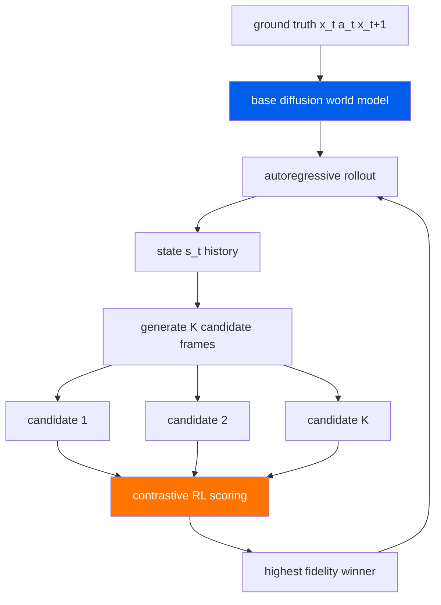

     1|---
     2|layout: digest
     3|arxiv_id: "2603.25685"
     4|title: "Persistent Robot World Models: Stabilizing Multi-Step Rollouts via Reinforcement Learning"
     5|date: 2026-03-29
     6|authors: ["Jai Bardhan", "Patrik Drozdik", "Josef Sivic", "Vladimir Petrik"]
     7|categories: ["world-models", "robotics", "diffusion"]
     8|abs: "https://arxiv.org/abs/2603.25685"
     9|pdf: "https://arxiv.org/pdf/2603.25685"
    10|code: ""
    11|---
    12|
    13|## problem
    14|
    15|robot world models are trained as single-step predictors: given frame $x_t$ and action $a_t$, predict $x_{t+1}$. this works well for one-step accuracy, but breaks down catastrophically when deployed autoregressively for multi-step rollout. at each step, prediction error $\epsilon_t$ is fed back as input for the next step, and these errors compound. after $T$ steps the visual quality of generated frames degrades to the point of being unusable for planning.
    16|
    17|this is the core bottleneck for using video world models in robotics. long-horizon tasks (manipulation sequences, navigation) require stable rollouts over $50$--$100+$ steps, but even state-of-the-art diffusion world models diverge after a handful of steps.
    18|
    19|the fundamental issue is a **train-test mismatch**: the model is trained on ground-truth history $\{x_0, \ldots, x_t\}$ but at inference it receives its own predictions $\{\hat{x}\_0, \ldots, \hat{x}\_t\}$. small discrepancies accumulate, and the model has never learned to operate on its own noisy outputs.
    20|
    21|## architecture

    22|
    23|the base world model is a diffusion-based video predictor. given observation $x_t$ and action $a_t$, it generates the next frame $\hat{x}\_{t+1}$ via an iterative denoising process. the architecture itself is standard (UNet backbone, temporal conditioning on actions).
    24|
    25|the key contribution is not architectural but training-based: a **reinforcement learning post-training** scheme that closes the train-test gap by training the model on its own autoregressive rollouts rather than ground-truth histories.
    26|
    27|### contrastive rl objective for diffusion
    28|
    29|the RL objective is adapted from contrastive methods originally designed for discrete and continuous RL. for diffusion models, this is non-trivial because the output space is high-dimensional (full images) and the action space is the denoising trajectory.
    30|
    31|given a state $s_t$ (the current rollout history), the model generates $K$ candidate next frames $\{\hat{x}\_{t+1}^{(1)}, \ldots, \hat{x}\_{t+1}^{(K)}\}$ by sampling different noise realizations. each candidate is scored by a reward function $\mathcal{R}$, and the RL objective reinforces candidates with higher rewards relative to the batch:
    32|
    33|$$ \mathcal{L}_{\text{RL}} = -\mathbb{E}_{s_t} \left[ \log \frac{\exp(\beta \, \mathcal{R}(\hat{x}_{t+1}^{(i)}, s_t))}{\sum_{j=1}^{K} \exp(\beta \, \mathcal{R}(\hat{x}_{t+1}^{(j)}, s_t))} \right] $$
    34|
    35|where $\beta$ is a temperature parameter controlling the sharpness of the preference distribution. this is a softmax contrastive loss: it pushes probability mass toward the best candidate within the batch.
    36|
    37|### reward design
    38|
    39|the reward $\mathcal{R}$ combines multi-view perceptual fidelity metrics. for a multi-camera robot setup with external and wrist cameras:
    40|
    41|$$ \mathcal{R}(\hat{x}_{t+1}, x_{t+1}) = -\lambda_{\text{lpips}} \cdot \text{LPIPS}(\hat{x}_{t+1}, x_{t+1}) + \lambda_{\text{ssim}} \cdot \text{SSIM}(\hat{x}_{t+1}, x_{t+1}) $$
    42|
    43|where $\text{LPIPS}$ measures perceptual similarity (lower is better) and $\text{SSIM}$ measures structural similarity (higher is better), computed across camera views. this provides dense, low-variance supervision compared to sparse task rewards.
    44|
    45|### variable-length rollout training
    46|
    47|the training protocol samples variable-length rollout horizons $T \sim \mathcal{U}(1, T_{\max})$. for each rollout, the model generates frames autoregressively and receives RL signal at each step. this curriculum means the model sees and learns to correct for errors at every timescale simultaneously.
    48|
    49|## training
    50|
    51|**base model training**: standard diffusion denoising objective on single-step ground-truth pairs $(x_t, a_t, x_{t+1})$.
    52|
    53|**RL post-training phase**:
    54|1. sample a rollout length $T$ and an initial state from the dataset
    55|2. generate $K$ candidate futures from each autoregressive step
    56|3. compute rewards against the ground-truth continuation
    57|4. apply the contrastive RL update
    58|5. the model's own predictions serve as conditioning for subsequent steps
    59|
    60|this is applied as post-training on an already-converged base diffusion model. the RL phase does not require the base model to change architecture -- it only adjusts the parameters via the contrastive gradient signal.
    61|
    62|## evaluation
    63|
    64|evaluated on the **DROID dataset** (diverse real-robot manipulation trajectories across multiple scenes and objects).
    65|
    66|### quantitative metrics
    67|
    68|| metric | camera view | improvement |
    69||--------|-------------|-------------|
    70|| LPIPS | external | $-14\%$ |
    71|| SSIM | wrist | $+9.1\%$ |
    72|
    73|these numbers represent the improvement of the RL post-trained model over the base diffusion world model baseline on autoregressive rollouts.
    74|
    75|### paired comparison
    76|
    77|- **98% win rate** in automated paired comparisons against the baseline across rollout steps
    78|- **80% human preference** in blind human evaluation study where annotators compared rollout videos from the base model vs RL post-trained model
    79|
    80|### qualitative behavior
    81|
    82|the RL post-trained model maintains visual coherence significantly longer during autoregressive rollouts. the base diffusion model shows characteristic failure modes: color drift, object blur, and eventual structural collapse. the RL post-trained model suppresses these failure modes by learning to generate predictions that remain stable under its own feedback loop.
    83|
    84|## reproduction guide
    85|
    86|1. **no public code repo** as of publication. this is a significant barrier to reproduction.
    87|2. **dataset**: DROID is publicly available (droid-dataset.github.io) -- download and preprocess multi-view manipulation trajectories.
    88|3. **base model**: train or obtain a standard diffusion world model on single-step prediction. any reasonable UNet-based video diffusion architecture should work as the base.
    89|4. **RL post-training**: implement the contrastive RL objective:
    90|   - sample $K$ candidates per step ($K=4$--$8$ is typical)
    91|   - compute LPIPS + SSIM rewards against ground-truth frames
    92|   - apply the softmax contrastive loss with temperature $\beta$
    93|5. **variable-length rollouts**: start with short horizons ($T=4$) and progressively increase to $T=16$--$32$ during RL post-training.
    94|6. **key ablation**: compare fixed ground-truth conditioning (standard training) vs autoregressive conditioning (RL post-training) to isolate the compounding error effect.
    95|
    96|## notes
    97|
    98|the central insight is reframing world model stability as an RL problem. rather than designing complex architectures to prevent error accumulation (recurrent state, latent feedback, etc.), they simply train the model on the distribution it will actually encounter at deployment time: its own generated outputs.
    99|
   100|the multi-candidate rollout comparison is clever and practical. by generating $K$ futures from the same state, you get a ranking within each batch without needing a separate learned reward model. the ground-truth frame provides the "answer key" for ranking. this is much cheaper than training a reward model and provides direct gradient signal.
   101|
   102|this approach is complementary to architectural solutions. LeWorldModel (2603.19312) attacks stability from the architecture side (Gaussian prior, latent space design), while this paper attacks it from the training side. the open question is whether combining both yields multiplicative gains.
   103|
   104|**relevance to BOPI**: this directly addresses the rollout stability bottleneck that makes video world models impractical for long-horizon planning. if RL post-training can stabilize arbitrary base diffusion world models, it provides a general-purpose tool rather than requiring bespoke architectures. the contrastive RL objective is also architecturally agnostic -- it could potentially be applied to non-diffusion world models as well.
   105|
   106|**open questions:**
   107|- how much compute does the RL post-training phase require relative to the base model training?
   108|- does this transfer across robot embodiments and tasks, or does the RL phase need to be rerun per domain?
   109|- what is the maximum stable rollout horizon achievable, and does it scale with more RL training?
   110|- can the reward be extended beyond perceptual metrics to include task-relevant signals (e.g., object position accuracy)?
   111|