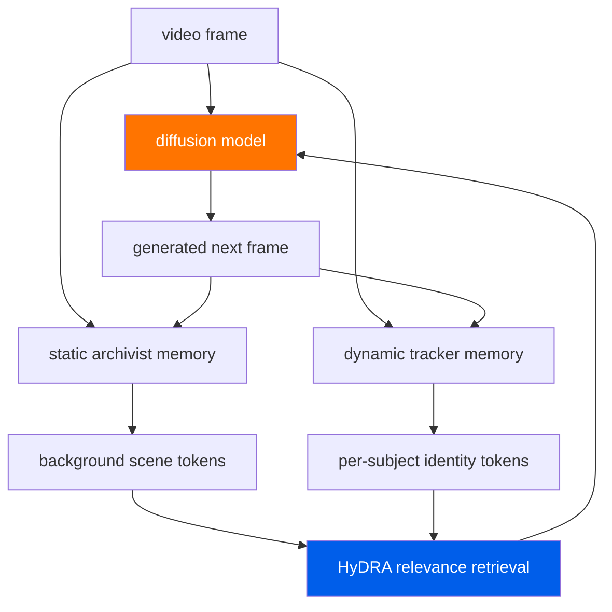

     1|---
     2|layout: digest
     3|arxiv_id: "2603.25716"
     4|title: "Out of Sight but Not Out of Mind: Hybrid Memory for Dynamic Video World Models"
     5|date: 2026-03-29
     6|authors: ["Kaijin Chen", "Dingkang Liang", "Xin Zhou", "Yikang Ding", "Xiaoqiang Liu", "Pengfei Wan", "Xiang Bai"]
     7|categories: ["world-models", "video-generation", "memory"]
     8|abs: "https://arxiv.org/abs/2603.25716"
     9|pdf: "https://arxiv.org/pdf/2603.25716"
    10|code: ""
    11|---
    12|
    13|## problem
    14|
    15|video world models treat environments as static canvases. when dynamic subjects (people, animals, vehicles) move out of the camera frame and re-emerge, current methods produce frozen, distorted, or vanishing subjects. the core issue: most video diffusion models have no persistent memory of object identity across occlusion events. they can generate plausible frames locally but fail to maintain object consistency when subjects leave and re-enter the field of view.
    16|
    17|prior approaches to video consistency:
    18|- **image-level consistency** (ID-based methods): inject identity features at inference time, but only work for faces and don't handle full-body or non-human subjects
    19|- **temporal attention in transformers**: limited by context window length. once a subject leaves the frame, attention weights decay and the model forgets
    20|- **recurrent memory in video models**: some methods use LSTM/GRU states, but these compress all information into a fixed-size vector, losing fine-grained identity details
    21|- **segmentation-guided generation**: track objects via segmentation masks, but require pretrained segmentation models and fail on occlusion
    22|
    23|## architecture

    24|
    25|**Hybrid Memory paradigm**: the model maintains two separate memory banks with distinct roles:
    26|1. **static archivist memory**: compresses and stores background scene structure (walls, floors, furniture). updated slowly, provides spatial grounding.
    27|2. **dynamic tracker memory**: maintains per-subject identity tokens that persist across occlusion. updated every frame the subject is visible, retrieved when the subject re-enters.
    28|
    29|**HyDRA (Hybrid Dynamic Retriever Architecture)**: the memory module that compresses memory into tokens with spatiotemporal relevance-driven retrieval:
    30|- stores scene state as a set of memory tokens $\{m_1, m_2, ..., m_K\}$
    31|- each new frame computes relevance scores via cross-attention: $s_i = \text{softmax}(\mathbf{q}\_t \cdot \mathbf{m}\_i^T / \sqrt{d})$
    32|- top-$k$ relevant tokens are selected for selective attention to motion cues
    33|- memory tokens are updated via gated merge: $\mathbf{m}\_i' = \mathbf{m}\_i + \alpha \cdot g_i \cdot \Delta\mathbf{m}\_i$, where $g_i$ is a learned gate
    34|
    35|**HM-World benchmark dataset**: new benchmark designed to evaluate dynamic subject consistency:
    36|- $59$K video clips across $17$ scenes
    37|- $49$ unique subjects (humans, animals, vehicles)
    38|- decoupled camera trajectories and subject trajectories (subjects move independently of camera)
    39|- designed exit-entry events where subjects leave and re-enter the frame
    40|
    41|## training
    42|
    43|- based on a video diffusion model backbone (details in paper)
    44|- trained on existing video datasets augmented with the HM-World data
    45|- the hybrid memory module is trained jointly with the generation model
    46|- training uses standard diffusion training with added memory consistency losses
    47|
    48|## evaluation
    49|
    50|**HM-World benchmark**:
    51|- significantly outperforms SOTA in dynamic subject consistency
    52|- improved overall generation quality compared to baselines
    53|- specific metrics include subject identity consistency (face/body matching), temporal coherence, and FVD (fréchet video distance)
    54|
    55|**qualitative results**:
    56|- prior methods: subjects freeze, distort, or change identity when re-entering frame
    57|- HyDRA: subjects maintain identity, pose, and appearance across occlusion events
    58|- background remains stable throughout (benefit of separate static memory)
    59|
    60|**comparison to baselines**: outperforms standard video diffusion models, memory-augmented variants, and segmentation-guided approaches on the occlusion consistency metric.
    61|
    62|## reproduction guide
    63|
    64|1. no public code repo available yet - check the paper's project page for updates
    65|2. the HM-World dataset construction is described in detail in the paper, so you could build a similar benchmark
    66|3. key ingredients: a base video diffusion model + the HyDRA memory module. the memory module can likely be plugged into existing video diffusion architectures
    67|4. for a minimal implementation: start with a short video diffusion model, add a small key-value memory store, and train on videos with explicit occlusion events
    68|5. the decoupled camera/subject motion in HM-World is important - standard video datasets have camera-following-subject bias that doesn't stress-test occlusion handling
    69|
    70|## notes
    71|
    72|the occlusion problem in video world models is underserved and this paper addresses it head-on. the dual-role memory (archivist for static + tracker for dynamic) is a clean conceptual split that makes intuitive sense.
    73|
    74|relevant to robot world models where objects frequently leave camera view during manipulation. a robot that forgets what an occluded object looks like will fail at long-horizon tasks. the tracker memory idea could be adapted for robotic manipulation: maintain per-object state tokens that persist when objects are out of view.
    75|
    76|the HM-World benchmark is a useful contribution on its own. most video generation benchmarks don't specifically test occlusion handling, so this fills a gap.
    77|
    78|**open questions:**
    79|- how does the memory scale with many dynamic subjects? is there a combinatorial explosion?
    80|- can the tracker memory handle subjects that change appearance (e.g., a person taking off a jacket)?
    81|- what's the inference cost of the memory retrieval? does it add significant latency?
    82|- can this be combined with a world model for robotics where object state (position, velocity) is tracked alongside visual identity?
    83|