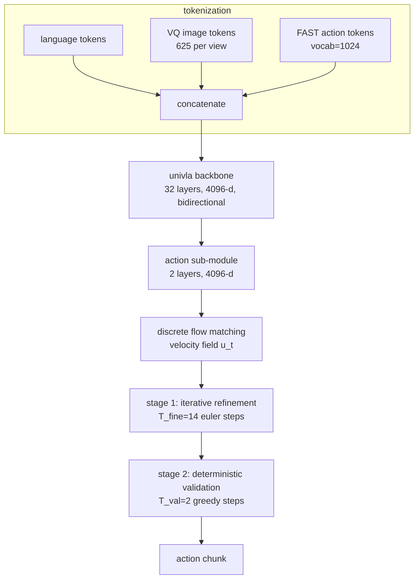

## problem

discrete-token VLAs face a fundamental decoding limitation: **irreversible commitment**. in autoregressive (AR) decoding, each token is fixed once generated -- left-to-right errors cascade through the entire action chunk. in discrete diffusion (DD), only masked positions are updated per step, preventing full-sequence revision. both paradigms mean a single early error (e.g., wrong gripper state token) can ruin a long-horizon manipulation task. DFM-VLA applies discrete flow matching (DFM) to action token generation, enabling every token to be revised at every step through a principled velocity field.

prior methods and their specific limitations:
- **OpenVLA** (Kim et al., 2025): AR decoding fixes tokens permanently, no revision possible
- **PD-VLA** (Song et al., 2025): DD with BART-style noising, only updates masked positions
- **LLADA-VLA** (Wen et al., 2025): DD, same mask-restricted update limitation
- **CEED-VLA** (Song et al., 2025): DD + consistency distillation, fewer steps but still mask-restricted
- **RDT** (Liu et al., 2024): continuous diffusion, loses discrete VLM backbone semantics

## architecture

built on **UniVLA** (Emu3-based), an 8B parameter bidirectional transformer with 32 layers, hidden size 4096, 32 attention heads (8 KV heads for GQA), RMSNorm, RoPE ($\theta = 10^6$), and vocabulary size 184,622. backbone uses full bidirectional attention (not causal), enabling parallel processing of the entire token sequence.



**action tokenization:** continuous 7-DOF actions (6 pose + gripper) discretized via FAST (Pertsch et al., 2025) then BPE-compressed to a 1024-token vocabulary. boundary markers `boa`/`eoa` delimit action tokens; text and image tokens remain clean (never noised).

**velocity field -- two constructions:**

variant 1 (auxiliary head, DFM-VLA+Head): inspired by EditFlow (Havasi et al., 2025). a dedicated prediction head maps backbone hidden states to replacement rates for each token position.

variant 2 (embedding-guided, DFM-VLA+Embed): uses a metric-induced probability path over the action token embedding space. this is the primary variant.

**probability path:**

$$p\_t(x\_i \mid x\_i^1) = \text{softmax}(-\beta\_t \cdot d(x\_i, x\_i^1))$$

where $d(\cdot, \cdot)$ is distance in the action embedding space and $\beta\_t = c \cdot (t/(1-t))^\alpha$ with defaults $c=3, \alpha=1$. boundary conditions: $\beta\_0 = 0$ (uniform), $\beta\_1 = \infty$ (dirac at target).

**kinetic-optimal velocity:**

$$u\_t(x\_i, z \mid x^1) = p\_t(x\_i \mid x\_i^1) \cdot \dot{\beta}\_t \cdot [d(z\_i, x\_i^1) - d(x\_i, x\_i^1)]\_+$$

where $[\cdot]\_+ = \max(\cdot, 0)$. this moves probability mass from $z$ toward $x\_i$ only when $x\_i$ is closer to the ground truth target $x\_i^1$.

**training loss:**

$$\mathcal{L}\_{\text{CE}} = \mathbb{E}\_{t \sim \mathcal{U}(0,1),\, x^1,\, x^t} \left[ -\log p\_{1 \mid t}(x^1 \mid x\_t, l) \right]$$

**two-stage decoding:**
- stage 1: 14 euler steps with stochastic token jumps (acceptance probability $\min(1, h \cdot \lambda\_i)$)
- stage 2: 2 deterministic greedy steps for stable convergence
- total: 16 forward passes per action chunk

## training

- hardware: 8 $\times$ NVIDIA H100 (single node), BF16 precision
- optimizer: AdamW ($\beta\_1 = 0.9, \beta\_2 = 0.95, \epsilon = 10^{-6}$), weight decay 0.1
- learning rate: $8 \times 10^{-5}$ with cosine schedule and 50 warmup steps
- gradient clipping: max norm 5.0
- gradient accumulation: 4 steps per GPU
- effective batch size: 256 (8 GPUs $\times$ 8 samples/GPU $\times$ 4 accum)
- training steps: 16k-32k (simulation), 5k per task (real-world)
- initialization: UniVLA world-model pretrained checkpoint (~21 GB)
- datasets: CALVIN ABCD$\to$D, LIBERO (Spatial/Object/Goal/Long), real-world bimanual AgileX (100 demos/task)

## evaluation

**CALVIN ABCD$\to$D (average success length, max 5):**

| method | avg len | 5-step rate |
|--------|---------|-------------|
| $\pi\_{0}$-Fast | 4.09 | 0.776 |
| DreamVLA | 4.21 | 0.842 |
| FlowVLA | 4.26 | 0.864 |
| UniVLA* | 4.42 | 0.862 |
| **DFM-VLA+Embed** | **4.44** | **0.880** |

**LIBERO (success rate %):**

| method | spatial | object | goal | long | average |
|--------|---------|--------|------|------|---------|
| $\pi\_{0}$-Fast | 96.4 | 96.8 | 88.6 | 60.2 | 85.5 |
| DreamVLA | 97.5 | 94.0 | 89.5 | 89.5 | 92.6 |
| **DFM-VLA+Embed** | **96.8** | **98.8** | **94.4** | **92.6** | **95.7** |

DFM-VLA beats DreamVLA by +3.1 pts average, with particularly strong results on long-horizon tasks (92.6% vs 89.5%). the data scale ablation shows DFM's advantage is largest in low-data regimes: at 10% data, DFM achieves 3.21 avg length vs 2.84 for DD and 1.71 for AR.

**inference efficiency:** DFM + adaptive KV cache achieves 2.41x speedup over AR at near-identical performance (4.40 vs 4.42 avg length).

**real-world (bimanual AgileX, 40 trials/task):**

| method | pot lift | place veg | place block | average |
|--------|----------|-----------|-------------|---------|
| $\pi\_{0}$-Fast | 50.0 | 42.5 | 35.0 | 42.5 |
| RDT | 65.0 | 62.5 | 52.5 | 60.0 |
| **DFM-VLA+Embed** | **77.5** | **70.0** | **65.0** | **70.8** |

## reproduction guide

code is not yet released ("coming soon" on project page). reproduction requires implementing DFM modifications on top of the UniVLA codebase:

```bash
# 1. setup
conda create -n dfm_vla python=3.10
pip install torch==2.4.0+cu124 flash-attn==2.5.7 transformers==4.44.0 tiktoken

# 2. download pretrained UniVLA checkpoint (~21 GB)
huggingface-cli download Yuqi1997/UniVLA --local-dir ./checkpoints/UniVLA

# 3. prepare benchmark data (CALVIN, LIBERO)
# follow UniVLA docs for dataset setup

# 4. key modifications from UniVLA:
# - replace AR next-token loss with DFM loss (Eq. L_ce)
# - implement probability path with embedding distances
# - implement velocity field (Eq. 7)
# - modify inference: CTMC euler solver with two-stage decoding

# 5. training (8x H100)
torchrun --nproc_per_node=8 train.py \
  --config configs/dfm_vla_calvin.yaml \
  --learning_rate 8e-5 --max_steps 20000 \
  --gradient_accumulation_steps 4
```

gotchas:
- 8B model in BF16 needs ~16GB memory; with activation checkpointing, batch size 8 fits on 8xH100 80GB
- the embedding-guided variant converges faster and performs better than the head-based one
- two-stage decoding balance is critical: T_fine=14, T_val=2 is optimal. too many validation steps hurts performance
- schedule is robust to c $\in \{1, 3, 5\}$ and $\alpha \in \{0.5, 1\}$ but may destabilize at extremes

compute cost: 20k-32k steps on 8xH100, estimated 3-6 hours wall-clock for simulation fine-tuning.

## notes

DFM-VLA is the first application of discrete flow matching to VLA action generation. the key insight is that DFM's velocity field enables full-sequence iterative refinement -- every token can be revised at every step -- which neither AR nor DD can do. the embedding-guided velocity formulation using token distances in embedding space is elegant: it preserves semantic neighborhood structure during refinement, so corrections are smooth and semantically coherent.

this directly extends the trend tracked in the unified-discrete-token-space-vla note (2603.25406, 2603.25661). MMaDA-VLA uses discrete diffusion for joint vision-action generation but still can't revise all tokens. DFM-VLA solves the revision problem while keeping the discrete token paradigm. combining DFM's iterative refinement with MMaDA-VLA's joint vision-action generation and Fast-dVLA's real-time speed is a clear next step.

the low-data advantage is notable: DFM's +1.50 improvement over AR at 10% data suggests the flow matching framework provides better inductive biases for action generation than AR or DD. relevant to robotics where real-world data is expensive.
