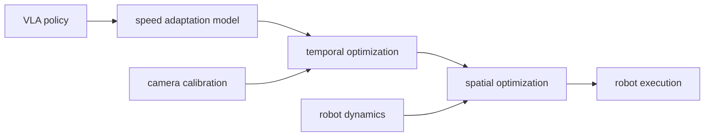

## problem

VLA models produce high-quality actions in simulation but execute too slowly on real robots. the gap between neural network inference speed and physical robot control frequency (typically 3-30 Hz) makes direct deployment impractical. prior work like VLASH and $\pi\_{0}$-Fast focused on GPU-side inference scheduling, but left the full robot deployment stack open. this paper tackles the orthogonal problem: given a VLA that already runs fast on GPU, how do you actually make the robot move fast in the real world?

## architecture

this is a systems paper, not a model architecture paper. no new VLA model is proposed. instead it introduces a four-stage deployment pipeline that wraps around any VLA:



**stage 1 -- sub-5ms system delay calibration:** sinusoidal sweep signals sent to the robot while recording camera timestamps. estimates the total loop delay (camera capture + image transfer + inference + command dispatch) to under 5ms precision. uses 120fps camera phase estimation to align perception and control clocks.

**stage 2 -- speed adaptation model:** a lightweight regression model trained on human-in-the-loop demonstrations where a human operator specifies desired speed profiles. trained incrementally -- each day of operation collects new data and retrains. maps context (task type, environment layout) to a speed throttle multiplier.

**stage 3 -- temporal optimization:** formulates step-duration allocation as a quadratic program (QP) solved via OSQP. distributes acceleration evenly across trajectory segments to respect robot kinematic limits while minimizing total execution time. given $n$ waypoints with positions $q\_i$ and durations $\tau\_i$, minimizes $\sum \tau\_i$ subject to velocity and acceleration constraints.

**stage 4 -- spatial optimization:** acados MPC running in SQP-RTI (real-time iteration) mode. pre-amplifies VLA commands to compensate for ~150ms robot mechanical lag. enforces joint position, velocity, and acceleration limits as hard constraints. uses the robot's rigid body dynamics model.

**roofline analysis:** identifies motion-bounded segments (where VLA inference is faster than the robot can move) vs. control-bounded segments (where computation is the bottleneck). temporal optimization helps the former; spatial optimization helps the latter.

## training

the speed adaptation model is the only trainable component:

- architecture: lightweight regression network (specifics not disclosed in paper)
- training: human-in-the-loop throttle data collected during daily operation
- update cycle: retrained daily as new demonstration data accumulates
- no VLA fine-tuning required -- the pipeline is model-agnostic

## evaluation

real robot evaluation on table-top manipulation tasks with a Franka Emika Panda arm:

| task | human baseline (s) | unoptimized VLA (s) | VLA V2 pipeline (s) | speedup |
|------|-------------------|---------------------|---------------------|---------|
| fold shirt | 19.0 | 75.3 | 18.9 | 3.98x |
| place into fixture | 37.6 | 89.5 | 37.8 | 2.37x |
| pick and latch | 36.0 | 98.6 | 42.6 | 2.31x |

the pipeline brings VLA execution time down to human-parity levels for simple tasks (fold shirt) and within 12-18% of human baseline for harder tasks. critical observation: the unoptimized VLA is 2-3x slower than humans because it stops between waypoints and moves at constant speed. the optimization pipeline eliminates these inefficiencies.

**limitation:** the paper reports execution time only, not task success rate or ablation studies. no comparison against a simple uniform-speedup baseline. the base VLA model is not specified.

## reproduction guide

```bash
git clone https://github.com/dexmal/realtime-vla-v2.git
pip install -r requirements.txt  # acados, osqp, robot-specific drivers
```

requires a physical robot (Franka Panda or similar) with position control interface. the calibration procedure needs a 120fps+ camera and the ability to send arbitrary joint commands for sinusoidal sweeps.

gotchas:
- system delay calibration must be re-run whenever the software stack changes (new camera driver, different inference runtime)
- the speed adaptation model requires human demonstrations in the target environment -- it does not transfer zero-shot
- acados MPC setup requires accurate URDF and inertial parameters for the specific robot
- no simulation support -- everything is designed for real-world deployment

compute cost: the pipeline runs entirely on a single workstation with a consumer GPU. the MPC solver adds negligible overhead (~1ms per step).

## notes

this paper is important because it exposes a blind spot in the VLA research community: everyone optimizes model architecture and inference scheduling, but nobody has published a systematic study of the full deployment stack. the four-stage pipeline is orthogonal to model-level optimizations from MMaDA-VLA (2603.25406), Fast-dVLA (2603.25661), and DFM-VLA (2603.26320) -- all of those could benefit from this deployment stack.

the roofline analysis framework (motion-bounded vs. control-bounded) is a useful mental model for anyone deploying neural policies on real hardware. for bopi specifically, the calibration and MPC stages are directly applicable to getting a VLA running on the physical bopi body.
