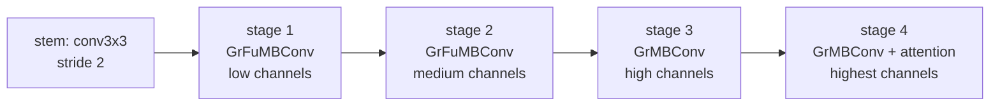

## problem

efficient vision backbone design is dominated by MACs (multiply-accumulate operations) as the primary efficiency metric. but MACs are a poor predictor of actual latency on CPUs, where limited parallelism (4-8 cores on a raspberry pi, 2-4 on an MCU) means total compute, not throughput, is the bottleneck. architectures optimized for GPUs and mobile NPUs (FasterNet, MobileNetV4, RepViT) often perform poorly on bare CPUs because their high MAC counts overwhelm limited compute budgets, even though they achieve high MACs-per-second (MACpS) on parallel hardware.

the core insight: on CPUs, latency $\propto \text{MACs} / \text{MACpS}$. you need both low total MACs AND high per-second throughput. depthwise convolutions (DWConv) achieve low MACs but terrible MACpS (poor hardware utilization). standard convolutions have high MACpS but too many MACs. the sweet spot: **grouped convolutions** and **small kernels**.

## architecture

two new MBConv variants form the building blocks:

**Grouped Fused MBConv (GrFuMBConv):** sets `groups=2` in the expansion convolution of a fused MBConv, with 2$\times$2 kernels. expansion factor = 4. structure: GroupedConv(groups=2, k=2$\times$2) $\to$ PWConv $\to$ (BN + GELU). achieves **45% fewer MACs** than standard FuMBConv with essentially identical MACpS on CPU. the MAC reduction ratio is always exactly 0.55, independent of channel dimension.

**Grouped MBConv (GrMBConv):** sets `groups=2` in the expansion convolution of a standard MBConv, with 2$\times$2 kernels. structure: GroupedConv(groups=2, k=2$\times$2) $\to$ DWConv(k=2$\times$2) $\to$ PWConv. achieves **~24% fewer MACs** than MBConv, with only ~5% lower MACpS on CPU.

**design rules discovered through systematic measurement:**

| channel range | preferred variant | why |
|---------------|-------------------|-----|
| < 256 | fused (GrFuMBConv) | ~70% higher MACpS than unfused |
| >= 256 | unfused (GrMBConv) | ~27% higher MACpS, better FLOP utilization |

2$\times$2 kernels give ~42% higher MACpS for DWConv, ~5% for FuMBConv, ~12% for GrFuMBConv on ARM CPUs, because smaller kernels fit better in L1/L2 cache and reduce memory bandwidth pressure.

**CPUBone macro design:**



- 4 stages with stride-2 down-sampling at boundaries
- early stages use fused variants (low channels, benefit from MACpS)
- later stages use unfused variants (high channels, better FLOP utilization)
- LowFormer attention in the final stage with nearest-neighbor upsampling (not transpose conv -- ~5% higher MACpS, significant latency improvement)
- stem: Conv2D 3$\times$3, stride 2

**four model sizes:**

| model | params | MACs | top-1 |
|-------|--------|------|-------|
| B0 | 5.4M | 562M | 78.7% |
| B1 | 12.4M | 746M | 78.7% |
| B2 | 24.8M | 1527M | 82.8% |
| B3 | 44.9M | 2977M | 84.1% |

## training

- hardware: LEONARDO supercomputer (EuroHPC), GPU cluster (likely A100)
- optimizer: AdamW, weight decay 0.05
- learning rate: cosine annealing with 5-epoch warmup
- regularization: AutoAugment, RandAugment (B2/B3), Mixup, CutMix, DropPath, BN momentum decay
- training epochs: 600
- resolution: 224$\times$224
- channel-last memory format
- B0/B1: batch 512, lr $10^{-3}$. B2: batch 1024, lr $10^{-3}$. B3: batch 2400, lr $3 \times 10^{-3}$
- downstream: RetinaNet on COCO (12 epochs, 1x schedule), Semantic FPN on ADE20K (40k iterations, batch 32)

## evaluation

**ImageNet classification (CPU latency):**

| backbone | params | MACs | top-1 | pi 5 CPU (ms) | pixel 7 CPU (ms) | intel CPU (ms) |
|----------|--------|------|-------|---------------|------------------|-----------------|
| CPUBone-B0 | 5.4M | 562M | 78.7 | **42.3** | 10.5 | **4.7** |
| FasterNet-T0 | 2.2M | 376M | 77.2 | ~45 | -- | -- |
| MobileNetV3-Large | 5.4M | 219M | 75.2 | 158 | -- | -- |
| MobileNetV4-Conv-M | 4.3M | 507M | 78.9 | -- | -- | -- |
| CPUBone-B3 | 44.9M | 2977M | 84.1 | 157.1 | 44.1 | 18.6 |
| RepViT-M2.3 | 52M | 4031M | 83.5 | considerably slower | -- | -- |

CPUBone-B0 runs at **42.3ms on raspberry pi 5 CPU** -- 3.7x faster than MobileNetV3-Large at higher accuracy. B0 vs FasterNet-T0: 1.5% higher accuracy at similar latency despite 1.5x more MACs, because grouped convolutions maintain higher MACpS.

**downstream tasks (pi 5 CPU):**

| backbone | COCO AP | ADE20K mIoU | latency (ms) |
|----------|---------|-------------|-------------|
| CPUBone-B0 | 37.5 | 37.9 | 131.5 |
| CPUBone-B2 | 40.4 | 42.1 | 338.2 |
| comparable models | ~40.0 | ~41.0 | ~1000+ |

up to 3x faster execution than comparable models at similar or higher detection/segmentation quality.

**where it loses:** on GPU throughput, the grouped convolutions and 2$\times$2 kernels hurt performance. CPUBone is explicitly not designed for GPU use -- it trades GPU efficiency for CPU efficiency.

## reproduction guide

```bash
git clone https://github.com/altair199797/CPUBone.git
cd CPUBone
pip install torch torchvision timm mmcv mmdet mmseg

# training (8 GPUs, ImageNet)
python -m torch.distributed.launch --nproc_per_node=8 train.py \
  --model cpubone_b0 --data /path/to/imagenet \
  --batch-size 512 --lr 1e-3 --epochs 600 \
  --opt adamw --weight-decay 0.05 --sched cosine --warmup-epochs 5
```

gotchas:
- latency measurement must use batch_size=1. multi-batch gives misleading results on CPUs
- use ONNX/TFLite export for accurate CPU benchmarking -- PyTorch eager mode adds overhead
- nearest-neighbor upsampling in LowFormer attention is critical (33.5ms vs 39.7ms on pi 5 for B1 with transpose conv)
- groups=2 is optimal. groups=4 degrades accuracy by 0.3%, groups=8 by 0.7%, with minimal latency improvement
- channel-last memory format is important for training throughput

compute: B0/B1 training needs 8+ GPUs at 512 batch size for 600 epochs. inference runs on bare CPU -- no GPU needed at deployment.

## notes

CPUBone is directly relevant to bopi's embedded/hardware interest. the 5.4M parameter B0 model achieving 78.7% top-1 at 42.3ms on a raspberry pi 5 CPU is genuinely deployable on edge hardware. the design principles (grouped convolutions, small kernels, fused variants for low-channel stages) are simple enough to apply to custom architectures for robotics perception on MCUs.

the key lesson for embedded AI practitioners: stop optimizing for MACs alone. on CPUs, the metric that matters is MACs / MACpS. DWConv has low MACs but terrible MACpS, making it deceptively inefficient. grouped convolutions (groups=2) give the best trade-off: they halve the MACs of the expansion conv while maintaining most of the MACpS of a full convolution.

important caveat: all benchmarks are on ARM application processors (pi 5, pixel 7 pro, snapdragon) and intel xeon. no results on actual MCUs (STM32, ESP32). the principles should transfer but need verification at the lower end.
