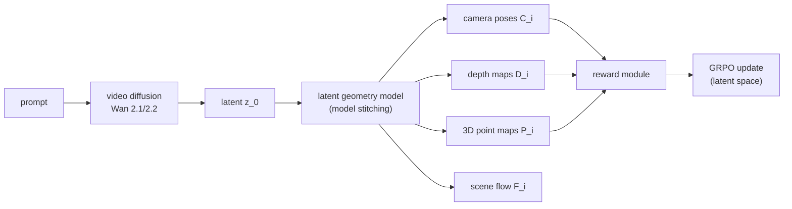

## problem

large-scale video diffusion models (Wan2.1, Wan2.2) produce visually impressive videos but suffer from geometric inconsistency -- camera drift, unstable trajectories, and broken 3D structure across frames. prior approaches either modify the generator architecture (limiting generalization) or use RGB-space geometric rewards (expensive: requires VAE decoding for every reward computation, sensitive to decoding artifacts, mostly limited to static scenes). VGGRPO computes geometry rewards **directly in latent space**, eliminating the VAE decode bottleneck and extending to dynamic scenes.

specific prior methods and limitations:
- **epipolar-DPO** (Kupyn et al., 2025): sparse epipolar constraints from VGGT; requires RGB decoding; offline preference data; static scenes only
- **VideoGPA** (Du et al., 2026): dense geometry rewards from VGGT; same RGB decode overhead; static scenes only
- **Geometry Forcing** (Wu et al., ICLR 2026): full fine-tuning, compromises pretraining generalization
- architecture-conditioned methods (point cloud conditioning, Gen3C): require additional inputs, increase complexity, constrain generative flexibility

## architecture



**Latent Geometry Model (LGM):** the core technical contribution. uses "model stitching" to connect a video VAE's latent space to a geometry foundation model (Any4D):

1. start with pretrained geometry model $\Phi$ composed of $L$ transformer layers $\{T\_1, \ldots, T\_L\}$
2. VAE encoder $E$ maps video $x$ to latents $z = E(x)$
3. insert a **lightweight stitching connector** $S\_\psi$: a single 3D convolution (kernel 5$\times$5$\times$5, stride 1$\times$2$\times$2, padding 2$\times$2$\times$2) that maps VAE latents into the intermediate feature space at layer $\ell$
4. remaining layers $\Phi\_{\ell+1:L}$ process these features

the LGM predicts per-frame: camera pose $C\_i$ (rotation + translation), depth map $D\_i$, 3D point map $P\_i$ (shared reference frame), and scene flow $F\_i$ (for dynamic content). LoRA adaptation (rank $r=64$, $\alpha=32$) on the geometry model's transformer layers.

**VGGRPO objective** -- latent-space GRPO:

$$J\_{\text{GRPO}}(\theta) = \frac{1}{K} \frac{1}{T} \sum\_k \sum\_t \min\left[\rho\_t^k(\theta) \hat{A}\_k,\; \text{clip}\_\epsilon(\rho\_t^k(\theta)) \hat{A}\_k\right] - \beta \cdot D\_{\text{KL}}(\pi\_\theta \| \pi\_{\text{ref}})$$

where $K = 64$ (group size), $\epsilon = 10^{-3}$, $\beta = 0.004$, and importance ratios are computed via closed-form Gaussian from ODE-to-SDE conversion.

**ODE-to-SDE conversion:**

$$dx\_t = \left[v\_t(x\_t) + \frac{\sigma\_t^2}{2t}(x\_t + (1-t)v\_t(x\_t))\right]dt + \sigma\_t \, dw$$

with $\sigma\_t = a\sqrt{t/(1-t)}$, enabling stochastic sampling with tractable log-probabilities for GRPO importance ratios.

**reward functions:**

camera motion smoothness:
$$r\_{\text{motion}}(z\_0) = 0.5 \cdot \left[\frac{1}{1 + e\_{\text{trans}}} + \frac{1}{1 + e\_{\text{rot}}}\right]$$

where $e\_{\text{trans}}$ and $e\_{\text{rot}}$ are jerk-to-velocity ratios for translation and rotation respectively.

geometry reprojection consistency:
$$e\_{\text{geo}}(z\_0) = \frac{1}{ \mid \Omega\_i \mid } \sum\_{p \in \Omega\_i} \mid \hat{D}\_i(p) - D\_i(p) \mid$$

where $\hat{D}\_i$ is depth rendered by projecting the 3D point cloud into view $i$ using predicted camera $C\_i$, and $D\_i$ is directly predicted depth. for dynamic scenes, scene flow filters dynamic regions so only static points are aggregated.

combined advantage:
$$\hat{A}\_k = 0.5 \cdot \left[\frac{r\_{\text{motion}}(z\_0^k) - \mu\_{\text{motion}}}{\sigma\_{\text{motion}}} + \frac{r\_{\text{geo}}(z\_0^k) - \mu\_{\text{geo}}}{\sigma\_{\text{geo}}}\right]$$

**test-time latent reward guidance** (training-free):
$$\tilde{v}\_\theta(z\_t, t, p) = v\_theta(z\_t, t, p) - s\_{\text{reward}} \cdot \frac{t}{1-t} \cdot \nabla\_{z\_t} r(z\_t)$$

applied every 20 denoising steps (out of 50). fully differentiable through LGM, no VAE decode needed.

## training

two-stage pipeline:

**stage 1 -- LGM training:**
- optimizer: AdamW, lr $2 \times 10^{-4}$, no weight decay
- 20 epochs, cosine decay with 100-step linear warmup
- gradient clipping: max norm 1.0
- LoRA: rank=64, $\alpha=32$ on Any4D geometry model
- dataset: mixture of generated videos (from base Wan model) + real videos from DL3DV, RealEstate10K, MiraData

**stage 2 -- VGGRPO:**
- base models: Wan2.1-1B and Wan2.2-5B
- optimizer: AdamW, lr $10^{-4}$, weight decay $10^{-4}$
- LoRA: rank=32, $\alpha=64$
- gradient clipping: max norm 1.0
- group size K=64, denoising steps T_train=10 (reduced), T_infer=50
- total compute: ~1536 GPU hours
- hardware: likely Google TPU/GPU clusters (A100/H100-scale)

## evaluation

**main results (Wan2.1-1B, geometry metrics):**

| method | epipolar error $\downarrow$ | VQ $\uparrow$ | motion smoothness $\uparrow$ |
|--------|----------------------------|---------------|------------------------------|
| baseline | 45.26 | 40.00 | 0.9646 |
| SFT | 44.80 | 42.50 | 0.9671 |
| epipolar-DPO | 54.21 | 45.50 | -- |
| VideoGPA | 53.68 | 42.50 | 0.9650 |
| **VGGRPO** | **59.47** | **66.84** | -- |

VGGRPO achieves a **14.4-point epipolar error improvement** over baseline and a **21.3-point improvement** over epipolar-DPO, demonstrating that latent-space rewards are more effective than RGB-space rewards.

**generalization on standard VBench (Wan2.2-5B):**

| method | subject cons. $\uparrow$ | background cons. $\uparrow$ | img quality $\uparrow$ | motion smooth. $\uparrow$ |
|--------|--------------------------|----------------------------|------------------------|--------------------------|
| baseline | 0.9542 | 0.9528 | 0.6733 | 0.9841 |
| epipolar-DPO | 0.9601 | 0.9564 | 0.6353 | 0.9847 |
| VideoGPA | 0.9605 | 0.9565 | 0.6338 | 0.9835 |
| **VGGRPO** | **0.9644** | **0.9583** | **0.6861** | **0.9895** |

VGGRPO is the **only method** that improves image quality over baseline (0.6861 vs 0.6733). epipolar-DPO and VideoGPA actually degrade image quality despite improving geometry -- this is a common failure mode of RGB-space reward methods that the latent approach avoids.

**efficiency:** latent-based reward computation is 24.5% faster than RGB-based (41.33s vs 54.73s per batch of 4, Wan2.2-5B) because it eliminates VAE decoding.

**where it loses:** dynamic degree metric is slightly lower (0.3962 vs 0.4237 baseline) because smoother motion reduces optical flow magnitude -- this is actually desirable behavior but the metric interprets it as less dynamic content.

## reproduction guide

```bash
# stage 1: train latent geometry model
python train_lgm.py \
  --geometry-model any4d --base-model wan2.2-5b \
  --lr 2e-4 --epochs 20 --lora-rank 64 --lora-alpha 32 \
  --grad-clip 1.0

# stage 2: VGGRPO training
python train_vggrpo.py \
  --base-model wan2.2-5b --lgm-path /path/to/lgm \
  --lora-rank 32 --lora-alpha 64 --lr 1e-4 \
  --group-size 64 --train-steps 10 --infer-steps 50 \
  --clip-eps 1e-3 --kl-beta 0.004 --grad-clip 1.0
```

gotchas:
- 1536 GPU hours is extremely expensive. budget for multi-node training (8xH100: ~8 days, 64xH100: ~1 day)
- K=64 means 64 denoising trajectories per prompt per update -- massive memory even with T_train=10
- the ODE-to-SDE noise scale parameter `a` needs careful tuning
- which transformer layer $\ell$ to stitch at is crucial and may need per-model tuning
- training the LGM on diffusion latents (including generated ones) is essential to close the domain gap. training only on real video latents would fail
- dynamic scene support requires Any4D (not VGGT, which is static-only)

## notes

the latent geometry model is the most interesting technical contribution. "model stitching" -- splicing a VAE latent space into the middle of a pretrained model via a learned 3D conv connector -- is a clean, model-agnostic technique that could be applied to other dense prediction tasks in latent space (optical flow, segmentation, normal estimation). this is particularly relevant to world models for robotics, where latent-space prediction of geometry, depth, and scene flow could serve as auxiliary supervision for world model training.

the fact that RGB-based geometry rewards actually degrade image quality while latent-based rewards improve both geometry and quality is a strong argument for keeping reward computation in latent space. this connects to the broader trend of inference-time interventions (tracked in the inference-time-guidance-pattern-robotics note) -- manipulating latents directly is more effective and efficient than decoding to RGB first.

the test-time guidance formula is a practical standalone contribution. applying $\nabla\_{z\_t} r(z\_t)$ every 20 steps is training-free and could be combined with any video diffusion model, not just Wan. for robotics world models, this could enable controllable camera trajectory generation without modifying the base model.
