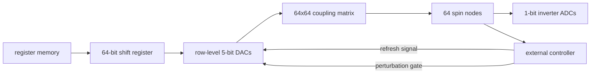

## problem

combinatorial optimization (Max-Cut, graph coloring, QUBO) is NP-hard and inefficient on von Neumann architectures. prior CMOS Ising machines face tradeoffs: ring-oscillator designs have high static power and sensitivity to mismatch/phase noise, while planar topologies require embedding into restricted connectivity graphs (introducing overhead). most lack explicit perturbation mechanisms for escaping local minima.

## architecture

continuous-time all-to-all current-mode coupling Ising machine in 65nm CMOS. 64 spins with native all-to-all connectivity (no embedding overhead).

**coupling implementation:** polarity via current sourcing/sinking. strength via 4-bit current-steering DACs per coupling unit (31 distinct levels + sign bit). coupling matrix is $64 \times 64$, arranged in a grid with row-level DACs.

**spin representation:** capacitor voltages, read out by 1-bit inverter-based ADCs.

**dynamics:** governed by

$$\frac{dv\_i}{dt} = \frac{a}{C} \sum\_{j \neq i} J\_{ij} Q(v\_j)$$

where $Q(v\_i) \in \{-1, +1\}$ is the spin state. energy function:

$$H(v) = -\sum\_{i < j} J\_{ij} Q(v\_i) Q(v\_j)$$

$\frac{dH}{dt} \leq 0$ always, so the system converges toward low-energy solutions.

**landscape perturbation:** the coupling matrix is periodically refreshed column-by-column to mitigate charge leakage on gate capacitors. during perturbation, DAC biases are periodically gated off, forcing selected columns to zero. this temporarily reduces coupling density, allowing the system to escape shallow local minima. subsequent refresh restores the original hamiltonian. mean time-to-solution: 1.56ms, median: 0.72ms for 64-node problems.

## training

not applicable (analog circuit, no training). the coupling matrix is programmed directly from the QUBO problem coefficients.

## evaluation

**specifications:**
- process: 65nm CMOS
- active area: 0.943 mm$^2$ (560 $\mu$m x 314 $\mu$m)
- 64 spins, all-to-all connectivity
- 31 coefficient levels (4-bit + sign)
- energy-to-solution: 2.28 nJ/edge-bit
- anneal time: 3 $\mu$s per run
- success rate improvement: >1.7x with landscape perturbation vs gradient descent alone
- clock: 80 MHz for programming

**problem sizes tested:** 16 to 64 nodes, densities 10% to 90%. 1000 runs per problem, 20 random problems per size-density pair. success defined as achieving $\geq 99\%$ of best-known energy (Tabu solver). SR decreases with problem size (expected), increases with density.

## reproduction guide

this is a chip design paper. to reproduce:
1. design the 64x64 coupling matrix with current-steering DACs in 65nm CMOS
2. implement capacitor-based spin storage with inverter ADC readout
3. build external digital controller for programming and perturbation gating
4. fabricate through a multi-project wafer service (e.g., TSMC 65nm via MOSIS)

not reproducible without chip fabrication. measurement setup requires: main power supply, level shifters, annealing-time fine-tuning circuitry, function generators for DAC bias and refresh control.

## notes

the landscape perturbation mechanism is clever -- it arises naturally from the need to refresh leaked charges on gate capacitors, turning a bug (leakage) into a feature (escape local minima). this is a common pattern in analog computing where physical imperfections enable useful computation.

2.28 nJ/edge-bit is state-of-the-art energy efficiency. the all-to-all connectivity eliminates the embedding overhead that plagues planar Ising machines. however, 64 spins is small -- practical QUBO problems in logistics/drug discovery need thousands of spins. scalability is the open question.

relevant to binh's embedded AI interests: this is a different paradigm from running neural networks on MCUs. Ising machines are domain-specific accelerators for combinatorial optimization. the energy efficiency numbers (nJ/edge-bit) are relevant as a reference point for analog computing efficiency in CMOS.
