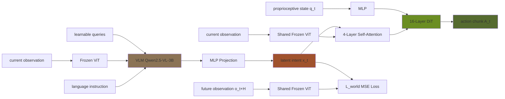

## problem

End-to-end Vision-Language-Action (VLA) models treat the VLM primarily as a multimodal encoder, directly mapping vision-language features to low-level continuous actions. This paradigm suffers from two fundamental issues:

1. **Underutilized decision-making**: The VLM's potential for high-level reasoning is squandered when it serves as a passive feature extractor rather than an active decision maker.

2. **Training instability**: Low-level action supervision causes representation collapse — the VLM's rich semantic features degrade and overfit to spurious action patterns. Methods like π0 (Physical Intelligence) and GR00T-N1 (NVIDIA) truncate gradient flows or freeze the VLM backbone entirely, which prevents the VLM from acquiring action-aware dynamics.

**Prior approaches and their limitations**:

- **Hierarchical Planners** (SayCan, Hi-RT-2, Code as Policies, ReKeP, Gemini Robotics 1.5): Generate text subtasks or executable code via LLM/VLM to guide a separate controller. These create a non-differentiable wall — no action gradients flow back to the foundation model — and incur high deployment latency. Video-generation-based variants (e.g., Du et al. 2023) predict pixel-level goals but suffer from prohibitive inference costs and lack VLM-level semantic knowledge.

- **End-to-End VLAs** (RT-2, OpenVLA, GR00T-N1, π0, CogAct, GR-3): Directly predict continuous actions. Even with auxiliary world modeling objectives, they lack a strict structural bottleneck — the policy can rely on superficial correlations (shortcut learning) rather than truly translating the VLM's intent.

- **Auxiliary world model approaches** (FLARE, SEER, CoT-VLA): FLARE uses additional query tokens for latent regularization but treats foresight as optional context at execution time. SEER concatenates foresight features with VL features but does not enforce a strict causal dependency. UniCoD uses Mixture-of-Transformers but still allows intent bypass. All suffer from loose coupling between predicted future states and the execution policy.

DIAL resolves this by introducing **latent visual foresight as a fully differentiable structural bottleneck** in a biologically-inspired dual-system architecture, ensuring every motor command is strictly grounded in the VLM's reasoning intent.

## architecture

DIAL decomposes VLA into two systems communicating through a latent intent bottleneck:

### System-2 (Brain): Predictive Intent Synthesis

System-2 uses a pre-trained VLM backbone (**Qwen2.5-VL-3B**). Given language instruction $l\_t$, current visual observation $o\_t$, and $N$ learnable query tokens appended to the LLM input:

1. The ViT encoder extracts visual patches from $o\_t$ (producing features in $\mathbb{R}^{N \times d}$ where $N$ = number of ViT patches, preserving spatial structure).
2. The LLM processes visual patches, language tokens, and learnable queries together.
3. The output representations of the query tokens pass through an **MLP projection head** to synthesize the latent intent $x\_t \in \mathbb{R}^{N \times d}$.

This latent intent $x\_t$ is explicitly constrained to encode visual foresight — it is trained to predict the ViT features of the observation $o\_{t+H}$ at $H$ timesteps ahead:

$$\mathcal{L}\_{\text{world}} = \|x\_t - \text{Enc}\_{\text{ViT}}(o\_{t+H})\|\_2^2$$

Both the foresight target and the current observation encoder use the **identical frozen pre-trained ViT** from the VLM backbone, ensuring strict feature-space consistency.

### System-1 (Cerebellum): Latent Inverse Dynamics

System-1 operates as a reactive motor controller:

1. An **independent perceptual pathway** using the same frozen ViT extracts features $\text{Enc}\_{\text{ViT}}(o\_t)$ from the current observation.
2. A **4-layer self-attention module** fully fuses the current visual features with the predictive intent $x\_t$, producing a spatially-aware fused representation.
3. This fused representation serves as the **cross-attention condition** for a **16-layer Diffusion Transformer (DiT)**.
4. The robot's proprioceptive state $q\_t$ is projected via an MLP into a dense feature token and fed directly into the DiT alongside noisy action tokens.

Action generation uses **flow matching** (optimal transport). Given ground-truth action chunk $A\_t = [a\_t, a\_{t+1}, \ldots, a\_{t+H-1}]$ with horizon $H = 16$, time variable $\tau \sim \mathcal{U}[0,1]$, and Gaussian noise $\epsilon \sim \mathcal{N}(0, I)$, the interpolated path is $A\_t^\tau = \tau A\_t + (1-\tau)\epsilon$:

$$\mathcal{L}\_{\text{fm}}(\theta) = \mathbb{E}\_{\tau, \epsilon}\left[\|V\_\theta(A\_t^\tau \mid x\_t, \text{Enc}\_{\text{ViT}}(o\_t), q\_t, \tau) - (A\_t - \epsilon)\|\_2^2\right]$$

### Key Design Principle

System-1 functions as a **latent inverse dynamics model**: it must resolve the discrepancy between current visual features and predicted latent foresight to generate actions. Unlike traditional inverse dynamics that operate on raw pixels, DIAL resolves state-transition dynamics entirely within a structured latent space. This imposes a **hard bottleneck** — the policy cannot bypass System-2's intent.

### Overall Policy

$$x\_t = f\_{\text{System-2}}(l\_t, o\_t), \quad A\_t \sim \pi\_{\text{System-1}}(\cdot \mid x\_t, o\_t, q\_t)$$

### Parameter Counts

- **VLM backbone (Qwen2.5-VL-3B)**: ~3B parameters (frozen ViT + frozen text embeddings; LLM blocks, learnable queries, and MLP head are trainable)
- **System-1**: 4-layer self-attention + 16-layer DiT + proprio MLP (lightweight relative to VLM)
- Total trainable parameters are dominated by the Qwen2.5 LLM blocks (~2.8B trainable)



## training

### Two-Stage Paradigm

**Stage 1: Decoupled Warmup** — System-2 and System-1 train independently:

- System-2: optimized solely via $\mathcal{L}\_{\text{world}}$ to master physically-grounded visual foresight. Uses action-free data.
- System-1: trained via $\mathcal{L}\_{\text{fm}}$ with $x\_t$ replaced by ground-truth future features $\text{Enc}\_{\text{ViT}}(o\_{t+H})$. Learns sensorimotor control under perfect future guidance.

**Stage 2: End-to-End Training** — Full pipeline unified:

- System-1 now conditioned on synthesized $x\_t$ from System-2.
- Action gradients backpropagate through $x\_t$ into trainable VLM parameters.
- The foresight reconstruction loss ($\mathcal{L}\_{\text{world}}$) regularizes the VLM, preventing representation collapse.

$$\mathcal{L}\_{\text{total}} = \mathcal{L}\_{\text{world}} + \mathcal{L}\_{\text{fm}}$$

### Frozen / Trainable Split

- **Frozen**: ViT encoder, text embedding layer of VLM
- **Trainable**: LLM blocks, learnable query tokens, MLP projection head, entire System-1 (self-attention + DiT + proprio MLP)

### Simulation Training (RoboCasa GR1 Tabletop)

- **Full Data regime**: 24,000 trajectories (1,000/task), 160,000 steps total (80k warmup + 80k end-to-end)
- **Few-Shot regime**: 2,400 trajectories (100/task), 40,000 steps total (20k warmup + 20k end-to-end)
- **Human data pre-training** (few-shot + human): 27,419 EgoDex trajectories + 2,400 robot trajectories, 40k steps pre-training (20k warmup + 20k end-to-end) + 20k steps end-to-end fine-tuning on robot-only data
- Robot state/action: 47-dimensional (29 joint DoF: 14 dual arms + 12 hands + 3 waist; 18 EEF pose dims)
- Action chunk horizon: $H = 16$

### Real-World Training (IRON-R01-1.11 Humanoid)

- State/action space: 50-dimensional (extends simulation with 3-DoF head)
- 120 robot trajectories per task (laboratory collected)
- Pre-training: 160,000 steps on mixed dataset (32k proprietary factory robot trajectories + 30k EgoDex trajectories), split 80k decoupled warmup + 80k end-to-end
- Fine-tuning: 2,000 steps task-specific end-to-end

### Training Infrastructure

The paper does not explicitly list GPU count or wall-clock training time, but the use of a 3B VLM backbone with DiT-based System-1 suggests training on multi-GPU setups (likely 4–8 A100s given the scale of 160k steps).

## evaluation

### RoboCasa GR1 Tabletop — Full Data (1,000 trajectories/task, 160k steps)

Results on 24 tasks (18 Pick & Place + 6 Articulated), 50 episodes each:

| Method | Pick & Place | Articulated | 24-Task Avg |
|--------|-------------|-------------|-------------|
| Diffusion Policy | ~30 | ~24 | ~27 |
| UWM | ~40 | ~38 | ~39 |
| GR00T-N1.6 | ~44 | ~51 | 47.6 |
| FLARE | ~47 | ~64 | 55.0 |
| GR00T-Qwen3 | ~40 | ~50 | 43.7 |
| π0-Qwen3 | ~50 | ~48 | 48.8 |
| FAST-Qwen3 | ~43 | ~42 | 42.3 |
| OFT-Qwen3 | ~46 | ~50 | 47.8 |
| **DIAL** | **68.9** | **74.3** | **70.2** |

DIAL achieves **70.2% average**, a +15.2 point margin over the next-best (FLARE at 55.0%).

### RoboCasa GR1 Tabletop — Few-Shot (100 trajectories/task, 40k steps)

| Method | Pick & Place | Articulated | 24-Task Avg |
|--------|-------------|-------------|-------------|
| GR00T-Qwen2.5 (frozen) | — | — | 21.8 |
| GR00T-Qwen2.5-FT | — | — | 30.6 |
| GR00T-Qwen2.5+FLARE | — | — | 51.9 |
| GR00T-Qwen2.5+SEER | — | — | 49.6 |
| GR00T-Qwen2.5+SEER-EV | — | — | 47.2 |
| DIAL-DINO | — | — | 47.2 |
| **DIAL** | **56.0** | **64.7** | **58.3** |

Key finding: **DIAL at 58.3% (100 trajectories/task) surpasses FLARE at 55.0% trained with 10× more data (1,000 trajectories/task)**.

### Scalability with Human Data (Few-Shot + EgoDex)

| Setting | In-Dist Pick & Place | In-Dist Articulated | In-Dist Avg | OOD Unseen Appearance | OOD Unseen Combos | OOD Unseen Objects | OOD Avg |
|---------|---------------------|---------------------|-------------|----------------------|-------------------|--------------------|---------|
| DIAL w/o Human Data | 56.0 | 65.3 | 60.8 → note | 50.7 | 53.0 | 34.8 | 46.2 |
| DIAL + Human Data | 60.8 | 62.0 | 61.1 | 53.8 | 58.7 | 41.1 | 51.2 |

Human data boosts OOD average from 46.2% to 51.2%. Articulated tasks show no improvement due to domain mismatch (EgoDex lacks articulated demonstrations).

### Real-World (IRON-R01-1.11) — In-Distribution

| Method | Pick & Place | Pour | Avg |
|--------|-------------|------|-----|
| GR00T-Qwen2.5 | ~30 | ~17 | ~25 |
| GR00T-Qwen2.5+FLARE | ~40 | ~30 | ~35 |
| DIAL w/o Human Data | ~50 | ~40 | ~45 |
| DIAL w/o Decoupled Warmup | ~55 | ~55 | ~57.5 |
| **DIAL** | **80** | **70** | **77.5** |

Removing decoupled warmup causes in-distribution performance to drop from 77.5% to 57.5%.

### Real-World — Out-of-Distribution

| Method | Combinatorial | Distractor | Instance-Level | Avg |
|--------|--------------|------------|----------------|-----|
| GR00T-Qwen2.5 | ~10 | ~10 | ~10 | ~10 |
| GR00T-Qwen2.5+FLARE | ~20 | ~20 | ~5 | ~17.5 |
| DIAL w/o Human Data | ~20 | ~20 | ~30 | ~26.7 |
| DIAL w/o Decoupled Warmup | ~30 | ~30 | ~30 | ~30.0 |
| **DIAL** | **60** | **40** | **60** | **58.3** |

### Where DIAL Wins

- **Data efficiency**: 10× fewer demonstrations to match or exceed prior methods
- **Structured grounding**: Strict bottleneck prevents shortcut learning
- **OOD generalization**: Strong zero-shot transfer to unseen objects, textures, combinations
- **Cross-embodiment scaling**: Effectively absorbs knowledge from human demonstrations
- **Articulated tasks**: 74.3% vs 55.0% (FLARE) in full-data setting

### Where DIAL is Weaker

- **Articulated tasks with human data**: No improvement (62.0% vs 65.3% without) when human data lacks relevant demonstrations
- **Latent space dependency**: Performance drops significantly with DINO-v2 features (47.2% vs 58.3%) — requires native VLM feature consistency

## reproduction guide

### Environment Setup

```bash
# Clone the repository (not yet released — check project page)
git clone https://github.com/xpeng-robotics/dial.git
cd dial

# Create conda environment
conda create -n dial python=3.10 -y
conda activate dial

# Install PyTorch (CUDA 12.1)
pip install torch torchvision --index-url https://download.pytorch.org/whl/cu121

# Install dependencies
pip install -r requirements.txt
# Expected key deps: transformers, diffusers, flow-matching, robosuite, robocasa
```

### Data Preparation

**Simulation (RoboCasa GR1 Tabletop)**:
```bash
# Install RoboCasa
pip install robocasa

# Download GR1 tabletop dataset — 24 tasks, 1000 trajectories each (full) or 100 each (few-shot)
# Follow RoboCasa docs for dataset download
python tools/download_robocasa_data.py --tasks all --split full
# or for few-shot:
python tools/download_robocasa_data.py --tasks all --split fewshot --traj_per_task 100
```

**Human Data (EgoDex)**:
```bash
# Download EgoDex basic_pick_place subset (27,419 trajectories)
# and pour subset (3,205 trajectories)
# Extract wrist EEF poses, pad to match robot state dimension
python tools/process_egodex.py --subset basic_pick_place --output_dir data/egodex
```

### Training — Simulation Few-Shot

```bash
# Stage 1: Decoupled Warmup (20,000 steps)
python train.py \
  --config configs/dial_robocasa_fewshot.yaml \
  --stage warmup \
  --num_steps 20000 \
  --batch_size 256 \
  --lr 1e-4 \
  --data_dir data/robocasa_fewshot

# Stage 2: End-to-End Training (20,000 steps)
python train.py \
  --config configs/dial_robocasa_fewshot.yaml \
  --stage endtoend \
  --num_steps 20000 \
  --batch_size 256 \
  --lr 1e-4 \
  --warmup_ckpt checkpoints/warmup/latest.pt \
  --data_dir data/robocasa_fewshot
```

### Training — Few-Shot + Human Data

```bash
# Pre-training: 40k steps (20k warmup + 20k end-to-end) on mixed human + robot data
python train.py \
  --config configs/dial_robocasa_human.yaml \
  --stage pretrain \
  --num_steps 40000 \
  --human_data_dir data/egodex/basic_pick_place \
  --robot_data_dir data/robocasa_fewshot

# Fine-tuning: 20k steps end-to-end on robot-only data
python train.py \
  --config configs/dial_robocasa_human.yaml \
  --stage finetune \
  --num_steps 20000 \
  --pretrain_ckpt checkpoints/pretrain/latest.pt \
  --robot_data_dir data/robocasa_fewshot
```

### Evaluation

```bash
# Evaluate on RoboCasa GR1 Tabletop (24 tasks, 50 episodes each)
python eval.py \
  --config configs/dial_robocasa_fewshot.yaml \
  --ckpt checkpoints/endtoend/latest.pt \
  --num_episodes 50 \
  --tasks all

# Expected output: ~58.3% average success rate (few-shot), ~70.2% (full data)
```

### Verification Checklist

1. Confirm System-2 warmup produces valid latent foresight by computing MSE against ground-truth ViT features — should decrease steadily.
2. Verify System-1 with ground-truth future guidance achieves stable action prediction during warmup.
3. After end-to-end training, check that $\mathcal{L}\_{\text{fm}}$ gradients propagate through $x\_t$ to VLM parameters.
4. Run PCA visualization of predicted foresight vs ground-truth future vs current observation to confirm semantic alignment (see Figure 12 in paper).
5. Compare against frozen VLM baseline — should see >2× improvement in success rate.

### Hardware Requirements

- Minimum: 4× A100 80GB GPUs (for 3B VLM + DiT)
- Recommended: 8× A100 80GB for full-data regime with larger batch sizes
- Storage: ~500GB for RoboCasa full dataset + EgoDex

## notes

### Key Takeaways

1. **Structural bottleneck > auxiliary loss**: The core insight is that merely adding a world modeling objective (like FLARE) is insufficient — the architecture must structurally force the policy to depend on the VLM's intent. DIAL's inverse dynamics formulation achieves this.

2. **Latent-space consistency matters**: The DINO-v2 ablation (58.3% → 47.2%) shows that the latent intent must live in the VLM's native feature space. Cross-manifold translation destroys the semantic-physical alignment.

3. **Decoupled warmup is critical**: Removing it causes a 20-point drop in real-world OOD performance (58.3% → 30.0%). The warmup prevents posterior collapse by letting System-1 learn under perfect guidance before encountering noisy predictions.

4. **Action-aware foresight**: The end-to-end gradients transform $x\_t$ from pure visual prediction into a task-oriented representation optimized for downstream motor execution — this is DIAL's unique mechanism.

5. **Cross-embodiment scaling works**: 27k human egocentric trajectories meaningfully improve zero-shot generalization to novel objects (+5 OOD points), validating the action-free world modeling pre-training paradigm.

### Connections to Other Work

- **FLARE** (Zheng et al. 2025): Closest predecessor — also uses flow matching with future latent alignment. DIAL differs by enforcing a structural bottleneck (inverse dynamics) rather than treating foresight as optional context. FLARE achieves 55.0% vs DIAL's 70.2% on full-data RoboCasa.

- **SEER** (Tian et al. 2024): Predictive inverse dynamics model that concatenates foresight features. DIAL improves on this by operating entirely within the VLM's native latent space and using a decoupled warmup.

- **π0** (Black et al. 2024): Dual-system VLA with flow matching DiT. π0 freezes the VLM entirely; DIAL makes the LLM blocks trainable through controlled gradient flow, achieving better intent-action alignment.

- **GR00T-N1.6** (NVIDIA): Upgraded GR00T with larger DiT and fine-tuned late VLM layers. DIAL's 70.2% vs GR00T-N1.6's 47.6% on RoboCasa highlights the value of explicit world modeling.

- **CoT-VLA** (Zhao et al. 2025): Uses visual chain-of-thought for reasoning. Requires costly annotations and introduces inference latency. DIAL achieves implicit reasoning through latent foresight without annotation overhead.

- **UniCoD** (Zhang et al. 2025): Mixture-of-Transformers for unified world prediction and action. DIAL's explicit System-1/System-2 split provides cleaner decoupling.

- **Latent Action Pretraining** (Ye et al. 2025, ICLR): Learns discrete latent actions from video. DIAL operates in continuous latent space with explicit intent-action grounding.

- **WorldVLA** (Cen et al. 2025): Autoregressive action world model. DIAL avoids autoregressive tokenization overhead by using flow matching in continuous latent space.

- **Biological inspiration**: The System-2/System-1 framing directly parallels Kahneman's dual-process theory — deliberative reasoning vs. fast automatic responses. This cognitive grounding provides an intuitive explanation for the architecture's effectiveness.

### Future Directions (from paper)

- Scaling System-1 DiT to larger parameter sizes
- End-to-end fine-tuning of the ViT backbone (stabilized via EMA-based encoding and latent token compression)
- Pre-training on massive action-free human videos (YouTube-scale) to build truly generalist embodied agents
- Integrating latent world modeling into native VLM pre-training objectives
- Modular iteration: pre-train System-1 once, swap in new VLM generations without retraining the action expert
