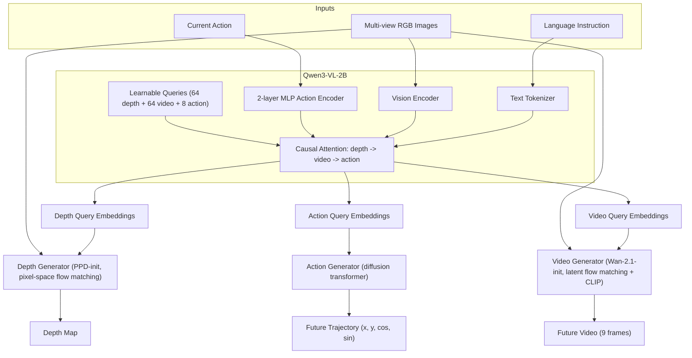

## problem

World-action models (WAM) unify world model generation with motion planning, but existing approaches (PWM, Epona, UniUGP, DriveLaW) model only 2D appearance or latent representations. They lack explicit 3D geometric grounding, which is essential for occlusion reasoning, distance estimation, and physically consistent motion in autonomous driving. The generated world may be visually plausible but not maximally informative for planning, and the planner may not benefit from structured safety cues like free-space constraints.

Prior approaches and their specific limitations:
- **Vision-based E2E (TransFuser, UniAD, DiffusionDrive):** direct observation-to-action mapping, no future world modeling at all.
- **VLA planners (AutoVLA, DriveVLA-W0, ReCogDrive):** optimize action outputs but do not explicitly model future world evolution under alternative actions. DriveVLA-W0 adds future-image prediction but uses image-token regression rather than generative video rollout, and has no geometric representation.
- **World models (Vista, GEM):** generate future observations but rely on external action signals; not integrated with planning.
- **2D world-action models (PWM, Epona):** unify generation and planning but operate on 2D pixel/latent representations without depth or geometric structure.
- **OmniNWM:** generates depth but targets panoramic reconstruction, not unified end-to-end planning with a causal depth-to-action pathway.

## architecture

DriveDreamer-Policy couples a large language model (backbone) with three lightweight generative expert modules connected through a fixed-size query interface. The LLM processes multimodal inputs and produces world/action embeddings that condition the experts via cross-attention.

**Backbone:** Qwen3-VL-2B, which processes text instructions, multi-view RGB images, and current action tokens.

**Learnable query tokens:** 64 depth queries, 64 video queries, 8 action queries, appended in that order. Causal attention mask enforces depth $\to$ video $\to$ action information flow in a single forward pass.

**Depth generator:** Pixel-space diffusion transformer initialized from PPD. Trained with conditional flow matching. Input: concatenated noisy depth + current RGB image. Conditioned on LLM depth-query embeddings via cross-attention. No VAE needed (depth is low-dimensional enough for pixel-space generation).

**Video generator:** Latent-space diffusion transformer initialized from Wan-2.1-T2V-1.3B, adapted from text-to-video to image-to-video. Uses a VAE to encode current RGB into latents, then denoises noisy video latents for a 9-frame horizon at 144 $\times$ 256 resolution. Conditioned on LLM video-query embeddings plus CLIP visual features from the current frame (concatenated as cross-attention keys/values).

**Action generator:** Standalone diffusion transformer mapping noise to future trajectories. Conditioned on LLM action-query embeddings via cross-attention. Trajectory states parameterized as $(x, y, \cos\theta, \sin\theta)$ to avoid angular wrap-around. Can be activated independently for planning-only mode.

**Action encoder:** 2-layer MLP with layer normalization.



**Operating modes:**
- **Planning-only:** action generator only (fastest, minimal compute).
- **Imagination-enabled planning:** action + depth/video generators for safety-critical scenarios.
- **Full generation:** all three experts for offline simulation and data synthesis.

## training

**Dataset:** Navsim benchmark. Train split: 100k samples, eval split: 12k samples, sampled at 2Hz from real-world driving logs.

**Depth labels:** Generated offline by Depth Anything 3 (DA3) -- no LiDAR needed. Depth normalized via log transform + per-map percentiles to $[-0.5, 0.5]$.

**Single-stage joint training.** Loss:

$$\mathcal{L} = \lambda_d \mathcal{L}_d + \lambda_v \mathcal{L}_v + \lambda_a \mathcal{L}_a$$

where $\mathcal{L}\_d, \mathcal{L}\_v, \mathcal{L}\_a$ are flow matching regression losses for depth, video, and action prediction respectively. Weights: $\lambda_d = 0.1$, $\lambda_v = 1.0$, $\lambda_a = 1.0$.

**Flow matching objective** (shared by all generators):

$$\mathcal{L}_{FM} = \mathbb{E}_{x_0, x_1, t} \left\| v_\theta(x_t, t \mid c) - (x_1 - x_0) \right\|^2$$

where $x_t = (1-t)\, x_0 + t\, x_1$, $t \sim \mathcal{U}(0,1)$, $x_0 \sim p_{\text{data}}$, $x_1 \sim p_{\text{noise}}$.

**Optimization:** AdamW, LR $1 \times 10^{-5}$, 100k steps, batch size 32, on 8 NVIDIA H20 GPUs. No extra datasets or pre-training beyond initialized backbones.

**Model initialization:**
| Component | Source |
|---|---|
| LLM backbone | Qwen3-VL-2B (frozen-ish, fine-tuned end-to-end) |
| Depth generator | PPD (Pixel-Perfect Depth) |
| Video generator | Wan-2.1-T2V-1.3B (adapted image-to-video) |
| Action generator | Trained from scratch (diffusion transformer) |

## evaluation

### Planning performance (Navsim closed-loop)

**Navsim v1 (PDMS metric):**

| Method | Category | Sensors | PDMS |
|---|---|---|---|
| DiffusionDrive | Vision E2E | 3xC+L | 88.1 |
| DriveVLA-W0 | VLA | 1xC | 88.4 |
| LaW | World-Model | 1xC | 84.6 |
| Epona | World-Model | 3xC | 88.3 |
| FSDrive | World-Model | 1xC | 85.1 |
| PWM | World-Model | 1xC | 88.1 |
| **DriveDreamer-Policy** | **World-Action** | **3xC** | **89.2** |

PDMS breakdown for this method: NC 98.4, DAC 97.1, TTC 95.1, C 100.0, EP 83.5.

**Navsim v2 (EPDMS metric):**

| Method | Category | EPDMS |
|---|---|---|
| ARTEMIS | Vision E2E | 89.1 |
| DriveVLA-W0 | VLA | 86.1 |
| LaW | World-Model | 88.7 |
| **DriveDreamer-Policy** | **World-Action** | **88.7** |

EPDMS breakdown: NC 98.4, DAC 87.9, TTC 99.9, DDC 99.5, TLC 97.6, LK 97.7, EC 98.3, HC 79.4, EP 97.6.

### World generation quality

**Video (single-view front, compared to PWM):**

| Method | LPIPS$\downarrow$ | PSNR$\uparrow$ | FVD$\downarrow$ |
|---|---|---|---|
| PWM | 0.23 | 21.57 | 85.95 |
| **DriveDreamer-Policy** | **0.20** | 21.05 | **53.59** |

FVD improvement of 32.36 over PWM.

**Depth (compared to PPD variants):**

| Method | AbsRel$\downarrow$ | $\delta_1\uparrow$ | $\delta_2\uparrow$ | $\delta_3\uparrow$ |
|---|---|---|---|---|
| PPD (zero-shot) | 18.5 | 80.4 | 94.0 | 97.2 |
| PPD (fine-tuned) | 9.3 | 91.4 | 98.3 | 99.5 |
| **DriveDreamer-Policy** | **8.1** | **92.8** | **98.6** | **99.5** |

### Key ablations

**World learning for planning (PDMS on Navsim v1):**

| Variant | PDMS |
|---|---|
| No world learning | 88.0 |
| Depth + Action | 88.5 |
| Video + Action | 88.9 |
| Depth + Video + Action | **89.2** |

Single-modality world learning helps; joint depth+video provides the largest gain.

**Depth for video generation:**

| Variant | LPIPS$\downarrow$ | PSNR$\uparrow$ | FVD$\downarrow$ |
|---|---|---|---|
| Video only (no depth) | 0.22 | 19.89 | 65.82 |
| Depth + Video | **0.20** | **21.05** | **53.59** |

**Query count (64+64+8 vs 32+32+4):** Reducing queries drops PDMS from 89.2 to 88.9, FVD from 53.59 to 57.97, AbsRel from 8.1 to 9.7.

## reproduction guide

**Compute requirements:** 8 NVIDIA H20 GPUs (96GB each). Training for 100k steps at batch size 32 should take roughly 3-5 days depending on H20 throughput. Memory is the main constraint due to the three parallel diffusion experts plus the VLM backbone.

**Data preparation:**
1. Download Navsim dataset (navtrain / navtest splits).
2. Run Depth Anything 3 (DA3) on all training images to produce depth labels. Store normalized depth maps (log transform + percentile normalization to $[-0.5, 0.5]$).
3. Prepare action trajectories in $(x, y, \cos\theta, \sin\theta)$ format from Navsim logs.

**Dependencies:**
- Qwen3-VL-2B (HuggingFace Transformers)
- PPD checkpoint for depth generator initialization
- Wan-2.1-T2V-1.3B checkpoint for video generator initialization
- CLIP model (for video conditioning)
- Depth Anything 3 (for generating depth labels)

**Training command (estimated):**

```bash
torchrun --nproc_per_node=8 train.py \
  --batch_size 4 \
  --gradient_accumulation_steps 8 \
  --learning_rate 1e-5 \
  --num_steps 100000 \
  --depth_weight 0.1 \
  --video_weight 1.0 \
  --action_weight 1.0 \
  --num_depth_queries 64 \
  --num_video_queries 64 \
  --num_action_queries 8 \
  --resolution 144 256 \
  --video_horizon 9
```

**Gotchas:**
- No GitHub code released yet (project page only at https://drivedreamer-policy.github.io/). Reproduction from scratch requires reassembling PPD + Wan-2.1 + Qwen3-VL-2B with the query interface and causal attention mask.
- Depth generator operates in pixel space (no VAE) while video generator operates in VAE latent space. These require different noise schedules and ODE solvers.
- The causal attention mask is within-query-group only: depth queries attend to all input tokens, video queries additionally attend to depth query outputs, action queries additionally attend to both depth and video query outputs.
- Inference modes matter for latency: planning-only skips depth and video generators entirely.
- Sensors: 3 cameras (surround view) without LiDAR. The method uses only RGB + text instruction + current action.
- Video evaluation compares single-view (front) only for fair comparison with PWM which only supports single-view.

## notes

- The core insight is that depth is cheap to generate (pixel-space, low-dimensional) and serves as an explicit 3D scaffold that benefits both video coherence and planning safety, without requiring LiDAR at inference.
- The modularity is a practical design choice: the fixed-size query interface lets each expert be swapped or disabled independently. The action generator does not depend on explicit depth/video outputs at inference time (only on the LLM embeddings which implicitly absorb world knowledge).
- The +2.6 EPDMS improvement over the prior best world-model method (LaW, 86.1) is entirely on Navsim v2. On Navsim v1, the improvement over PWM is +1.1 PDMS.
- FVD improvement of 32.36 over PWM is substantial and indicates significantly better temporal coherence in generated video.
- The depth generator outperforms both zero-shot and fine-tuned PPD on Navsim despite being trained jointly rather than standalone, suggesting that LLM conditioning provides useful global scene context for resolving monocular depth ambiguity.
- Key open question: whether the depth-video-action causal ordering is optimal or whether other orderings (e.g., action-video-depth) could work equally well. The paper only ablates presence/absence, not ordering.
- Action parameterization with $(x, y, \cos\theta, \sin\theta)$ avoids angular discontinuities but doubles the action dimensionality compared to $(x, y, \theta)$.
- No explicit compute cost or latency numbers are reported per operating mode (planning-only vs full generation). This would be critical for real-time deployment assessment.
- The method requires 3 cameras as input, while some competitors (DriveVLA-W0, Epona) use only 1. The 3-camera setup provides richer geometric context but increases input cost.
