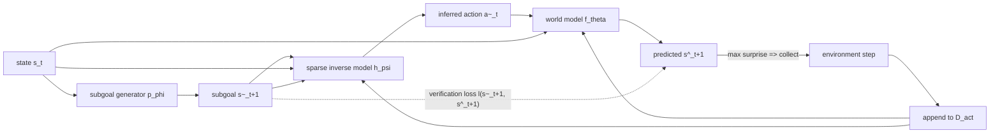

## problem

world models must predict future states across a broad range of actions (not just optimal ones), yet action-labeled robot data is expensive to collect. standard exploration strategies for gathering informative interactions -- epistemic uncertainty, ensemble disagreement, learning progress -- inherit the weaknesses of the world model itself: they are reliable in well-explored regions where additional data matters least, and unreliable in under-explored regions where verification matters most.

the paper addresses a concrete question: given a current state $s\_t$ and a set of candidate actions, which action should we execute to collect data that maximally improves the world model? the oracle answer is to pick the action where the world model has the highest prediction error, but computing that error requires ground-truth $s\_{t+1}$ which is unavailable before execution.

prior methods and their limitations:
- **on-policy exploration** (e.g., Dreamer-v3 rollouts): effective for specific policies but degrades sharply beyond predefined policy sets.
- **uncertainty / ensemble disagreement** (Sekar et al., 2020): reliable in well-explored regions, unreliable where verification matters most.
- **learning progress** (Kim et al., 2020): tends to over-prioritize transitions where the model is already competent, yielding redundant data.
- **RLIR** (Ye et al., 2025): uses forward-inverse cycles but with dense full-state generation, which is brittle when the world model produces off-manifold rollouts.

## architecture

WAV decomposes world model verification into two complementary factors via Bayes' rule:

$$ p(s\_{t+1} \mid s\_t, a\_t) \propto p(s\_{t+1} \mid s\_t) \cdot p(a\_t \mid s\_t, s\_{t+1}) $$



**three components:**

1. **subgoal generator** $p\_\varphi$: trained on action-free video data $\mathcal{D}\_{\text{vid}}$. given $s\_t$, samples $K$ candidate future states $\{\tilde{s}\_{t+1}^k\}\_{k=1}^K \sim p\_\varphi(\cdot \mid s\_t)$ as on-manifold references. exploits the asymmetry that action-free video data is orders of magnitude more abundant than action-labeled interactions.

2. **sparse inverse dynamics model** $h\_\psi$: trained on action-labeled data $\mathcal{D}\_{\text{act}}$ with a learned binary mask $M$ that selects action-relevant state features. infers $\hat{a}\_t = h\_\psi(M \odot s\_t, M \odot s\_{t+1})$. exploits the asymmetry that actions are identifiable from a small subset of state features (e.g., end-effector pose), making verification far lower-dimensional than forward prediction.

3. **world model** $f\_\theta$: action-conditioned forward dynamics model $\hat{s}\_{t+1} = f\_\theta(s\_t, a\_t)$. in the robotic experiments, this is Dreamer-v3 with a latent RSSM (512-dim GRU hidden state, 1024-dim stochastic latent).

**self-improving cycle** (reverse ordering -- critical design choice):

$$ s\_t \xrightarrow{p\_\varphi} \tilde{s}\_{t+1} \xrightarrow{h\_\psi} \hat{a}\_t \xrightarrow{f\_\theta} \hat{s}\_{t+1} $$

the verification score $\hat{\varepsilon}(s\_t, \hat{a}\_t, \hat{s}\_{t+1}) = \ell(\tilde{s}\_{t+1}, \hat{s}\_{t+1})$ measures the discrepancy between the proposed subgoal and the world model's predicted state. high discrepancy indicates the world model struggles with that transition, so the corresponding action is executed in the environment and the resulting labeled transition is added to $\mathcal{D}\_{\text{act}}$.

a forward-first cycle (sample actions, roll out, then invert) was rejected because early errors in $f\_\theta$ produce off-manifold rollouts on which the inverse model is unreliable.

## training

**world model** (Dreamer-v3 based):
- conv encoder with stride-2 convolutions for images; 5-layer MLP for proprioception
- GRU with 512-dim hidden state; 1024-dim stochastic latent
- rollout horizon: 32 frames
- batch size 16, batch length 32, Adam optimizer, lr $1 \times 10^{-4}$
- replay capacity $1 \times 10^5$
- reconstruction loss scale 1.0

**sparse IDM** (CLAM-based):
- ST Transformer encoder: 64x64x3 images partitioned into 16x16 patches, 16 visual tokens per frame, 128-dim embeddings
- latent action dim: 16, context length: 2
- action decoder: 3-layer MLP [1024, 1024, 1024] with 512-dim embedding
- 500k updates, action decoder trained every 2 steps, batch size 128
- $\ell_1$ sparsity regularization on latent actions with weight 0.1
- reconstruction loss weight: 1.0

**exploration loop** (Algorithm 1):
- warm-start world model on seed data (200 labeled transitions for MiniGrid; 200-1000 trajectories for robotics)
- each round: sample $K$ subgoals, infer actions, roll forward, pick argmax discrepancy, execute in env, append to dataset, update world model and IDM

## evaluation

### MiniGrid (3 tasks: Key Delivery, Ball Delivery, Object Matching)
- 50k interaction sequences; 25k for subgoal generator, 200 seed labeled transitions + 20k candidate pool for exploration, 10,368 balanced test transitions
- sparse IDM consistently outperforms world model across all three factors from Proposition 3.2:
  - **sample size**: gap most pronounced in low-data regime (400 samples)
  - **dimensionality**: WM degrades rapidly as objects increase from 6 to 14; IDM remains stable
  - **stochasticity**: noisy floor tiles inflate $\sigma\_s$ but IDM is unaffected (clean action imprint)
- verification scores: highest Spearman and Kendall rank correlation with oracle across all baselines
- acquisition: WAV closely matches oracle performance, outperforming Random, Uncertainty, and Progress by selecting interaction-rich transitions that baselines miss

### RoboMimic + ManiSkill (6 tasks: Lift, Can, Square, PokeCube, PullCube, LiftPeg)
- 1500 trajectories per task from 10 diffusion policy checkpoints at varying training stages
- warm-start on {200, 400, 600, 800, 1000} trajectories, then 2 exploration rounds of 200 epochs each
- 7-dim continuous action space in $[-1, 1]^7$
- 32-frame prediction horizon for MSE evaluation
- **world model error**: consistently lower than all baselines, with largest gains in low-data regime
- **rank correlation**: highest Spearman correlation with oracle on all 6 tasks
- **downstream policy reward** (SAILOR protocol with imagination-based planning): 18% higher average reward than strongest baseline, second only to oracle

key result: 2x sample efficiency improvement and 18% downstream policy performance gain.

## reproduction guide

**dependencies**: Dreamer-v3 codebase, CLAM implementation, MiniGrid gym environment, RoboMimic/ManiSkill via Roboverse, diffusion policy codebase.

**MiniGrid experiments** (fastest path to verify the core idea):
```bash
# 1. collect random play data (50k sequences from 3 MiniGrid tasks)
python collect_minigrid.py --tasks key_delivery,ball_delivery,object_matching --total 50000

# 2. train subgoal generator on 25k unlabeled transitions
python train_subgoal.py --data unlabeled_25k.pkl --epochs 100

# 3. train sparse IDM on 200 seed labeled transitions
python train_sparse_idm.py --data seed_200.pkl --sparsity_weight 0.1 --updates 500000

# 4. run exploration loop (Algorithm 1)
python explore.py --seed 200 --budget 100 --rounds 3 --K 32 --eval_every_round
```

**robotic manipulation experiments** (RoboMimic/ManiSkill):
```bash
# 1. train 10 diffusion policy checkpoints at varying steps (100-900k)
python train_diffusion_policies.py --task lift --checkpoints 10

# 2. collect trajectories from all checkpoints (~1500 per task)
python collect_trajectories.py --task lift --checkpoints 10

# 3. partition into warmup (expert + best checkpoint on-policy) and exploration (imperfect checkpoints)
python partition_data.py --warmup_size 200

# 4. train Dreamer-v3 world model on warmup
python train_world_model.py --warmup 200 --epochs 200 --batch_size 16 --lr 1e-4

# 5. train sparse IDM (CLAM backbone + L1 sparsity)
python train_sparse_idm.py --latent_dim 16 --sparsity 0.1 --updates 500k

# 6. self-improvement loop
python self_improve.py --warmup_size 200 --exploration_rounds 2 --epochs_per_round 200
```

**gotchas:**
- the reverse cycle ordering (subgoal -> inverse -> forward) is critical. a forward-first cycle fails because early world model errors corrupt the inverse model.
- the learned mask $M$ for sparse IDM must be trained jointly, not applied post-hoc. the L1 sparsity weight of 0.1 was found to work well; too high causes the mask to collapse to too few features.
- MiniGrid requires the custom "swap" action which is not in the original EmptyEnv. the paper defines it as exchanging the object in front of the agent with the carried object.
- SAILOR reward model requires separate training (discriminator between expert and learner rollouts with moment-matching + gradient penalty).

**compute cost**: MiniGrid experiments run on a single GPU in minutes to hours. robotic manipulation experiments require a GPU for Dreamer-v3 and CLAM training; the paper reports 3 seeds for each setting. the full evaluation across 6 robotic tasks at 5 warmup sizes is the bulk of the compute.

## notes

the core theoretical contribution formalizes two asymmetries that make sparse inverse verification tractable where forward prediction fails:

1. **distribution asymmetry** (Proposition 3.1): if there exists an identifiable verification subset $\mathcal{S}$ of the latent space such that $(z\_t^\mathcal{S}, a\_t)$ stays on-support even when $(z\_t, a\_t)$ is out-of-support, then the inverse model can recover correct action labels on compositional OOS transitions. the formal guarantee relies on mechanism sparsity (Lachapelle et al., 2024) and latent action identifiability (Lachapelle, 2025).

2. **sample-efficiency asymmetry** (Proposition 3.2): in a linear-Gaussian model with $n$ samples, the forward/inverse error ratio factorizes into three terms: dimensionality $(d\_s + d\_a) / 2d\_z$, stochasticity $(\sigma\_s / \lambda \sigma\_a)^2$, and sample size $(n - 2d\_z - 1) / (n - d\_s - d\_a - 1)$. WAV helps most when $d\_s \gg d\_z$, $\sigma\_s \gg \sigma\_a$, and $n$ is small.

the method has clear failure modes acknowledged by the authors:
- **action aliasing**: when different actions produce indistinguishable subset transitions (e.g., soft gripper compliance), pseudo-labels drift.
- **back-action from OOS**: when OOS variables causally influence the verifier subset (e.g., compliant contact forces feeding back into joint torques), the source-set assumption breaks.

the three inference passes per exploration step (subgoal generation, inverse inference, forward rollout) are a computational concern noted as a limitation. the authors suggest shared intermediate representations or adaptive computation as future directions.

**open questions:**
- how does WAV scale to longer-horizon tasks where single-step inverse dynamics are insufficient?
- can the framework be extended to use richer generative priors (e.g., video diffusion models) as subgoal generators?
- the method still relies on environment feedback to correct prediction errors -- reducing this dependence toward fully self-improving world models (analogous to LLM self-improvement from synthetic data) remains an open challenge.
- applicability to real-robot settings where the generation-verification gap may be smaller due to tighter coupling between agent and environment dynamics.
