## Problem

Recursive (looped) transformers reuse a single shared weight block across multiple depth steps, slashing parameter counts from billions to hundreds of millions while preserving nominal depth. The fundamental limitation is **weight uniformity**: if the same weights are applied at every step, every step performs the same operation. A 36-layer model can learn distinct transformations at layers 5, 18, and 33, but a looped model running one block $N$ times cannot.

Prior approaches to this problem have notable gaps:

- **Universal Transformer** (Dehghani et al., 2019): shares weights with adaptive halting but no per-step adaptation mechanism.
- **RingFormer** (Heo et al., 2025): adds per-step static LoRA signals and unique LayerNorm, but the adaptations are fixed at training time and do not depend on the input being processed.
- **Huginn** (Geiping et al., 2025): splits a pretrained LLM into prelude/recurrent/coda sections, demonstrating a 3.5B model with 40% fewer parameters can match the original, but does not make per-step modulation input-dependent.
- **Relaxed Recursive Transformer** (Bae et al., 2024): initializes per-step LoRA from SVD of original layer residuals, finding rank 512 nearly closes the gap, but these are static parameters.
- **Retrofitted Recurrence** (McLeish et al., 2025): converts pretrained models to recursive ones and identifies a "healing" curriculum, but does not address per-step differentiation.
- **Universal Hypernetworks** (arXiv:2604.02215): a closely related line of work on generating weights dynamically, sharing the hypernetwork motivation but targeting a different architectural context.

The key missing capability: **input-conditioned** per-step weight modulation. A math problem and a poem should receive different per-step modifications, but no prior recursive transformer system provides this.

## Architecture

Ouroboros converts a pretrained transformer into a recursive architecture with three sections and a Controller hypernetwork. The design adds only 9.2M trainable parameters (0.6% of the base model) to Qwen2.5-3B.

### Prelude / Recurrent / Coda Split

Given a pretrained transformer with $L$ layers, the architecture partitions them into three groups:

- **Prelude** (layers 0 to $P-1$): frozen, maps token embeddings into a latent reasoning space.
- **Recurrent Block** (single layer $R$): looped $N$ times with Controller-generated LoRA modulation.
- **Coda** (layers $L-C$ to $L-1$): frozen, decodes from latent space to next-token predictions.

For Qwen2.5-3B ($L=36$): $P=8$, $R=18$, $C=8$, retaining 17 of 36 layers. Layers $\{8,\ldots,17\} \cup \{19,\ldots,27\}$ are removed; their knowledge is captured via SVD initialization.

### SVD-Initialized Fixed LoRA Bases

For each linear projection $W_R$ in the recurrent layer and each removed layer $l$ with weight $W_l$, the system computes the residual $\Delta_l = W_l - W_R$, averages over all removed layers, and performs truncated SVD:

$$\bar{\Delta} = \frac{1}{ \mid R \mid } \sum_{l \in R} (W_l - W_R), \quad \bar{\Delta} \approx U_r S_r V_r^\top$$

Setting $A = V_r^\top$ and $B = U_r S_r$, both matrices are then frozen. These capture the principal directions along which removed layers differed from the recurrent layer. The Controller only modulates the magnitude along each direction.

### CompactController Hypernetwork

The Controller takes two inputs -- (1) mean-pooled hidden state $\bar{h} \in \mathbb{R}^d$, (2) step embedding $e_t \in \mathbb{R}^s$ -- and produces a diagonal vector $\delta_k \in \mathbb{R}^r$ for each of $K=7$ LoRA targets (Q, K, V, O projections and gate, up, down FFN projections):

$$\delta_k = W_k \cdot \text{StyleNet}(\text{Proj}(\bar{h}) \;;\; e_t), \quad k \in \{1, \ldots, K\}$$

where $\text{Proj}: \mathbb{R}^d \to \mathbb{R}^{2s}$ is a linear projection with SiLU, StyleNet is a two-layer MLP ($3s \to 2s \to s$), and $W_k \in \mathbb{R}^{r \times s}$ are per-target zero-initialized linear heads. Zero initialization ensures the Controller starts as identity.

The weight update for target $k$:

$$\Delta W_k = \frac{\alpha}{r} \cdot B_k \cdot \text{diag}(\delta_k) \cdot A_k$$

where $A_k, B_k$ are frozen SVD bases and $\alpha/r$ is the LoRA scaling factor ($\alpha=16$, $r=32$, scaling $= 0.5$).

### Gated Recurrence

Following Chen (2026), the standard residual connection is replaced with a learned gate:

$$g^{(t)} = \sigma(W_g [h_{\text{new}}^{(t)} \odot h^{(t-1)}] + b_g), \quad h^{(t)} = g^{(t)} \odot h_{\text{new}}^{(t)} + (1 - g^{(t)}) \odot h^{(t-1)}$$

where $W_g$ is zero-initialized and $b_g = -2.0$, giving $\sigma(b_g) = 0.12$. At initialization, the gate retains 88% of the previous hidden state, creating a gradient highway across recurrence steps.

### Per-Step LayerNorm

Each recurrence step $t$ uses a unique RMSNorm with learnable scale $\gamma_t \in \mathbb{R}^d$:

$$\text{StepNorm}_t(x) = \frac{x}{\text{RMS}(x)} \odot \gamma_t$$

### Architecture Diagram

```mermaid
flowchart TD
    Input["Input Tokens"] --> Prelude["Prelude: 8 frozen layers<br/>(Qwen2.5-3B layers 0--7)"]
    Prelude --> LoopStart

    subgraph RecurrentBlock["Recurrent Block (looped N times)"]
        LoopStart --> MeanPool["MeanPool(h) -> h&#772;"]
        MeanPool --> Controller["CompactController (0.7M params)<br/>h&#772; + step_embed -> delta_k"]
        Controller --> DiagMod["Diagonal LoRA Modulation<br/>delta_W_k = (alpha/r) * B_k * diag(delta_k) * A_k"]
        DiagMod --> RecLayer["Recurrent Layer 18<br/>(with modulated LoRA)"]
        RecLayer --> StepNorm["Per-Step RMSNorm<br/>(gamma_t per step)"]
        StepNorm --> Gate["Gated Recurrence<br/>g = sigma(W_g * concat + b_g)<br/>b_g = -2.0 (88% retention)"]
        Gate --> LoopStart
    end

    RecurrentBlock --> Coda["Coda: 8 frozen layers<br/>(Qwen2.5-3B layers 28--35)"]
    Coda --> LMHead["LM Head"]

    style Controller fill:#e1f5fe
    style Gate fill:#fff3e0
    style RecLayer fill:#f3e5f5
```



### Parameter Breakdown

| Component | Parameters | Status |
|---|---|---|
| Prelude (8 layers) | 544M | Frozen |
| Recurrent Layer | 86M | Frozen |
| Coda (8 layers) | 544M | Frozen |
| Embeddings + LM Head | 622M | Frozen |
| CompactController | 0.7M | Trained |
| Recurrence Gate | 8.4M | Trained |
| Per-Step LayerNorm | 131K | Trained |
| SVD LoRA Bases | 7.3M | Frozen |
| **Total trainable** | **9.2M (0.6%)** | |

## Training

### Setup

- **Base model**: Qwen2.5-3B -- 36 layers, $d_{\text{model}}=2048$, 16 attention heads with 2 KV heads (GQA), FFN intermediate size 11,008, vocabulary 151,936.
- **Hardware**: NVIDIA H100 80GB, CUDA 13.0, PyTorch 2.11.0, BF16 precision. Approximately 21 GB GPU memory during training, 4 GB for inference.
- **Optimizer**: AdamW ($\beta_1=0.9$, $\beta_2=0.95$, weight decay 0.05).
- **Schedule**: Cosine learning rate with 2,000-step linear warmup, gradient clipping at 1.0.
- **Batch**: batch size 2 with gradient accumulation 16 (effective batch 32).
- **Data**: FineWeb-edu (Penedo et al., 2024), streamed at sequence length 2,048.
- **Training steps**: 300,000 per run.

### Key Training Details

The system is trained in phases. The core training phase (Phase 2) runs at fixed depth $N$ with the Controller generating per-step modulation. The codebase also includes Phase 1 (distillation), Phase 3 (RL with GRPO), and a variable-depth mode, though the paper's reported results are from Phase 2 fixed-depth training.

A critical finding: **gated recurrence is non-negotiable**. On Qwen2.5-0.5B, applying the same Controller and recursive refinement without the gate increased loss by 0.20 points over the base model. With the gate, loss decreased by 3.49 points (from 9.42 to 5.93). Without gating, recursive layer application makes the model strictly worse.

## Evaluation

### Controller vs. Static Per-Step LoRA

All runs: 300K steps, rank 32, FineWeb-edu, single H100.

| Configuration | Controller | Static LoRA | Delta (Controller wins) |
|---|---|---|---|
| Depth = 1 | **5.082** | 6.519 | **1.437** |
| Depth = 4 | **5.075** | 5.246 | 0.171 |
| Depth = 8 | **5.080** | 5.119 | 0.039 |
| Depth = 16 | **5.078** | 5.106 | 0.028 |
| lr = 1e-3 (depth 8) | **5.073** | 5.091 | 0.018 |
| Rank = 8 (depth 8) | **5.078** | -- | -- |
| Rank = 64 (depth 8) | **5.079** | -- | -- |

Baselines: 17-layer (no recurrence) = 8.975; Full Qwen 3B (36 layers) = 1.378.

The Controller wins in every configuration. The largest gap (1.44 points) is at depth 1, where static LoRA has only a single learnable diagonal vector. Both approaches reduce the 17-layer baseline loss from 8.975 to approximately 5.08, recovering roughly 51.3% of the gap to the full 36-layer model.

### Hyperparameter Robustness

All 8 Controller configurations converge to a loss of 5.073--5.082 (range of only 0.009):

| Variant | Final Loss | Improvement vs. Baseline |
|---|---|---|
| Depth = 1 | 5.082 | -43.4% |
| Depth = 2 | 5.081 | -43.4% |
| Depth = 4 | 5.075 | -43.5% |
| Depth = 8 | 5.080 | -43.4% |
| Depth = 16 | 5.078 | -43.4% |
| Rank = 8 | 5.078 | -43.4% |
| Rank = 32 | 5.080 | -43.4% |
| Rank = 64 | 5.079 | -43.4% |

The depth-invariance is particularly notable: depth 1 and depth 16 achieve the same loss, implying a single Controller-modulated pass captures most of the recoverable signal.

### Held-Out Generalization (Limitation)

On 12 held-out text passages not in FineWeb-edu:

| Model | Avg Loss | Beats 17-layer | Beats Full 3B |
|---|---|---|---|
| Full Qwen 3B (36 layers) | 1.683 | -- | -- |
| 17-layer baseline | 5.690 | -- | 0/12 |
| Ouroboros V2 | 5.961 | 3/12 | 0/12 |

The Controller does **not** improve over the 17-layer baseline on held-out text. Root cause: frozen coda layers (layers 28--35) expect a specific hidden-state distribution from layer 18. The Controller's LoRA modulation shifts this distribution in ways that reduce FineWeb-edu loss but are not beneficial on held-out text. Mitigations tested (dropout 0.1/0.2, mixed training data, constrained LoRA scaling $\alpha=0.5$) narrowed the gap from +0.27 to +0.24 but did not cross zero.

## Reproduction Guide

### Prerequisites

- Python 3.10+, PyTorch 2.4+ (paper uses 2.11.0)
- NVIDIA H100 80GB (or equivalent with >=24 GB VRAM for reduced batch)
- Qwen2.5-3B model access from Hugging Face

### Installation

```bash
git clone https://github.com/RightNow-AI/ouroboros.git
cd ouroboros
pip install -e .
```

Required dependencies: `torch>=2.4`, `transformers>=4.40`, `accelerate>=0.30`, `datasets>=2.18`, `einops>=0.8`, `wandb>=0.16`, `safetensors>=0.4`, `scipy>=1.11`.

### Quick Validation

```bash
# Run the 66 unit tests to verify installation
pytest tests/ -v
```

### Full Training Replication (Paper Configuration)

```bash
CUDA_VISIBLE_DEVICES=0 python scripts/train_v2.py \
    --steps 300000 \
    --lr 3e-4 \
    --depth 8 \
    --lora_rank 32 \
    --batch_size 2 \
    --grad_accum 16 \
    --save_dir checkpoints_v2
```

Expected runtime: approximately 300K steps on a single H100 80GB. At approximately 1--2 seconds per step (batch 2, grad accum 16, seq len 2048), this is roughly 3.5--7 days of single-GPU training.

### Static LoRA Baseline Comparison

```bash
CUDA_VISIBLE_DEVICES=0 python scripts/train_v2_static.py \
    --steps 300000 \
    --lr 3e-4 \
    --depth 8 \
    --lora_rank 32
```

### Loading a Trained Model

```python
from ouroboros.ouroboros_v2 import OuroborosV2

model = OuroborosV2(
    n_prelude=8,
    n_coda=8,
    recurrent_layer_idx=18,
    lora_rank=32,
    lora_alpha=16.0,
    max_recurrence=64,
    default_depth=8,
)
model.load_base_model("Qwen/Qwen2.5-3B")
model = model.cuda()
model.set_phase(2)  # Fixed-depth mode with Controller

# Compare with and without Controller
output = model(input_ids, labels=labels)
baseline = model.forward_base_only(input_ids, labels=labels)
```

### Gotchas

1. **GPU memory**: The full Qwen2.5-3B in BF16 plus the recurrent block expansion requires approximately 21 GB during training. An H100 80GB is recommended; an A100 40GB may work with reduced batch size or gradient accumulation.
2. **Data streaming**: Training uses FineWeb-edu streamed from Hugging Face. Ensure stable internet or pre-download the dataset. The `get_phase2_dataset` function in `training/data.py` handles streaming.
3. **Gating is essential**: Do not disable the recurrence gate. Without it, recursive application degrades the model below the baseline.
4. **Generalization gap**: The trained Controller improves in-distribution (FineWeb-edu) loss by 43.4% but does not transfer to held-out text. This is expected and documented in Section 5.4 of the paper.
5. **Depth invariance**: All depths converge to approximately the same loss (~5.08), so depth 1 is the cheapest option for inference.
6. **The paper's `weight_decay` differs**: The paper text states weight decay 0.05, but `train_v2.py` defaults to 0.01. The paper configuration should use 0.05.
7. **Code maturity**: The codebase is 6,979 lines of Python across 42 files with 66 unit tests. It includes experimental components (RL training, distillation, variable depth, Halter module) that are not evaluated in the paper.

### Compute Cost Estimate

| Resource | Requirement |
|---|---|
| GPU | 1x H100 80GB |
| Training time | ~3.5--7 days (300K steps) |
| GPU memory (train) | ~21 GB |
| GPU memory (inference) | ~4 GB |
| Storage (model + checkpoints) | ~15 GB (Qwen2.5-3B weights + periodic checkpoints) |
| Dataset | FineWeb-edu (1.3T tokens, streamed) |

## Notes

- The system's depth-invariance is both a strength and a limitation. Practically, depth 1 suffices, but this means deeper recurrence is not being exploited for "thinking harder on harder inputs." The implemented but unevaluated Halter module for adaptive halting may address this.
- The 1.44-point Controller advantage over static LoRA at depth 1 is the strongest evidence that input conditioning is genuinely useful. At higher depths, static LoRA narrows the gap by allocating more learnable vectors but never catches the Controller.
- The generalization failure is architectural, not algorithmic. Unfreezing 2--4 coda layers or adding coda adapters is the most promising fix, identified as immediate future work.
- The codebase includes RL training (GRPO) and knowledge distillation components not discussed in the paper, suggesting active development toward a more complete system.
- Only Qwen2.5-3B was tested. Whether the Controller advantage persists at 7B or 70B scale is unknown -- larger models have more inter-layer redundancy, which could amplify SVD initialization effectiveness.
- Related work on Universal Hypernetworks (arXiv:2604.02215) shares the motivation of dynamic weight generation via hypernetworks but targets a different architectural setting; the two approaches are complementary.
