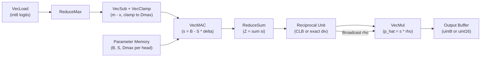

## Problem

The softmax function in Transformer Multi-Head Attention (MHA) becomes a computational bottleneck for small, quantized models deployed on edge accelerators. While matrix multiplications are heavily optimized at low bit-widths (e.g., int8), softmax still requires expensive exponentiation and normalization that resist integer-only implementation. On AMD Versal AI Engines specifically, this bottleneck is acute: the reference BF16 softmax either uses LUT-assisted exponentials (limited to 4 parallel accesses on AIE-ML) or native BF16 exponential instructions (AIE-MLv2), both of which fail to utilize the high-throughput int8 multiply-accumulate (MAC) pipeline and introduce costly int8-to-float conversion overheads.

Prior approaches and their limitations:

- **I-BERT** (Kim et al., 2021): approximates $\exp(x)$ via a low-order polynomial of a log-quotient plus power-of-2 shifts. Still requires polynomial MAC chains and more complex integer arithmetic.
- **IntAttention** (Zhong et al., 2025): uses a 32-entry LUT for the exponential plus integer normalization. LUT access limits throughput on AIE-ML (4 parallel accesses).
- **ITA** (Islamoglu et al., 2023): streaming integer softmax for embedded hardware; limits intermediate precision to reduce energy but targets a different accelerator class.
- **Softermax** (Stevens et al., 2021): replaces $e^x$ with $2^x$ for shift-friendly renormalization and fuses max into online normalization. Removes a separate reduction but still requires exponential-style computation.
- **ConSmax** (Liu et al., 2025): uses learnable normalization parameters to eliminate max search and denominator summation. Sacrifices exact unit-sum probabilities and requires additional learned parameters.
- **Sparsemax** (Martins and Astudillo, 2016): projects onto the simplex via Euclidean projection, producing sparse outputs, but requires sorting/selecting primitives ($O(K \log K)$) that are less hardware-friendly.
- **TurboAttention** (Kang et al., 2024): combines hybrid LUT-polynomial exponentials with negligible-exponential pruning in FlashAttention-style kernels. Designed for GPU datacenter, not integer-native edge accelerators.

The core gap: no existing method provides a pure integer-ALU softmax path (no LUTs, no floating point, no polynomial chains) while preserving task accuracy on small quantized models. HCCS fills this gap.

## Architecture

Head-Calibrated Clipped-Linear Softmax (HCCS) replaces the exponential softmax entirely with a clipped linear surrogate that maps directly onto int8 MAC units.

### Surrogate Definition

Given quantized attention logits $x \in \mathbb{Z}\_8^n$ per row, the standard max-centering produces $d_i = x_i - \max_j x_j \leq 0$. HCCS reformulates this as an unsigned clamped distance:

$$\delta_i = \min(\max_j x_j - x_i,\; D_{\max,h}), \quad \delta_i \in [0, D_{\max,h}]$$

where $D_{\max,h}$ is a per-head clamp bound. This ensures intermediate values stay in uint8, avoiding signed arithmetic overhead. The linear surrogate score is then:

$$s_i = B_h - S_h \cdot \delta_i$$

with $B_h > 0$ and $S_h \ge 0$. Non-negativity is guaranteed by the calibration constraint $B_h - S_h \cdot D_{\max,h} \ge 0$, which eliminates the need for an explicit $\max(0, \cdot)$ rectifier in hardware.

### Fixed-Point Normalization

Scores are normalized to a valid probability distribution using purely integer arithmetic:

$$Z = \sum_i s_i, \quad \rho = \lfloor T / Z \rfloor, \quad \hat{p}_i = s_i \cdot \rho$$

where $T = 32767$ for int16 output or $T = 255$ for int8 output. The sum $Z$ is accumulated in 32-bit precision. For int8 output, a shifted reciprocal $\rho_{u8} = \lfloor 255 \cdot 2^R / Z \rfloor$ (with $R = 15$) retains fractional precision before final right-shifting.

### Leading-Bit Reciprocal Approximation (CLB)

An optional approximation replaces the scalar divide with a bit-shift:

$$\rho \approx T / 2^{\lfloor \log_2 Z \rfloor}$$

This overestimates the true reciprocal by at most $2\times$, but in practice the overestimate is much smaller. The measured speedup from CLB exceeds $3\times$ for short sequences where reciprocal latency is not amortized.

### Per-Head Calibration

Three per-head constants $\theta_h = (B_h, S_h, D_{\max,h})$ are determined offline via grid search minimizing average KL-divergence against the standard softmax, computed in int16 arithmetic:

$$(\hat{B}_h, \hat{S}_h, \hat{D}_{\max,h}) = \arg\min_{B, S, D} \; \mathbb{E}_{x \sim D_h} \left[ D_{\mathrm{KL}}\!\left(\mathrm{softmax}(x) \;\|\; \hat{p}(x; B, S, D)\right) \right]$$

Calibration uses 64 batch samples from a representative dataset. Integer deployment constraints ($D_{\max,h} \le 127$, $B_h - S_h \cdot D_{\max,h} \ge 0$, $n \cdot B_h \le 32767$, etc.) are enforced during the search.

### Hardware Pipeline (AIE Kernel)

The AIE kernel processes each attention row through five stages, all in integer arithmetic:

Key design choices: (1) max subtraction reordered to stay in uint8 domain, (2) explicit zero-clamp eliminated by construction via the $B_h - S_h \cdot D_{\max,h} \ge 0$ constraint, (3) single scalar reciprocal operation amortized over the full row, (4) all other operations are vectorized int8 MAC/MUL/SUB matching native AIE execution units.

Multi-tile scaling: since each softmax row is independent, throughput scales linearly across AIE tiles with no inter-tile synchronization required.

## Training

### Quantization-Aware Retraining (QAT)

HCCS calibration parameters are fixed before training. The model is then retrained with standard quantization-aware training where the HCCS surrogate replaces softmax in the forward pass. This is analogous to holding quantization bounds fixed during QAT: the nonlinearity is fixed, and the network adapts to compensate for the surrogate's approximation error.

Training details:
- Models: BERT-tiny (2 layers, 2 heads, hidden=128) and BERT-small (4 layers, 8 heads, hidden=512)
- Tasks: SST-2 (binary sentiment, max seq length 64) and MNLI (NLI, max seq length 128)
- Calibration: grid search over bounded integer parameter space using 64 batch samples, minimizing int16 KL-divergence
- No-retrain HCCS substitution causes large accuracy drops (e.g., 20.6 pp on BERT-tiny/SST-2), confirming retraining is essential

### Calibration Granularity Ablation

Per-head calibration significantly outperforms coarser alternatives:

| Calibration | BERT-tiny SST-2 | BERT-small SST-2 | BERT-tiny MNLI | BERT-small MNLI |
|---|---|---|---|---|
| Shared/global | 0.817 | 0.834 | 0.416 | 0.545 |
| Per-layer | 0.819 | 0.842 | 0.552 | 0.602 |
| Per-head (proposed) | 0.822 | 0.878 | 0.639 | 0.723 |

The gap is most pronounced on MNLI, where heterogeneous attention heads benefit from fine-grained calibration.

## Evaluation

### Task Accuracy

| Task | Model | Float32 Baseline | HCCS Retrained | Delta |
|---|---|---|---|---|
| SST-2 | BERT-tiny | 0.825 | 0.822 | -0.003 |
| SST-2 | BERT-small | 0.893 | 0.878 | -0.015 |
| MNLI | BERT-tiny | 0.653 | 0.639 | -0.013 |
| MNLI | BERT-small | 0.742 | 0.723 | -0.019 |

HCCS with QAT stays within 0.3--1.9 percentage points of the float32 baseline. The i8+CLB normalization path showed accuracy comparable to the i16+div configuration across all model-task pairs.

### Attention Distribution Fidelity

KL divergence of HCCS vs. float32 softmax (pre-retraining, fixed weights): typically $\approx 0.1$--$0.3$ for broad heads and $\approx 0.2$--$0.3$ for focused heads. After retraining, KL increases but downstream task accuracy is preserved. Broad heads maintain slow probability decline; focused heads continue concentrating mass into top ranks.

### Hardware Throughput

Benchmarked on the cycle-accurate AIE simulator in AMD Vitis 2025.2, targeting VEK280 (AIE-ML) and VEK385 (AIE-MLv2):

**AIE-ML (VEK280):**

| $n$ | BF16 Reference | HCCS i16+Div | i16+Div Speedup | HCCS i8+CLB | i8+CLB Speedup |
|---|---|---|---|---|---|
| 32 | 0.09 G/s | 0.41 G/s | 4.6x | 1.36 G/s | 15.1x |
| 64 | 0.16 G/s | 0.78 G/s | 4.9x | 2.19 G/s | 13.7x |
| 128 | 0.25 G/s | 1.37 G/s | 5.5x | 2.18 G/s | 8.72x |

**AIE-MLv2 (VEK385):**

| $n$ | BF16 Reference | HCCS i16+Div | i16+Div Speedup | HCCS i8+CLB | i8+CLB Speedup |
|---|---|---|---|---|---|
| 32 | 0.24 G/s | 0.41 G/s | 1.7x | 1.46 G/s | 6.1x |
| 64 | 0.46 G/s | 0.78 G/s | 1.7x | 2.46 G/s | 5.4x |
| 128 | 0.77 G/s | 1.41 G/s | 1.8x | 2.21 G/s | 2.9x |

The speedup is largest at shorter sequence lengths where per-row overhead of the BF16 exponential is most pronounced. CLB row latency rises from 29 cycles/row at $n=32$ to 69 cycles/row at $n=128$, sub-linear in sequence length.

### Multi-Tile Scaling

On AIE-MLv2 (VEK385), aggregate throughput scales linearly with tile count: 259 G elements/s (i16+Div) and 407 G elements/s (i8+CLB) at 184 tiles. A single AIE tile achieves roughly an order of magnitude higher throughput than prior FPGA softmax accelerators (~100s of M elements/s).

## Reproduction Guide

### Prerequisites

- AMD Vitis 2025.2 toolchain (includes cycle-accurate AIE simulator)
- Access to VEK280 or VEK385 Versal boards for hardware deployment (simulator sufficient for throughput benchmarks)
- PyTorch with HuggingFace Transformers for model training

### Step 1: Reproduce Calibration

1. Load BERT-tiny or BERT-small from HuggingFace
2. Run inference on a representative calibration set (64 samples) and collect per-head int8 attention logits
3. Grid search over integer $(B_h, S_h, D_{\max,h})$ minimizing $\mathrm{KL}(\mathrm{softmax}(x) \| \hat{p}(x; B, S, D))$ in int16 arithmetic
4. Enforce constraints: $D_{\max,h} \le 127$, $B_h - S_h \cdot D_{\max,h} \ge 0$, $B_h \le 32767$, $n \cdot B_h \le 32767$

### Step 2: Quantization-Aware Retraining

1. Replace softmax in the attention forward pass with HCCS using the calibrated per-head parameters
2. Perform standard QAT (e.g., using Brevitas, PyTorch Native Quantization, or a custom training loop)
3. Train for the same number of epochs as the baseline QAT recipe

### Step 3: AIE Kernel Deployment

1. Implement the five-stage pipeline (ReduceMax, VecSub+Clamp, VecMAC, ReduceSum, Reciprocal+VecMul) as an AIE kernel in C++
2. Compile with `v++` targeting `VEK280` or `VEK385`
3. Verify correctness by comparing kernel output against a Python reference implementation
4. Benchmark throughput using the cycle-accurate simulator

### Gotchas

- **No-retrain substitution is not viable**: direct HCCS insertion without QAT drops accuracy by 12--20+ pp. QAT is mandatory.
- **Calibrate in int16, not int8**: minimizing int8 KL-divergence produces poorer results due to local optima from quantization rounding. The int16 objective transfers well to uint8 output.
- **Overflow constraints are tight**: $n \cdot B_h \le 32767$ is the binding upper constraint on $B_h$. For $n = 128$, this limits $B_h \le 255$.
- **CLB reciprocal overestimates**: the leading-bit approximation can overestimate by up to $2\times$, but task accuracy is unaffected for the tested models. Validate on your specific workload before using CLB in production.
- **No public code repository**: as of publication, no GitHub release was provided. The AIE kernel must be implemented from the paper's algorithmic description.
- **Compute cost for training**: fine-tuning BERT-small for 3 epochs on a single GPU takes roughly 15--30 minutes. Calibration grid search adds negligible time (seconds).

## Notes

- HCCS is the first int8-optimized softmax surrogate for AMD AI Engines, completely avoiding floating-point conversion, LUT accesses, and polynomial chains.
- The per-head calibration philosophy is analogous to per-channel quantization: heterogeneous attention heads (some broad, some focused) require different surrogate parameters to maintain fidelity.
- The i8+CLB path achieves 15.1x speedup over the BF16 reference on AIE-ML at $n=32$, demonstrating that the reciprocal division is the dominant remaining bottleneck at short sequence lengths.
- AIE-MLv2 shows smaller relative speedups (up to 6.1x) because the BF16 reference benefits from a dedicated BF16 exponential instruction that AIE-ML lacks.
- The approach is currently validated only on encoder-only classification models (BERT-tiny, BERT-small). Scaling to decoder models with causal attention and longer sequences remains unexplored.
- The paper mentions a learnable version of HCCS (treating $\theta_h$ as differentiable constrained parameters) as complementary future work.
- Single-tile AIE throughput (~2.2--2.5 G elements/s) is comparable to softmax throughput on datacenter GPUs like the NVIDIA A100.
