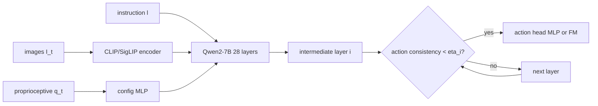

## problem
billion-scale VLA models ($\pi\_0$, $\pi\_{0.5}$) are too expensive for real-time control on commodity hardware. the VLM backbone accounts for the bulk of compute (11,074 GFLOPs for Molmo-7B backbone alone), while iterative diffusion/flow-matching action heads add further latency (4.93 GFLOPs per 10 denoising steps with Qwen3-400M). real-world robot manipulation requires tight latency budgets (sub-second action prediction). existing efficiency approaches (EdgeVLA, TinyVLA, SmolVLA) reduce model size but sacrifice the representation quality of large VLMs.

## architecture
A1 uses Molmo-7B as the VLM backbone (CLIP/SigLIP vision encoder + 28-layer Qwen2-7B) with an action head that can be attached at ANY intermediate layer, not just the final one. two action head variants:

**A1-FM (flow matching):** conditional flow matching action head using Qwen3-400M as the denoiser. loss:

$$\mathcal{L}^\tau(\theta) = \mathbb{E}\_{p(\mathbf{A}\_t \mid \mathbf{o}\_t), q(\mathbf{A}\_t^\tau \mid \mathbf{A}\_t)} \left\| v\_\theta(\mathbf{A}\_t^\tau, \mathbf{o}\_t) - \mathbf{u}(\mathbf{A}\_t^\tau \mid \mathbf{A}\_t) \right\|^2$$

**A1-MLP:** simple MLP head supervised with $\ell\_1$ loss. action chunk $\mathbf{A}\_t \in \mathbb{R}^{H \times D}$ where $H=8$ (chunk size) and $D=7$ (action dimension).

the key design: during training, layer index $i \sim \mathcal{U}(0, L)$ is randomly sampled, and the action head at layer $i$ is supervised. this teaches every layer to produce valid actions. at inference time, an action-consistency threshold $\eta\_i$ determines early exit: if $\|\mathbf{A}\_t^{(i)} - \mathbf{A}\_t^{(i-1)}\| < \eta\_i$, stop computing further layers.

compute budget: full A1-FM inference = 11,130 TFLOPs. with $\delta=10$ (denoising steps) at every layer, this balloons to 11,160 TFLOPs and 4.44s. reducing $\delta$ to 2 cuts inference to 0.73s.

## training
two-stage pipeline: pre-training on large-scale robot data, then task-specific fine-tuning.

**pre-training data:** DROID, AgiBot World, RoboCOIN, RoboMind, GM-100, RoboChallenge + 15,951 self-collected real-world trajectories across multiple robot platforms. total corpus is trajectory-only (no internet-scale VLM pre-training on this model).

**training config:** AdamW optimizer, batch size 1024, 200K steps total, VLM LR $5 \times 10^{-6}$, action head LR $5 \times 10^{-5}$, cosine annealing. 2K warmup steps. VLM frozen for first 1K steps. state mask probability 0.5 for pre-training.

**fine-tuning:** 50K steps for simulation (LIBERO, VLABench), 50-100K steps for real-robot tasks. batch size 32-128. state mask 0.3 for real tasks.

## evaluation
**simulation:** 96.6% on LIBERO, 99.8% on LIBERO-OBJECT, 53.5% on VLABench (4% above $\pi\_{0.5}$).

**real-world** (4 robot platforms: UR5, Franka, AgiBot, WuJie-Arm, Dobot-Arm): 56.7% average success rate vs $\pi\_{0.5}$ 47.5% and $\pi\_0$ 40.8%. strongest gains on long-horizon tasks: "pick glue" 80% vs 60% ($\pi\_{0.5}$), "clean table" 20% vs 0% ($\pi\_0$).

**early-exit efficiency:** at exit criterion $c=1.0$, A1-MLP achieves 96.6% on LIBERO while reducing layer compute by 15.6%. at $c=0.4$, compute drops 58.5% with only 2.3% accuracy loss. at $c=0.1$, 76.6% compute reduction with 94.9% accuracy (1.7% drop). A1-FM on AgiBot real-robot at $c=0.4$: 80% accuracy with 84.6% compute reduction (even matching full inference accuracy of 80%).

## reproduction guide
1. Molmo-7B backbone from HuggingFace (open weights)
2. pytorch training pipeline with random layer sampling for truncated supervision
3. pre-train on open-source robot datasets (DROID, AgiBot, RoboCOIN)
4. fine-tune per-robot with task-specific demonstrations
5. deploy with action-consistency early exit at desired threshold
6. known gotcha: flow matching denoising steps ($\delta$) dominate inference time, not the VLM layers. use $\delta=2$ for 6x speedup vs $\delta=10$

## notes
this is the most practical VLA efficiency result i've seen. the truncated supervision training (random layer sampling) is simple, elegant, and works surprisingly well -- 76% compute reduction for 1.7% accuracy loss on LIBERO is a strong tradeoff. the key observation that most VLM computation is redundant for action prediction aligns with the fast-slow pattern across modalities. A1-MLP is the more practical variant: no iterative denoising, direct action prediction, simpler to deploy. the fact that early exit sometimes IMPROVES accuracy suggests that deeper layers may overfit to task-irrelevant features. the open-source nature (Molmo backbone, full training details) makes this highly reproducible.
