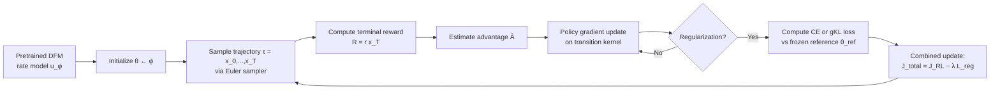

## Problem

Fine-tuning a pretrained Discrete Flow Matching (DFM) model to maximize expected terminal reward:

```
J(θ) = 𝔼_{X_T ∼ p_T^θ}[r(X_T)]
```

Three challenges:

1. **Intractable marginal**: DFM parameterizes transition rates $u_t^\theta(y,x)$ of a CTMC, not the policy itself. The exact marginal distribution $p_T^\theta$ is not directly accessible.
2. **Non-differentiable rewards**: Many reward functions (e.g., binary classifiers) are not differentiable, preventing gradient-based optimization through the reward.
3. **Over-optimization**: Pure reward maximization pushes samples away from the pretrained distribution, producing unrealistic sequences.

**Prior methods and their limitations**:
- **DRAKES** (Wang et al., 2024): RL for discrete diffusion via Gumbel-Softmax trick → restricted to continuous reward signals only.
- **SEPO** (Zekri & Boullé, 2025): Policy gradient for discrete diffusion → relies on self-normalized importance sampling (SNIS), adding estimation complexity.
- **Zhao et al. (2025)**: RL for discrete diffusion → uses an approximation that does not yield an unbiased estimator.
- **Nower Khan et al. (2026)**: RL for DFM via reward-reweighted conditional flow matching loss → different approach, not policy gradient.

## Architecture

The core insight is reframing DFM inference as an **inner MDP** $\mathcal{M} = (\mathcal{S}, \mathcal{A}, P, R, 1)$:



**Inner MDP definition** (Equation 4.2):

| Component | Definition |
|-----------|-----------|
| State | $s_t = (t, x_t)$ |
| Action | $a_t = x_{t + \Delta t}$ |
| Policy | $\pi_t^\theta(a_t \mid s_t) = p_t^\theta(x_{t+\Delta t} \mid x_t)$ |
| Transition | $P(s_{t+\Delta t} \mid s_t, a_t) = (\delta_{t+\Delta t}, \delta_{x_{t+\Delta t}})$ |
| Initial state | $P_0 = (\delta_0, p_0)$ |
| Reward | $R(s_t, a_t) = r(x_T)$ if $t = T - \Delta t$, else 0 |
| Discount | $\gamma = 1$ |

The one-step policy coincides with the jump distribution of the Euler-discretized CTMC (Equation 4.3):

```
p_t^θ(x_{t+Δt} | x_t) = { u_t^θ(x_{t+Δt}, x_t) Δt,        if x_{t+Δt} ≠ x_t
                          { 1 - Σ_{y≠x_t} u_t^θ(y, x_t) Δt,  if x_{t+Δt} = x_t
```

**Proposition 4.1** guarantees $J_\mathrm{RL}(\theta) = J(\theta)$ — the RL objective on the inner MDP exactly equals the original expected-reward objective.

The framework extends directly to **conditional generation** by conditioning all quantities on $c$: the transition kernel becomes $p_t^\theta(x_{t+\Delta t} \mid x_t, c)$, and the policy becomes $\pi_t^\theta(a_t \mid s_t, c)$.

## Training

### DoMinO-REINFORCE (Algorithm 1)

Standard REINFORCE with a log-likelihood gradient estimator. Since $\pi_t^\theta(\cdot \mid s_t) = p_t^\theta(\cdot \mid x_t)$, the log-likelihood is tractable via Equation 4.3.

Update rule (with advantage $\hat{A}$ to reduce variance):

```
θ ← θ + η · (1/M) Σ_{m=1}^{M} Σ_{t=0}^{T−Δt} ∇_θ log p_t^θ(x_{t+Δt}^{(m)} | x_t^{(m)}) · Â^{(m)}
```

**Inputs**: pretrained rate model $u_\phi$, step size $\Delta t$, horizon $T$, batch size $M$, learning rate $\eta$, iterations $K$, reward function $r(x)$, advantage estimator $\hat{A}$.

### DoMinO-PPO (Algorithm 2)

Clipped surrogate objective for stability under high-variance rewards:

```
J_PPO(θ) = 𝔼_{τ ∼ π_old}[ Σ_t min{ r_t(θ) Â_t,  Clip(r_t(θ), 1−ε, 1+ε) Â_t } ]
```

where $r_t(\theta) = \pi_\theta(a_t \mid s_t) / \pi_\text{old}(a_t \mid s_t)$. The likelihood ratio is tractable because both numerator and denominator use the one-step transition kernel. In the terminal-reward setting, a trajectory-level advantage $\hat{A}$ is shared across time steps.

**Inputs**: same as REINFORCE plus clip parameter $\varepsilon$.

### Regularization (Section 5)

Two TV-distance regularizers prevent over-optimization. Both are computed on rollout states $(X_t, t)$ — no additional sampling needed, just one extra forward pass through the frozen reference model.

**Cross-Entropy (CE)** regularizer:

```
L_reg^CE(θ; θ_ref) = 𝔼_{t, X_t ∼ p_t^{θ_ref}}[ −Σ_{y∈S} p_{1|t}^{θ_ref}(y | X_t) log p_{1|t}^θ(y | X_t) ]
```

**Generalized KL (gKL)** regularizer, using $D_\mathrm{gKL}(u, v) = \sum_j u_j \log(u_j / v_j) - \sum_j u_j + \sum_j v_j$:

```
L_reg^gKL(θ; θ_ref) = 𝔼_{t, X_t ∼ p_t^{θ_ref}}[ D_gKL(u_t^{θ_ref}(·, X_t), u_t^θ(·, X_t)) ]
```

**Full objective**:

```
J_total(θ) = J_RL(θ) − λ · L_reg(θ; θ_ref)
```

These are preferred over path-wise KL regularization (used by DRAKES, SEPO) because: (1) path-wise KL requires integrating rate-level terms along the full trajectory, increasing cost; (2) path-wise KL regularizes the entire trajectory rather than just the terminal distribution, imposing unnecessary constraints.

### Theoretical guarantees

| Theorem | Statement |
|---------|-----------|
| **Thm 6.1** (Discretization error) | Both $\left\lvert J(\theta) - \tilde{J}(\theta) \right\rvert = O(\Delta t)$ and $\left\lVert \nabla_\theta J(\theta) - \nabla_\theta \tilde{J}(\theta) \right\rVert_\infty = O(\Delta t)$ |
| **Thm 6.2** (CE bound) | $\mathrm{TV}(p^\theta, p^{\theta_\mathrm{ref}}) \lesssim \sqrt{L_\mathrm{reg}^\mathrm{CE}(\theta; \theta_\mathrm{ref}) - L_\mathrm{reg}^\mathrm{CE}(\theta_\mathrm{ref}; \theta_\mathrm{ref})}$ |
| **Thm 6.3** (gKL bound) | $\mathrm{TV}(p^\theta, p^{\theta_\mathrm{ref}}) \lesssim \sqrt{L_\mathrm{reg}^\mathrm{gKL}(\theta; \theta_\mathrm{ref})}$ |

## Evaluation

### Task: Regulatory DNA Sequence Design (HepG2)

- **Dataset**: ~700,000 DNA sequences of length 200 bp from Gosai et al. (2024), with activity measurements in human cell lines
- **Backbone**: Discrete flow matching model (Gat et al., 2024) pretrained on the full dataset
- **Reward oracle**: Enformer architecture (Avsec et al., 2021) predicting enhancer activity in HepG2
- **Split**: Separate reward oracles for fine-tuning and evaluation

### Metrics

| Metric | What it measures | Direction |
|--------|-----------------|-----------|
| Pred-Activity | Predicted enhancer activity (evaluation oracle) | ↑ |
| ATAC-Acc (%) | Chromatin accessibility (binary classifier) | ↑ |
| 3-mer Corr-All | Pearson correlation of 3-mer frequencies vs natural HepG2 | ↑ |

### Results without regularization (Table 1)

| Method | Pred-Activity | ATAC-Acc (%) | 3-mer Corr-All |
|--------|:------------:|:------------:|:--------------:|
| Pre-trained Diffusion | 0.17 | 1.5 | 0.925 |
| Pre-trained Flow Matching | 0.64 | 1.1 | 0.884 |
| DRAKES | 6.37 | 96.1 | −0.379 |
| SEPO | 7.55 | **99.5** | −0.537 |
| **DoMinO-REINFORCE** | **8.32** | 99.2 | **−0.285** |
| **DoMinO-PPO** | **8.35** | **99.2** | **−0.331** |

Key takeaways:
- DoMinO improves Pred-Activity by +10.5% over SEPO (8.35 vs 7.55) and +31.1% over DRAKES (8.35 vs 6.37)
- DoMinO achieves much better sequence naturalness than SEPO: 3-mer Corr −0.285/−0.331 vs −0.537
- Pre-trained flow matching is a stronger backbone than diffusion (0.64 vs 0.17 Pred-Activity before fine-tuning)

### Results with regularization (Table 2)

| Method | Pred-Activity | ATAC-Acc (%) | 3-mer Corr-All |
|--------|:------------:|:------------:|:--------------:|
| DRAKES with KL | 5.61 | 92.5 | −0.302 |
| SEPO with GF | 7.64 | **99.9** | −0.496 |
| DoMinO-REINFORCE | 8.32 | 99.2 | −0.285 |
| DoMinO-REINFORCE + CE | 8.22 | 94.1 | −0.347 |
| **DoMinO-REINFORCE + GKL** | **8.24** | 90.2 | **0.013** |
| DoMinO-PPO | 8.35 | 99.2 | −0.331 |
| DoMinO-PPO + CE | 7.98 | **97.5** | **−0.152** |
| DoMinO-PPO + GKL | 7.78 | 95.8 | −0.167 |

Key takeaways:
- **DoMinO-REINFORCE + GKL** is the only method achieving *positive* 3-mer Corr-All (0.013), indicating generated sequences better match natural HepG2 distribution, while retaining Pred-Activity of 8.24
- DRAKES with KL hurts functional performance (5.61 vs 6.37) for modest naturalness gain (−0.302 vs −0.379)
- SEPO with GF barely improves naturalness (−0.496 vs −0.537)
- DoMinO regularizers provide much larger naturalness gains: −0.285 → 0.013 with GKL

## Reproduction Guide

### Requirements
- Pretrained DFM model (Gat et al., 2024 architecture) on target sequence dataset
- Reward function or oracle (Enformer for DNA design)
- Advantage estimator (e.g., batch-normalized reward)

### DoMinO-REINFORCE pseudocode

```
Input: pretrained u_φ, step size Δt, horizon T, batch M, lr η, iters K, reward r(x)

θ ← φ  # initialize from pretrained

for k = 1 to K:
    for m = 1 to M:
        Sample trajectory τ^(m) = {x_t^(m)}_{t=0}^T via Euler sampler with u_t^θ
        R^(m) ← r(x_T^(m))

    Â^(m) ← Advantage_estimator({τ^(m), R^(m)}_{m=1}^M)

    θ ← θ + η · (1/M) Σ_m Σ_{t=0}^{T−Δt} ∇_θ log p_t^θ(x_{t+Δt}^{(m)} | x_t^{(m)}) · Â^(m)}

    # Optional: add regularization
    # Sample states (X_t, t) from reference model trajectory
    # Compute L_reg^CE or L_reg^gKL against frozen θ_ref
    # θ ← θ − η · λ · ∇_θ L_reg(θ; θ_ref)
```

### DoMinO-PPO additions
- Set $\theta_\text{old} \leftarrow \theta$ at start of each iteration
- Sample trajectories from $\pi_\text{old}$ (old policy)
- Compute importance ratio $r_t(\theta) = p_t^\theta(x_{t+\Delta t} \mid x_t) / p_t^{\theta_\text{old}}(x_{t+\Delta t} \mid x_t)$
- Apply clipped surrogate: $\min\{r_t(\theta) \hat{A}, \text{Clip}(r_t(\theta), 1-\varepsilon, 1+\varepsilon) \hat{A}\}$

### Practical notes
- The transition kernel $p_t^\theta(x_{t+\Delta t} \mid x_t)$ is directly available from the rate model $u_t^\theta$
- Log-likelihood: $\log p_t^\theta(x_{t+\Delta t} \mid x_t) = \log(u_t^\theta(x_{t+\Delta t}, x_t) \cdot \Delta t)$ when $x_{t+\Delta t} \neq x_t$
- Regularization reuses stored rollout states — no extra sampling, just one forward pass through frozen reference model
- Code release: "upon acceptance" per paper footnote

## Notes

### Why this matters for robotics VLAs
DFM is increasingly used for **action generation** in vision-language-action models. DoMinO provides a principled RL fine-tuning framework that:
- Works with non-differentiable reward signals (e.g., task success metrics in robotics)
- Does not require biased auxiliary estimators or likelihood surrogates
- Preserves the original DFM sampler (no custom sampling needed)
- Extends naturally to conditional generation (condition on language instructions / images)

### Key differentiators vs. diffusion-based RL fine-tuning
- **Unbiased**: No Gumbel-Softmax approximation (vs. DRAKES), no SNIS estimation (vs. SEPO)
- **Tractable likelihood**: The one-step transition kernel of the Euler-discretized CTMC has a closed-form log-probability
- **Better regularization**: TV-distance regularizers are more aligned with sample-level naturalness than path-wise KL

### Limitations
- Evaluated only on DNA sequence design (single domain)
- No comparison with GRPO instantiation (mentioned as supported but not tested)
- Code not yet released
- Theoretical bounds assume uniformly bounded velocity fields and compact parameter sets
- The discretization error is $O(\Delta t)$ — may need small step sizes for accurate gradients
