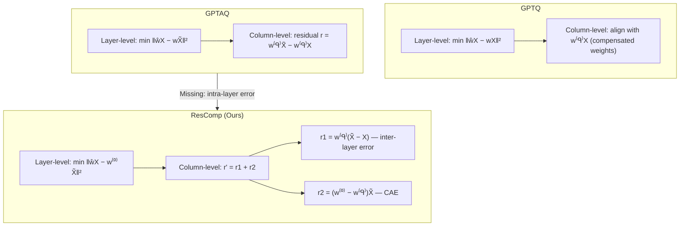

## problem

Compensation-based quantization methods like **GPTQ** and **GPTAQ** iteratively quantize weight columns and adjust remaining unquantized weights to minimize output error. While GPTQ only considers layer-wise reconstruction error (using a single *Quant-flow*), GPTAQ improves upon this by introducing *asymmetric calibration* with both a *Quant-flow* $\mathbf{X}$ (simulating quantized inference) and an *FP-flow* $\widetilde{\mathbf{X}}$ (true full-precision computation), defining a **residual error** $\mathbf{r} = \mathbf{w}^{(q)}_{q:}\widetilde{\mathbf{X}}_{q:,:} - \mathbf{w}^{(q)}_{q:}\mathbf{X}_{q:,:}$.

**The key flaw identified:** During the intra-layer iterative process, both GPTQ and GPTAQ align the quantized output against $\mathbf{w}^{(q)}\widetilde{\mathbf{X}}$ (the output from **compensated** weights) rather than the true reference $\mathbf{w}^{(0)}\widetilde{\mathbf{X}}$ (the output from the **original** full-precision layer). For $q \geq 1$, $\mathbf{w}^{(q)}$ has been modified by prior compensation steps, making the calibration target imprecise. This sub-optimal objective accumulates error within each layer.

## architecture

The paper proposes **ResComp** — a drop-in enhancement to both GPTQ and GPTAQ that introduces a **Compensation-Aware Error (CAE)**. The core insight is that the correct residual error at step $q$ should be:

$$\mathbf{r}' = \underbrace{\mathbf{w}^{(q)}(\widetilde{\mathbf{X}} - \mathbf{X})}_{\mathbf{r}1 \text{ (inter-layer)}} + \underbrace{(\mathbf{w}^{(0)} - \mathbf{w}^{(q)})\widetilde{\mathbf{X}}}_{\mathbf{r}2 \text{ (compensation-aware)}}$$

Where $\mathbf{r}1$ is the existing GPTAQ residual (from preceding layer output error) and $\mathbf{r}2$ is the **novel compensation-aware error** — the discrepancy between the original FP weights and the current compensated weights.

The revised column-level weight update becomes:

$$\Delta\mathbf{W}_{:,q:} = \underbrace{\frac{(\hat{\mathbf{W}}^{(q)}_{:,q} - \mathbf{W}^{(q)}_{:,q})}{\tilde{\mathbf{H}}^{-1}_{qq}} \cdot \tilde{\mathbf{H}}^{-1}_{q,:}}_{\text{Standard Update}} + \underbrace{\mathbf{W}^{(q)}_{:,q} \mathbf{P}1_{q,q:}}_{\text{GPTAQ term}} + \underbrace{(\mathbf{W}^{(0)}_{:,q} - \mathbf{W}^{(q)}_{:,q}) \mathbf{P}2_{q,q:}}_{\text{CAE term (ours)}}$$

Where $\mathbf{P}1$ and $\mathbf{P}2$ are pre-computed correction matrices using neuron decomposition with Cholesky factorization $\mathbf{H}^{-1} = \mathbf{L}\mathbf{L}^T$:

$$\mathbf{P}1 = \big((\Delta\mathbf{X}\mathbf{X}^\top \mathbf{L}) \odot \mathbf{M}_{\mathbf{U}}\big)\mathbf{L}^\top, \quad \mathbf{P}2 = \big(((\mathbf{H} + \Delta\mathbf{X}\mathbf{X}^\top)\mathbf{L}) \odot \mathbf{M}_{\mathbf{U}}\big)\mathbf{L}^\top$$

No explicit storage of $\widetilde{\mathbf{X}}\mathbf{X}^\top$ is needed since $\widetilde{\mathbf{X}}\mathbf{X}^\top = \mathbf{X}\mathbf{X}^\top + \Delta\mathbf{X}\mathbf{X}^\top$.

## training

This is a **post-training quantization** (PTQ) method — no training or fine-tuning is involved. The quantization procedure is fully offline:

1. **Calibration data**: 128 samples from the C4 dataset (following GPTAQ setup)
2. **Input computation**: Two parallel flows — Quant-flow $\mathbf{X}$ and FP-flow $\widetilde{\mathbf{X}}$ are pre-computed per layer
3. **Pre-computation**: Hessian $\mathbf{H} = \mathbf{X}\mathbf{X}^\top$, inverse Cholesky factor $\mathbf{L}$ (with damping $\lambda_1$), correction matrices $\mathbf{P}1$ and $\mathbf{P}2$
4. **Block-wise quantization**: Sequential column processing with block size $B$, using lazy updates for GPU utilization
5. **Quantization format**: Per-group symmetric quantization; clipping ratio for activations set to 0.9 when rotation is applied

**Computational overhead** (single NVIDIA H20 GPU, 3-bit weight-only):
- **Memory**: ~56% more per-layer calibration memory (e.g., L2-7B q_proj: 0.16 GB → 0.25 GB; L3-70B down_proj: 4.48 GB → 6.95 GB). Peak memory for L3-70B: 69.5 GB (vs GPTAQ 63.7 GB). No inference-time overhead.
- **Time**: ~5% overhead over GPTAQ (L2-7B: 952s → 1001s; L2-13B: 1626s → 1728s; L3-70B: 5883s → 6344s)

## evaluation

### Weight-Only Quantization (W3A16, 3-bit per-group symmetric)

Key results on perplexity (Wiki2/C4) and average zero-shot accuracy across 6 tasks:

| Model | Method | Wiki2 ↓ | C4 ↓ | Avg Acc ↑ |
|-------|--------|---------|------|-----------|
| **L2-7B** | GPTQ | 6.73 | 13.60 | 64.9% |
| | GPTQ+Ours | **6.40** | **8.34** | **66.5%** |
| | GPTAQ | 6.53 | 8.40 | 66.3% |
| | GPTAQ+Ours | **6.25** | **8.19** | **66.6%** |
| **L2-13B** | GPTQ | 5.43 | 7.38 | 71.4% |
| | GPTQ+Ours | 5.42 | **7.37** | **72.3%** |
| | GPTAQ | 5.42 | 7.34 | 71.9% |
| | GPTAQ+Ours | **5.39** | **7.34** | **72.1%** |
| **L3-8B** | GPTQ | 8.53 | 13.28 | 69.3% |
| | GPTQ+Ours | **8.00** | **12.53** | **69.0%** |
| | GPTAQ | 8.39 | 12.96 | 68.8% |
| | GPTAQ+Ours | **7.77** | **12.25** | **70.5%** |
| **L3.2-1B-Instruct** | GPTAQ | 19.62 | 27.44 | 55.3% |
| | GPTAQ+Ours | **18.32** | **26.87** | **56.1%** |

The most dramatic improvement is **GPTQ+Ours on L2-7B**: C4 perplexity drops from 13.60 to 8.34 (38.7% relative reduction), demonstrating that the CAE term is especially impactful when only the standard GPTQ update is used.

### 2-bit Weight-Only with QuaRot (W2A16)

On L2-7B with QuaRot rotation: GPTAQ Wiki2 9.30 → **7.31**, GPTAQ+Ours avg accuracy 53.3% → **57.5%**.

### Weight-Activation Quantization (W2A4KV4)

Combined with QuaRot/SpinQuant rotations:
- **L2-13B**: Wiki2 9.55 (SpinQuant+GPTAQ) → **8.60** (Ours), avg accuracy 50.2% → **52.2%**
- **L2-7B**: Wiki2 11.6 → **11.1**, avg accuracy 48.1% → **49.2%**
- **L3-8B**: +1.3% average accuracy over Quarot+GPTAQ
- Notable finding: SpinQuant-based methods fail catastrophically on L3-70B at W2A4 (perplexity > 1e5) because the pre-trained rotation matrix cannot adapt to 2-bit weight distribution shifts.

### Ablation Study (W2A16 with rotation)

| Method | L2-7B Wiki2 | L2-7B C4 | L2-7B Acc | L2-13B Wiki2 | L2-13B C4 | L2-13B Acc |
|--------|-------------|----------|-----------|--------------|-----------|------------|
| GPTQ | 19.0 | 36.5 | 44.9% | 10.8 | 21.9 | 50.5% |
| GPTQ+Ours | **17.9** | **35.4** | **47.5%** | **9.7** | **19.8** | **54.3%** |
| GPTAQ | 9.5 | 19.5 | 51.5% | 7.5 | 13.9 | 55.8% |
| GPTAQ+Ours | **8.9** | **18.3** | **54.0%** | **7.3** | **13.6** | **58.2%** |

The CAE term is beneficial even without cross-layer error propagation (GPTQ column), and complementary when combined with GPTAQ's inter-layer residual.

## reproduction guide

1. **Code**: `https://github.com/list0830/ResComp`
2. **Dependencies**: Build upon GPTAQ codebase; requires PyTorch, Hugging Face Transformers
3. **Models**: Llama2 (7B, 13B), Llama3 (8B, 70B), Llama3.1-8B-Instruct, Llama3.2-1B-Instruct from Hugging Face Hub
4. **Calibration**: 128 samples from C4 dataset, clipping ratio 0.9 for activations with rotation
5. **Quantization**: Per-group symmetric; 3-bit (weight-only), 2-bit (with QuaRot rotation)
6. **Hardware**: Single NVIDIA H20 GPU for calibration; peak ~70 GB for L3-70B with GPTAQ+Ours
7. **Evaluation**: WikiText-2 and C4 perplexity; zero-shot on PiQA, ARC-E, ARC-C, HellaSwag, Winogrande, BoolQ
8. **Key hyperparameters**: Block size $B$ for lazy updates, damping $\lambda_1$ for inverse Cholesky, group size (128 as per GPTAQ default)

## notes

- **ICLR 2026 camera ready** — published April 2026. The method is a clean, theoretically-motivated fix to an identified sub-optimality in GPTQ/GPTAQ's column-level objective, requiring only ~5% additional quantization time.
- **Drop-in compatibility**: Works with both GPTQ and GPTAQ as a plug-in enhancement; no architectural changes to the quantized model.
- **Zero inference overhead**: The CAE correction is applied only during offline calibration; the quantized weights are standard integer formats.
- **Additional results in appendix**: Vision Transformers (DeiT-T/S/Base) under W4A4 and W2A4; Qwen3 models; calibration dataset sensitivity analysis.
- The method also generalizes to GPTQ without the GPTAQ framework — in that case, the FP-flow $\widetilde{\mathbf{X}}$ is derived from the original weights' outputs, and only the CAE term $\mathbf{r}2$ is added (no $\mathbf{r}1$).
- Authors from **Zhejiang University** and **vivo Mobile Communication**; Haibin Shen and Kejie Huang are corresponding authors.
