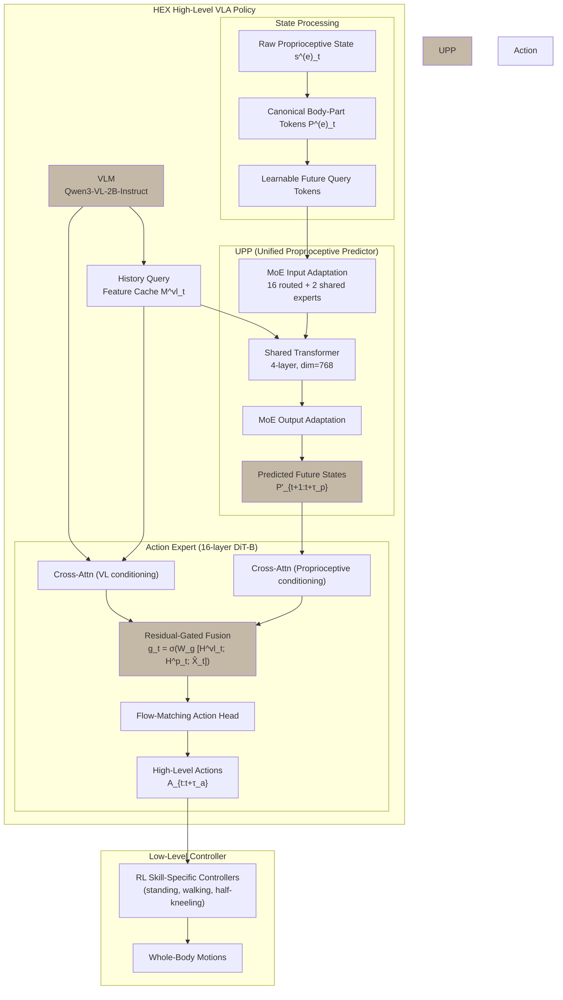

## problem

Existing Vision-Language-Action (VLA) models for humanoid robots treat body parts largely independently, failing to model the structured interactions among body parts under shared balance and posture constraints. This makes high-DoF whole-body manipulation on full-sized bipedal humanoids challenging and often unstable, especially in **fast-reaction** and **long-horizon** scenarios where temporal consistency and whole-body coordination are essential.

**Key limitations of prior approaches:**

1. **Explicitly decomposed designs** (separate locomotion and manipulation policies [48]) rely heavily on manual task priors and brittle interface design; errors accumulate across modules, making tightly coupled behaviors (manipulation during locomotion) difficult.
2. **Hierarchical VLA approaches** (e.g., GR00T N1 [5], $\Psi_0$ [43], LeVERB [50]) produce task-relevant arm/hand commands via a high-level VLM but do not explicitly model how body parts interact through shared balance/posture in the policy itself. Actions are predicted over high-dimensional joints or latent commands without structured whole-body dependency modeling.
3. **Small-scale IL models** (ACT [58]) and **medium-scale VLA models** (SwitchVLA [24]) can fit seen trajectories well but lack generalization under distribution shift.
4. **Large-scale generalist models** ($\pi_{0.5}$ [20], GR00T N1.5 [5]) show improved generalization but still produce less smooth motions in reactive tasks and exhibit mild lag/stuttering, failing to maintain coordinated whole-body behavior.

## architecture

HEX is a **hierarchical framework** consisting of a high-level VLA policy and a low-level RL-based whole-body controller. The high-level VLA policy has three core components: (1) a VLM with history query feature cache, (2) a Unified Proprioceptive Predictor (UPP) with morphology-based MoE, and (3) an Action Expert with adaptive residual-gated fusion.



### VLM with History Query Feature Cache (Section 3.2)

At each timestep $t$, the VLM encodes language tokens $\mathbf{L}$, current visual tokens $\mathbf{V}_t$, and a query token $\mathbf{Q}_t$:

$$[\mathbf{L}'_t, \mathbf{V}'_t, \mathbf{Q}'_t] = f_{\mathrm{vlm}}([\mathbf{L}, \mathbf{V}_t, \mathbf{Q}_t])$$

Rather than re-encoding long image histories, the resulting query feature $\mathbf{Q}'_t$ is stored in a **fixed-length cache** with window $\tau_v = 2$:

$$\mathcal{M}^{\mathrm{vl}}_t = \{\mathbf{Q}'_{t-\tau_v}, \dots, \mathbf{Q}'_{t-1}, \mathbf{Q}'_t\}$$

This provides efficient temporal visual context ("review") without repeated encoding.

### UPP with Morphology-based MoE (Section 3.3)

**Humanoid-aligned state representation:** Raw proprioceptive state $\mathbf{s}^{(e)}_t$ is organized into canonical body-part slots (left/right arms, left/right hands, left/right legs, head, waist, auxiliary `others`), each mapped to a shared latent space with missing-part tokens for absent parts:

$$\mathbf{P}^{(e)}_t \in \mathbb{R}^{P \times d}$$

**Spatio-temporal token sequence:** Current part tokens are concatenated with learnable future query tokens $\mathbf{N}_{t+1:t+\tau_p}$ (prediction horizon $\tau_p = 50$), with temporal and part positional embeddings added.

**MoE adaptation layers:** Lightweight MoE modules (16 routed experts + 2 shared experts, top-1 routing) at input and output of the shared transformer backbone enable token-wise specialization for embodiment- and part-dependent variations. The routed experts capture morphology-specific statistics, while the shared expert preserves reusable dynamics.

**Shared transformer backbone:** 4-layer transformer (hidden dim 768) with interleaved self-attention and VL-conditioned attention predicts future proprioceptive latents:

$$\mathbf{P}'_{t+1:t+\tau_p} = f_{\mathrm{upp}}\!\left(\mathbf{P}_t, \mathbf{L}'_t, \mathbf{V}'_t, \mathcal{M}^{\mathrm{vl}}_t\right)$$

### Action Expert with Adaptive Fusion (Section 3.4)

The Action Expert is a **16-layer DiT-B** (hidden dim 1024) that generates actions via iterative denoising under **dual conditioning**:

1. **Two parallel cross-attention branches** condition action states $\hat{\mathbf{X}}_t$ on VL features $\mathbf{H}^{vl}_t$ and proprioceptive features $\mathbf{H}^p_t$
2. **Residual-gated fusion** adaptively combines them:

$$\mathbf{g}_t = \sigma\!\left(W_g [\mathbf{H}^{vl}_t; \mathbf{H}^p_t; \hat{\mathbf{X}}_t]\right)$$

$$\mathbf{F}_t = \mathbf{H}^{v}_t + \mathbf{g}_t \odot \mathbf{H}^p_t$$

$$\mathbf{X}'_t = \mathbf{X}_t + \mathbf{F}_t$$

3. Self-attention + FFN refinement, then decoding to 100-step action chunks

### Low-Level Controller

Skill-specific RL policies trained with **DeepMimic-style** reference-tracking (standing, walking) or **AMP-style** adversarial motion prior objectives (half-kneeling). Operates at higher frequency than the high-level policy for balance-preserving execution.

## training

### Cross-Embodiment Pretraining

- **Dataset:** Over **12M frames** from **7 humanoid embodiments** across 4 data sources:
  - In-house HEX dataset: ~4M frames (Tienkung 2.0, Tienkung 3.0, Tienyi wheeled humanoid)
  - Humanoid Everyday dataset: ~3.4M frames (Unitree G1, H1)
  - AgiBot World Colosseo: 3.8M frames (wheeled AgiBot, G1-retargeted)
  - RoboCOIN Leju subset: 2.3M frames (Leju legged humanoid)
- **Duration:** 200k steps
- **Compute:** ~1K A100 GPU hours
- **Optimizer:** AdamW, cosine LR schedule
  - VLM: LR = $1.0 \times 10^{-5}$, warmup 5k steps
  - UPP + Action: LR = $2.0 \times 10^{-5}$, UPP warmup 2k steps
  - Min LR = $10^{-6}$
- **Batch size:** 16 per device, action chunk size 100

### Loss Function

Flow-matching objective with auxiliary state prediction:

$$\mathcal{L} = \mathcal{L}_a + \alpha \mathcal{L}_s$$

where:
- $\mathcal{L}_a = \left\|D_a(\mathbf{Z}^a_t) - \mathbf{Vel}_{t:t+\tau_a}\right\|_2^2$ (flow-matching velocity prediction for action denoising)
- $\mathcal{L}_s = \left\|D_s(\mathbf{P}'_{t+1:t+\tau_p}) - \mathbf{s}_{t+1:t+\tau_p}\right\|_2^2$ (future state prediction loss)
- Staged optimization: warm up UPP with $\mathcal{L}_s$ first, then jointly optimize

### Task-Specific Fine-Tuning

- 20k steps per task
- AdamW, LR = $1.0 \times 10^{-5}$ (VLM), $4.0 \times 10^{-5}$ (UPP + Action)
- UPP warmup reduced to 1k steps
- Inference: linear interpolation applied to predicted arm/hand actions for smoothness

## evaluation

### Evaluation Platforms

Two humanoid robots: **Tienkung 2.0** and **Tienkung 3.0** (full-sized bipedal humanoids).

### Tasks

**Seen Scenarios (Table 1, 12 trials each):**

| Task | Robot | Trajectories |
|------|-------|-------------|
| 1. Mirror human's pose | TK 3.0 | 108 |
| 2. Pour liquor following human order | TK 3.0 | 100 |
| 3. Human assistant (carry box, follow human) | TK 2.0 | 98 |
| 4. Walking while avoiding obstacles | TK 2.0 | 100 |
| 5. Kneel and manipulate objects | TK 3.0 | 300 |
| 6. Tidy Table | TK 3.0 | 100 |
| 7. Bring box and pack all objects | TK 3.0 | 100 |

**Long-Horizon Scenario (Table 2, 15 trials):**
- Box conveyance: grasp box → turn → walk to table → place box (56 training trajectories)

### Results — Seen Scenarios

| Method | Params | TK3.0 Avg | TK3.0 Kneel | TK3.0 Tidy | TK3.0 Pack | TK2.0 Avg |
|--------|--------|-----------|-------------|------------|------------|-----------|
| ACT | 80M | 57.1% | 83.3% | 8.3% | 8.3% | 75.0% |
| SwitchVLA | 0.3B | 40.5% | 0.0% | 8.3% | 0.0% | 68.8% |
| GR00T N1.5 | 3B | 70.2% | 100.0% | 41.7% | 33.3% | 79.2% |
| $\pi_{0.5}$ | 3.3B | 71.8% | 100.0% | 35.7% | 25.0% | 85.4% |
| **HEX** | **2.4B** | **79.8%** | **100.0%** | 41.7% | **41.7%** | **93.8%** |

### Results — Long-Horizon Box Convey

| Method | Grasp | Turn | Walk | Place |
|--------|-------|------|------|-------|
| ACT | 80.0% | 80.0% | 46.7% | 26.7% |
| SwitchVLA | 73.3% | 60.0% | 33.3% | 13.3% |
| GR00T N1.5 | 73.3% | 66.7% | 40.0% | 20.0% |
| $\pi_{0.5}$ | 100.0% | 100.0% | 73.3% | 40.0% |
| **HEX** | **100.0%** | **100.0%** | **73.3%** | **53.3%** |

HEX surpasses the strongest baseline by ~13% on the final Place Box stage.

### Generalization Results (Figure 6)

HEX achieves **61.8% average success rate** across 8 unseen distribution-shift variants, substantially outperforming:
- $\pi_{0.5}$: 44.3%
- GR00T N1.5: 41.0%
- SwitchVLA: 22.4%

Key highlights:
- **Pouring with visual distractors:** HEX 53.3% vs. 0% for all baselines (baselines mistakenly treat red plate as human hand)
- **Pose mimic with human intervention:** HEX 85.7% (only method maintaining "L" gesture under distraction)
- **Kneel pick with unseen objects:** HEX 100% (balls vs. trained blocks)

### Latency (RTX 4090)

- ACT: lowest latency but substantially lower success
- GR00T N1.5: favorable latency–accuracy tradeoff
- $\pi_{0.5}$: higher latency (~87ms)
- **HEX: 73.34ms** with highest success rate (79.8%)

### Ablation Key Findings

1. **Pretraining** improves optimization efficiency (lower early-stage loss, faster success), but final converged performance converges under single-task setting (11/12 vs. 10/12 at 20k steps)
2. **Component ablation** (on Pouring task): no components (4/12) → no UPP (6/12) → no history cache (8/12) → no MoE (10/12) → full HEX (11/12)
3. **UPP is the single most impactful component** — its removal causes the largest degradation
4. **MoE routing analysis:** Pre-transformer routing is largely static (body-part specialization); post-transformer routing is phase-dependent with expert switches aligning to subtask boundaries, especially for leg channels during static support vs. locomotion

## reproduction guide

### Required Infrastructure

- NVIDIA A100 GPUs (pretraining: multi-GPU, ~1K GPU-hours; fine-tuning: single GPU feasible)
- Two full-sized bipedal humanoid robots: Tienkung 2.0 and Tienkung 3.0
- Teleoperation setup: isomorphic arm–hand interface + handheld joystick for waist/legs

### Key Hyperparameters

```bash
# Pretraining
pretrain_steps=200000
batch_size_per_device=16
action_chunk_size=100
vlm_lr=1e-5
upp_action_lr=2e-5
vlm_warmup=5000
upp_warmup=2000
min_lr=1e-6

# Fine-tuning (per task)
finetune_steps=20000
vlm_lr=1e-5
upp_action_lr=4e-5
upp_warmup=1000

# Architecture
vlm_backbone="Qwen3-VL-2B-Instruct"
upp_layers=4
upp_dim=768
prediction_horizon=50  # tau_p
visual_history_window=2  # tau_v
action_horizon=100  # tau_a
moe_routed_experts=16
moe_shared_experts=2
moe_routing="top-1"
load_balancing_loss_weight=0.01
dit_layers=16
dit_dim=1024

# Low-level controller
optimizer="AdamW"
scheduler="cosine"
```

### Datasets

1. **In-house HEX dataset** (~4M frames): Tienkung 2.0, Tienkung 3.0, Tienyi
2. **Humanoid Everyday** (~3.4M frames): Unitree G1, H1
3. **AgiBot World Colosseo** (3.8M frames): G1-retargeted version
4. **RoboCOIN Leju subset** (2.3M frames): Leju legged humanoid

### Baselines Configuration (for fair comparison)

| Method | Action Horizon | Training | Hardware |
|--------|---------------|----------|----------|
| ACT | 200 | 35k steps | 8×A100, bs=64/GPU |
| SwitchVLA | 200 | 100 epochs | 8×A100, bs=200/GPU |
| GR00T N1.5 | 100 | 50k steps | 1×A100, bs=64 |
| $\pi_{0.5}$ | 100 | 50k steps | 8×A100, bs=8/GPU |

All methods share the same RL-based low-level controller for balance control to isolate high-level policy contribution.

## notes

- **NOTE: The task description referenced "Rethinking Residual Errors in Compensation-based LLM Quantization" but the actual paper at arxiv ID 2604.07993 is "HEX: Humanoid-Aligned Experts for Cross-Embodiment Whole-Body Manipulation."** This digest covers the actual paper.
- **Claims first whole-body VLA framework for full-sized bipedal humanoid robots.** Prior VLA works focused on fixed-base manipulation or simplified humanoid control.
- The **"review-and-forecast" paradigm** is the conceptual core: past visual context (review via history cache) + future state prediction (forecast via UPP) → adaptive fusion for action generation.
- The **humanoid-aligned canonical body-part representation** is key for cross-embodiment learning — it maps heterogeneous state spaces to a shared latent space using fixed part slots, enabling training across 7 different robot embodiments.
- **MoE routing patterns** reveal that post-transformer routing captures phase-dependent control demands (expert switches align with subtask boundaries), while pre-transformer routing encodes static body-part specialization.
- The **flow-matching action head** (as opposed to standard diffusion) with residual-gated fusion is a notable architectural choice for the action expert.
- **Limitations acknowledged implicitly:** pretraining benefit is mainly optimization efficiency in single-task setting; generalization gap to truly novel embodiments is not evaluated (cross-embodiment transfer is within the pretraining corpus); the framework assumes access to an RL-based low-level controller.
- Project page: https://hex-humanoid.github.io/ — likely contains supplementary videos and potentially code/model releases.
- Affiliations: Beijing Innovation Center of Humanoid Robotics, Xi'an Jiaotong University, Nankai University, Peking University.
