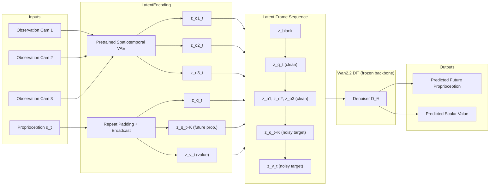

## problem

**Core insight:** Value estimation in robot RL is fundamentally a *future anticipation* problem. Existing value models built on VLMs (e.g., GVL, $\pi^{*}_{0.6}$) operate on static image--text data and capture only what is *present* in a scene, not how interactions *dynamically transform* the environment. This limits reliable value estimation in long-horizon tasks where the consequences of decisions unfold over extended time periods.

**Specific limitations addressed:**
- **VLM-based value functions** (GVL frames value as temporal ordering of shuffled video frames; $\pi^{*}_{0.6}$ frames value as 201-way classification over discretized return bins) produce value signals that are either monotonically insensitive to execution errors or completely disconnected from task progress.
- **Partial observability** in real robot deployment means a single-frame observation is insufficient to reason about future outcomes.
- **Delayed feedback** requires connecting present behavior with future task completion.

**Proposed solution:** Repurpose a pretrained video generator (Wan2.2) as a value function. By leveraging spatiotemporal priors from large-scale video corpora, the model learns to anticipate how embodiment dynamics evolve, grounding value estimation in *predicted* physical futures rather than static visual snapshots.

## architecture

ViVa is built on **Wan2.2**, a pretrained video diffusion Transformer, adapted for value estimation via latent injection without modifying the core architecture.



**Key architectural details:**

1. **Latent encoding of modalities:** All input/output modalities are mapped to latent frames of shape $(H^{\prime}, W^{\prime}, C^{\prime})$ where $H^{\prime}, W^{\prime}$ are VAE-downsampled spatial dimensions and $C^{\prime}$ is the latent channel dimension. Images are encoded via a pretrained spatiotemporal VAE (each camera view $\mathbf{o}^{i}\_{t}$ independently compressed). Low-dimensional vectors (proprioception $\mathbf{q}\_{t} \in \mathbb{R}^{d}$, scalar value $v\_{t} \in \mathbb{R}$) are mapped via **repeat padding and broadcast operations** to match the latent frame shape.

2. **Latent sequence during training (7 frames total):**
$$[\mathbf{z}\_{\text{blank}},\; \mathbf{z}\_{\mathbf{q}\_{t}},\; \mathbf{z}\_{\mathbf{o}^{1}\_{t}},\; \mathbf{z}\_{\mathbf{o}^{2}\_{t}},\; \mathbf{z}\_{\mathbf{o}^{3}\_{t}},\; \mathbf{z}\_{\mathbf{q}\_{t+K}},\; \mathbf{z}\_{v\_{t}}]$$
   - First 5 frames (blank, current proprioception, 3 camera views): **clean conditioning** frames
   - Last 2 frames (future proprioception $\mathbf{z}\_{\mathbf{q}\_{t+K}}$ and value $\mathbf{z}\_{v\_{t}}$): **noisy target frames** corrupted with Gaussian noise at level $\sigma$

3. **Latent sequence during inference:** Only conditioning frames are available. Clean prefix is formed and reverse diffusion generates target frames $\hat{\mathbf{z}}\_{\mathbf{q}\_{t+K}}$ and $\hat{\mathbf{z}}\_{v\_{t}}$. The predicted value is extracted from $\hat{\mathbf{z}}\_{v\_{t}}$ via a learned extraction mechanism.

4. **Why not predict future visual latents too?** Jointly predicting future visual latents was tried but caused degradation in value estimation accuracy. The hypothesis: difficulty mismatch -- visual generation requires high-dimensional spatial structure while the value latent has much simpler structure, making it susceptible to interference from the visual reconstruction objective.

## training

### Flow Matching Objective

ViVa adopts the flow matching formulation from Wan2.2. A linear interpolation path is constructed:
$$\mathbf{z}\_{\tau} = (1-\tau)\mathbf{z}\_{0} + \tau\mathbf{z}\_{1}, \quad \tau \in [0,1]$$

The model $v\_{\theta}(\mathbf{z}\_{\tau}; \tau, \mathbf{c})$ is trained to predict the constant velocity $\mathbf{z}\_{1} - \mathbf{z}\_{0}$ along this path.

### Combined Loss

$$\mathcal{L} = \lambda\_{\text{prop}}\,\mathbb{E}\!\left[\left\| v\_{\theta}(\mathbf{z}\_{\tau}^{\mathbf{q}};\tau,\mathbf{c}) - (\mathbf{z}\_{1} - \mathbf{z}\_{0}^{\mathbf{q}}) \right\|\_{2}^{2}\right] + \lambda\_{\text{val}}\,\mathbb{E}\!\left[\left\| v\_{\theta}(\mathbf{z}\_{\tau}^{v};\tau,\mathbf{c}) - (\mathbf{z}\_{1} - \mathbf{z}\_{0}^{v}) \right\|\_{2}^{2}\right]$$

where expectations are over $\mathbf{z}\_{0} \sim p\_{\text{data}}$, $\mathbf{z}\_{1} \sim \mathcal{N}(\mathbf{0}, \mathbf{I})$, and $\tau \sim \mathcal{U}[0,1]$.

### Hyperparameters

| Parameter | Value |
|---|---|
| $\lambda\_{\text{prop}}$ | 1.0 |
| $\lambda\_{\text{val}}$ | 0.5 |
| Prediction horizon $K$ | 50 (default; ablated at 25, 75) |
| Batch size | 192 |
| Epochs | 1 |
| Inference denoising steps | 1 (DDIM sampling) |
| Base policy | Gigabrain-0 |
| RL framework | RECAP ($\pi^{*}_{0.6}$ pipeline) |
| Training data | Mixture of demonstrations from all 3 tasks |

### Reward Definition

Episodes are annotated with binary success labels. Step-wise reward $r\_{t}$:

$$r\_{t} = \begin{cases} \frac{1}{T}, & \text{if } t < T, \\ 0, & \text{if } t = T \text{ and success}, \\ 1, & \text{if } t = T \text{ and failure}. \end{cases}$$

Cumulative return $G\_{t}$:

$$G\_{t} = \begin{cases} \frac{T-t}{T}, & \text{if success} \in [0, 1), \\ \frac{T-t}{T} + 1, & \text{if failure} \in [1, 2). \end{cases}$$

This ensures a constant margin of 1.0 between success and failure outcomes at any temporal stage, resolving ambiguity between progress and failure.

## evaluation

### Tasks (3 real-world, dual-arm)

| Task | Time Limit | Description |
|---|---|---|
| **Shirt folding** | 200s | Dual-arm coordination for deformable textiles; flatten garment, fold sleeves/sides, longitudinal fold, cross-fold |
| **Box packaging & assembly** | 300s | Pick item, place in partially formed box, fold flaps, close lid with interlocked tabs |
| **Toilet paper organization** | 300s | Tear sheet, discard, rewind loose end, apply sealing sticker |

### Quantitative Results (Table 1: Box Assembly)

| Method | Success (%) | Throughput (tasks/hr) |
|---|---|---|
| $\pi\_{0.5}$ (OpenVLA, imitation only) | 42 | 8 |
| Gigabrain-0 (imitation only) | 53 | 10 |
| RECAP + VLM-based value | 58 | 11 |
| **RECAP + ViVa** | **73** | **14** |

**Key improvements over VLM-based value:** +15 percentage points success rate, +3 tasks/hr throughput.

### Computational Efficiency (Table 2)

| Model | Training (GPU·days) | Inference (s/frame) |
|---|---|---|
| VLM-based (SigLIP encoder) | 6 | 0.32 |
| Vid-based (value only, no proprioception) | 3 | 0.11 |
| **ViVa (full model)** | **4** | **0.18** |

ViVa trains 1.5× faster than the VLM baseline with 1.8× faster inference, while achieving better value accuracy due to proprioception prediction.

### Ablation Studies

1. **Video backbone vs VLM backbone** (Fig. 8): With identical input/output structure, the video-based backbone shows steady value progression aligned with key manipulation milestones during shirt folding. The VLM-based variant shows erratic fluctuations with no discernible trend. Demonstrates that spatiotemporal priors are critical.

2. **Future proprioception prediction** (Fig. 9-10): Without proprioception prediction, ViVa becomes insensitive to subtle manipulation errors (misalignment after lid closure, instability during lifting, missed grasps, uneven force, premature release, asynchronous lifting). Full ViVa reliably detects all these fine-grained failures via sharp value drops.

3. **Prediction horizon $K$** (Fig. 11): $K=25$ shows excessive sensitivity with fluctuations; $K=75$ shows instability and fails to capture edge insertion failure; $K=50$ yields the smoothest, most stable estimates capturing both coarse progression and fine-grained events.

### Qualitative Generalization

**Out-of-domain (pants folding -- excluded from training):** ViVa shows sharp value increases at 4 key milestones (lifting, leg folding, waistband folding, final placement) with smooth monotonically rising trajectory. VLM-based value misses first and fourth milestones, shows counter-intuitive downward trend initially, and suffers high-frequency fluctuations.

## reproduction guide

### Prerequisites

1. **Wan2.2 pretrained video diffusion Transformer** (backbone, not modified)
2. **Pretrained spatiotemporal VAE** from Wan2.2 for latent encoding
3. **RECAP pipeline** from $\pi^{*}\_{0.6}$ framework for RL integration
4. **Gigabrain-0** pretrained VLA model as base policy
5. **Hardware:** Multi-GPU setup (paper reports training costs in GPU·days); all experiments on unspecified GPU hardware
6. **Robot:** Dual-arm setup with at least 3 camera views and proprioception sensing

### Data Requirements

- Collect demonstration trajectories for 3 tasks: shirt folding, box assembly, toilet paper organization
- Each trajectory needs: multi-view images (3 cameras), robot proprioception, binary success label at episode end
- Time limits: 200s (shirt), 300s (box, toilet paper)
- Train on mixed data from all tasks; single epoch only

### Training Procedure

```bash
# Key training parameters
BATCH_SIZE=192
EPOCHS=1
LAMBDA_PROP=1.0
LAMBDA_VAL=0.5
PREDICTION_HORIZON=50  # K=50
DENOISING_STEPS=1      # DDIM sampling at inference

# Reward computation (per episode):
# For each timestep t in [1, T]:
#   r_t = 1/T            if t < T
#   r_t = 0              if t == T and success
#   r_t = 1              if t == T and failure
# Value target G_t = sum(r_k, k=t..T)
```

### RECAP Integration

- Replace VLM-based value function (201-way classification over discretized return bins using SigLIP encoder) with ViVa
- Keep all other RECAP components identical (Gigabrain-0 base policy, advantage estimation, policy refinement)
- ViVa outputs scalar value via single-step DDIM denoising of the value latent frame

### Expected Outputs

- Box assembly: ~73% success rate, ~14 tasks/hr throughput (vs 58%/11 with VLM baseline)
- Training time: ~4 GPU·days
- Inference: ~0.18s per frame

### Failure Modes

- **Jointly predicting future visual latents** degrades value estimation (difficulty mismatch between high-dim visual and low-dim value objectives)
- **Too short horizon ($K=25$):** Excessive sensitivity, transient fluctuations during critical phases
- **Too long horizon ($K=75$):** Instability, fails to register intermediate events like edge insertion failure
- **Without proprioception prediction:** Insensitive to subtle manipulation errors (missed grasps, uneven force, etc.)
- **VLM-based baselines:** Overfit to temporal progression (monotonically increasing) regardless of execution quality; erratic fluctuations unrelated to task state; poor generalization to novel objects

### Project Page

No GitHub repository found. Project page: https://viva-value-model.github.io/

## notes

- The paper is from **GigaAI**, **Sichuan University**, and **Tsinghua University**. Jindi Lv and Hao Li are equal contributors; Zheng Zhu and Jiancheng Lv are corresponding authors.
- The approach is situated within the $\pi^{*}\_{0.6}$ RECAP ecosystem, which uses Gigabrain-0 as the base VLA model. The RECAP pipeline performs RL with experience corrections via advantage-conditioned policies.
- The key conceptual contribution is reframing value estimation as future anticipation -- video generative models naturally model how scenes evolve over time, making them more suitable than static VLMs for value functions.
- The design choice to **not** jointly predict future visual latents (only proprioception + value) is important for practitioners -- it avoids a multi-objective conflict that hurts value accuracy.
- The reward formulation with constant margin of 1.0 between success/failure returns is a clean way to separate outcome classes without requiring dense reward annotation.
- Real-robot evaluation was limited to box assembly only due to long RECAP rollout cycles and resource constraints. Results on shirt folding and toilet paper organization are qualitative only.
- The out-of-domain generalization test (pants folding) is compelling -- video priors transfer better than memorized visual patterns from VLMs.
- Comparison is primarily within the RECAP framework rather than against a broad set of RL baselines, which is a limitation.
