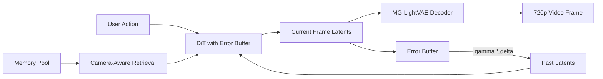

## problem

diffusion-based video models encode world knowledge and can generate high-quality clips, but when applied as interactive world models they fail at two things simultaneously: long-horizon spatiotemporal consistency and real-time generation. existing approaches pick one or the other. Matrix-Game 2.0 and HY-Gamecraft-2 achieve real-time streaming via causal autoregressive few-step diffusion, but have no memory mechanism for minute-long consistency. Lingbot-World scales context length for long-horizon geometric consistency, but can't maintain real-time inference. the goal: 720p generation at 40 FPS with stable memory consistency over minute-long sequences.

this is fundamentally a co-design problem across data, modeling, and deployment. you need annotated video-pose-action data at scale (hard to get from web scraping), a model that can both generate and retrieve memory, and an inference stack fast enough for real-time interaction.

## architecture

built on Wan2.2-TI2V-5B (DiT architecture) with action modules integrated into the first 15 DiT blocks. discrete keyboard actions go through cross-attention; continuous mouse signals through self-attention.

**three-stage pipeline:**

1. **data engine** -- three complementary sources:
   - Unreal-Gen: 1,000+ custom UE5 scenes with tick-synchronized video/pose/action capture, NavMesh-RL hybrid exploration agent, combinatorial character assembly ($>10^8$ variants), zero-human-in-the-loop batch rendering
   - AAA game recording: four-layer decoupled architecture (game process, agent, recording coordination, dataset output) for GTA V, RDR2, Palworld, Cyberpunk 2077, Hogwarts Legacy. physics-based WSAD inference from position deltas eliminates human annotation entirely
   - real-world data: DL3DV-10K, RealEstate10K, OmniWorld-CityWalk, SpatialVid-HD, all re-annotated with ViPE for pose consistency

2. **model training:**
   - error-aware base model: maintains an error buffer of prediction residuals $\delta = \hat{x}\_i - x\_i$, then injects sampled errors into history latents during training: $\tilde{x}\_i = x\_i + \gamma\delta$. based on SVI (Stable Video Infinity). flow-matching objective on current frames only
   - camera-aware memory retrieval: selects memory frames by camera pose and field-of-view overlap using Plücker-style relative geometry encoding. optionally retains first latent as persistent sink latent for global scene statistics
   - unified self-attention: memory latents, past latents, and current noisy latents share the same attention space in the DiT backbone (not a separate memory branch)
   - error injection on both memory and history latents: $\tilde{x}\_{1:k} = x\_{1:k} + \gamma\_h\delta$, $\tilde{m}\_{1:r} = m\_{1:r} + \gamma\_m\delta$
   - head-wise perturbed RoPE: $\hat{\theta}\_h = \theta\_{\text{base}}(1 + \sigma\_\theta \epsilon\_h)$ to break periodic synchronization across attention heads
   - 28B MoE scale-up: viewpoint-specialized design (separate first-person and third-person high-noise models, shared low-noise model). high-noise trained on action-accurate data, low-noise on internet video for generalization

3. **multi-segment DMD distillation:**
   - teacher, critic, and student all initialized from the same memory-augmented base model (unified bidirectional architecture)
   - student performs multi-segment rollouts (k=1 to 6 segments), past frames taken from tail of previous segment
   - DMD objective minimizes reverse KL between teacher and student distributions
   - cold-start stage (600 steps) with ground truth past frames, then multi-segment training (2,400 steps)

**real-time inference stack (asynchronous 8+1 GPU setup):**
- INT8 quantization on DiT attention projections (rest of model unchanged)
- MG-LightVAE: 50% and 75% pruned decoder variants, trained on 700K clips. 75% pruning gives 5.2x decoding speedup
- GPU-based memory retrieval: sampling-based frustum overlap approximation instead of exact 3D intersection
- torch.compile on VAE decoder after first iteration
- result: 40 FPS at 720p with 5B model

## training

base model fine-tuned from Wan2.2-TI2V-5B at LR $2 \times 10^{-5}$ for 50K steps. 4.8M video clips for memory-augmented training. with probability 0.8: 4 past + 10 current noisy latents; with 0.2: I2V mode (no memory/past).

distillation: cold-start 600 steps (student LR $5 \times 10^{-7}$, critic LR $1 \times 10^{-7}$, 5 student updates per iteration), then multi-segment 2,400 steps (both LR $1 \times 10^{-7}$, 3 student updates per iteration). past frames and memory masked with 0.2 probability.

hardware: not specified in detail. inference uses H-series or A-series GPUs in 8+1 async setup.

## evaluation

no quantitative benchmarks reported (no FVD, FID, or standard video metrics). evaluation is entirely qualitative with selected rollout examples showing scene revisitation and long-horizon consistency.

**acceleration ablation (5B model, 75% VAE pruning, 8+1 GPU):**

| config | FPS | drop |
|---|---|---|
| full stack | ~40 | -- |
| - INT8 quantization | 27.38 | 12.62 |
| - MG-LightVAE | 25.79 | 14.21 |
| - GPU retrieval | 6.60 | 33.40 |

GPU retrieval is the most critical component (removing it drops FPS from 40 to 6.6). INT8 quantization and VAE pruning contribute roughly equally.

**MG-LightVAE reconstruction (17-frame, 720x1280):**

| model | PSNR | SSIM | full time (s) | dec time (s) |
|---|---|---|---|---|
| Wan2.2 VAE (original) | 33.79 | 0.99 | 0.99 | 0.76 |
| 50% pruned | 31.84 | 0.99 | 0.52 | 0.30 |
| 75% pruned | 31.14 | 0.99 | 0.35 | 0.13 |

28B MoE model shows improved generation quality, dynamics, and generalization qualitatively but no quantitative comparison is provided.

## reproduction guide

1. clone: `git clone https://github.com/SkyworkAI/Matrix-Game`
2. the report is a technical report without detailed training configs, exact hyperparameters, or dataset sizes beyond what's described above
3. base model builds on Wan2.2-TI2V-5B with action modules in first 15 DiT blocks
4. data pipeline requires UE5 with NavMesh, AAA games with injected agents, and ViPE for pose annotation
5. inference requires 8+1 GPU async setup for real-time performance
6. no pretrained weights or inference code released as of the report date

the report is heavy on system description and light on reproducible details. training data scale, compute budget, and quantitative metrics are not disclosed.

## notes

Matrix-Game 3.0 is the most complete open-world-model system I've seen: it addresses the full stack from data generation through model training to deployment acceleration. the error buffer idea from SVI is elegant -- instead of hoping the model never accumulates errors, you train it to be robust to imperfect contexts from the start. the camera-aware memory retrieval with Plücker encoding is a principled way to inject geometry without a separate memory branch.

the big gap is the total absence of quantitative metrics. no FVD, no FID, no user studies, no comparison to Genie 2/3, Oasis, Lingbot-World, or any other system. everything is qualitative. for a report claiming "industrial-scale deployable world models," this is a significant omission. it's impossible to assess whether the memory mechanism actually works better than alternatives, or whether the distillation preserves quality.

the data engine is the most interesting contribution from a reproducibility standpoint. tick-synchronized UE5 capture with zero alignment error, physics-based WSAD inference from position deltas, and the four-layer decoupled recording architecture for AAA games. this is a serious engineering effort that other groups could learn from.

relevant to the bopi project: the camera-aware memory retrieval approach (select frames by geometric overlap, encode relative pose) is directly applicable to robotics world models that need to maintain scene consistency across viewpoints. the error buffer technique could be applied to any autoregressive generation pipeline where error accumulation is a problem.
